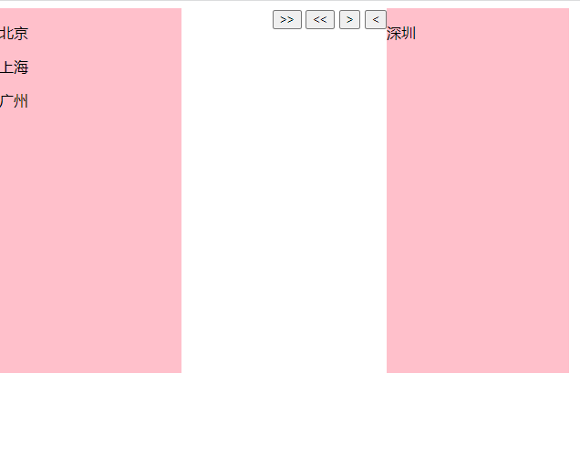

# JQuery

## 1.原生dom元素与JQuery元素的转换

```html
<div id="one"></div>
<div id="two"></div>
```


1.dom对象转换成JQuery对象

```javascript
var div1 = document.getElementById('one')
var $div1 = $(div1)//$div1已经转换成jquery对象 可以使用jq的方法
```


2.JQuery对象转换成dom对象

​	1.使用下标来转换

```javascript
var $divs =$('div')
var div1 = $divs[0]//div1已经转换成原生dom对象 可以使用原生的dom方法
```

​	2.使用jquery的方法

```javascript
var $divs =$('div')
var div1 = divs.get(0)
var div2 = divs.get(1)
```


## 2.text方法

**作用**:设置和获取文本内容

设置文本内容:$(‘xxx’).text(‘文本内容’)

获取文本内容:$(‘xxx’).text()

```html
  <button id="setText">设置文本</button>
    <button id="getText">获取文本</button>
    <div>
        <span>我是div1的文本</span>
    </div><br>
    <div>
        <span>我是div2的文本</span>
    </div>
```

```javascript
  $('#setText').click(function(){
        $('div').text('我是修改后的文本')
    })
    $('#getText').click(function(){
        console.log($('div').text());
    })

```


## 3.appendTo方法

作用:把子元素作为父元素的最后一个子元素添加

子元素.appendTo(父元素)

案例:点击不同的按钮,实现将城市从一个box移入另一个box

```html
 <div class="bbox">
         <h1>城市选择</h1>
        <div class="box1">
            <p>北京</p>
            <p>上海</p>
            <p>广州</p>
            <p>深圳</p>
        </div>
        <div class="btn-grounp">
            <button id="transferAll">>></button>
            <button id="backAll"> << </button>
            <button id="transfer">></button>
            <button id="back"> < </button>
        </div>
        <div class="box2"></div> 
    </div>
```


```javascript
 $('#transferAll').click(function() {
        $('.box1>p').appendTo($('.box2'))
    })
    $('#backAll').click(function() {
        $('.box2>p').appendTo($('.box1'))
    })
    $('#transfer').click(function() {
        $('.box1>p:last').appendTo($('.box2'))
    })
    $('#back').click(function() {
        $('.box2>p:last').appendTo($('.box1'))
    })
```



123
