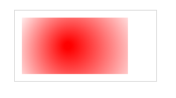

## Canvas学习

#### Canvas坐标

canvas 是一个二维网格。

canvas 的左上角坐标为 (0,0)

上面的 fillRect 方法拥有参数 (0,0,150,75)。

意思是：在画布上绘制 150x75 的矩形，从左上角开始 (0,0)。

###### 坐标实例

```html
<!DOCTYPE html>
<html>
<head> 
<meta charset="utf-8"> 
<title>菜鸟教程(runoob.com)</title> 
</head>
<body>

<canvas id="myCanvas" width="200" height="100" style="border:1px solid #c3c3c3;">
您的浏览器不支持 HTML5 canvas 标签。
</canvas>

<script>

var c=document.getElementById("myCanvas");
var ctx=c.getContext("2d");
ctx.fillStyle="#FF0000";
ctx.fillRect(0,0,150,75);

</script>

</body>
</html>
```

###### 示例图


#### Canvas-路径

在Canvas上画线，我们将使用以下两种方法：

- moveTo(*x,y*) 定义线条开始坐标
- lineTo(*x,y*) 定义线条结束坐标

绘制线条我们必须使用到 "ink" 的方法，就像stroke().

###### 线条实例

```html
<!DOCTYPE html>
<html>
<head> 
<meta charset="utf-8"> 
<title>菜鸟教程(runoob.com)</title> 
</head>
<body>

<canvas id="myCanvas" width="200" height="100" style="border:1px solid #d3d3d3;">
您的浏览器不支持 HTML5 canvas 标签。</canvas>

<script>

var c=document.getElementById("myCanvas");
var ctx=c.getContext("2d");
ctx.moveTo(0,0);
ctx.lineTo(200,100);
ctx.stroke();

</script>

</body>
</html>
```

###### 示例图

JE2WXO3W.png)

在canvas中绘制圆形, 我们将使用以下方法:

```html
arc(x,y,r,start,stop)
```

实际上我们在绘制圆形时使用了 "ink" 的方法, 比如 stroke() 或者 fill().

###### 圆实例

```html
<!DOCTYPE html>
<html>
<head> 
<meta charset="utf-8"> 
<title>菜鸟教程(runoob.com)</title> 
</head>
<body>

<canvas id="myCanvas" width="200" height="100" style="border:1px solid #d3d3d3;">
您的浏览器不支持 HTML5 canvas 标签。</canvas>

<script>

var c=document.getElementById("myCanvas");
var ctx=c.getContext("2d");
ctx.beginPath();
ctx.arc(95,50,40,0,2*Math.PI);
ctx.stroke();

</script> 

</body>
</html>
```

###### 示例图


#### Canvas-文本

使用 canvas 绘制文本，重要的属性和方法如下：

- font - 定义字体
- fillText(*text,x,y*) - 在 canvas 上绘制实心的文本
- strokeText(*text,x,y*) - 在 canvas 上绘制空心的文本

使用 fillText():

###### 实心文本实例

```html
<!DOCTYPE html>
<html>
<head> 
<meta charset="utf-8"> 
<title>菜鸟教程(runoob.com)</title> 
</head>
<body>

<canvas id="myCanvas" width="200" height="100" style="border:1px solid #d3d3d3;">
您的浏览器不支持 HTML5 canvas 标签。</canvas>

<script>

var c=document.getElementById("myCanvas");
var ctx=c.getContext("2d");
ctx.font="30px Arial";
ctx.fillText("Hello World",10,50);

</script>

</body>
</html>
```

###### 示例图


###### 空心文本实例

```html
<!DOCTYPE html>
<html>
<head> 
<meta charset="utf-8"> 
<title>菜鸟教程(runoob.com)</title> 
</head>
<body>

<canvas id="myCanvas" width="200" height="100" style="border:1px solid #d3d3d3;">
您的浏览器不支持 HTML5 canvas 标签。</canvas>

<script>

var c=document.getElementById("myCanvas");
var ctx=c.getContext("2d");
ctx.font="30px Arial";
ctx.strokeText("Hello World",10,50);

</script>

</body>
</html>
```

###### 示例图


#### Canvas渐变

渐变可以填充在矩形, 圆形, 线条, 文本等等, 各种形状可以自己定义不同的颜色。

以下有两种不同的方式来设置Canvas渐变：

- createLinearGradient(*x,y,x1,y1*) - 创建线条渐变
- createRadialGradient(*x,y,r,x1,y1,r1*) - 创建一个径向/圆渐变

当我们使用渐变对象，必须使用两种或两种以上的停止颜色。

addColorStop()方法指定颜色停止，参数使用坐标来描述，可以是0至1.

使用渐变，设置fillStyle或strokeStyle的值为 渐变，然后绘制形状，如矩形，文本，或一条线。

使用 createLinearGradient():

###### 线性渐变实例

```html
<!DOCTYPE html>
<html>
<head> 
<meta charset="utf-8"> 
<title>菜鸟教程(runoob.com)</title> 
</head>
<body>

<canvas id="myCanvas" width="200" height="100" style="border:1px solid #d3d3d3;">
您的浏览器不支持 HTML5 canvas 标签。</canvas>

<script>

var c=document.getElementById("myCanvas");
var ctx=c.getContext("2d");

// Create gradient
var grd=ctx.createRadialGradient(75,50,5,90,60,100);
grd.addColorStop(0,"red");
grd.addColorStop(1,"white");

// Fill with gradient
ctx.fillStyle=grd;
ctx.fillRect(10,10,150,80);

</script>

</body>
</html>
```

###### 示例图



###### 圆渐变实例

```htm
<!DOCTYPE html>
<html>
<head> 
<meta charset="utf-8"> 
<title>菜鸟教程(runoob.com)</title> 
</head>
<body>

<canvas id="myCanvas" width="200" height="100" style="border:1px solid #d3d3d3;">
您的浏览器不支持 HTML5 canvas 标签。</canvas>

<script>

var c=document.getElementById("myCanvas");
var ctx=c.getContext("2d");

// Create gradient
var grd=ctx.createRadialGradient(75,50,5,90,60,100);
grd.addColorStop(0,"red");
grd.addColorStop(1,"white");

// Fill with gradient
ctx.fillStyle=grd;
ctx.fillRect(10,10,150,80);

</script>

</body>
</html>
```

###### 示例图


#### Canvas-画像

把一幅图像放置到画布上, 使用以下方法:

- drawImage(*image,x,y*)

  

###### 画像实例

```ht
<!DOCTYPE html>
<html>
<head> 
<meta charset="utf-8"> 
<title>菜鸟教程(runoob.com)</title> 
</head>
<body>

<p>Image to use:</p>
<p>Canvas:</p>
<canvas id="myCanvas" width="250" height="300" style="border:1px solid #d3d3d3;">
您的浏览器不支持 HTML5 canvas 标签。</canvas>

<script>

var c=document.getElementById("myCanvas");
var ctx=c.getContext("2d");
var img=document.getElementById("scream");

img.onload = function() {
	ctx.drawImage(img,10,10);
} 
</script>

</body>
</html>
```

###### 示例图


