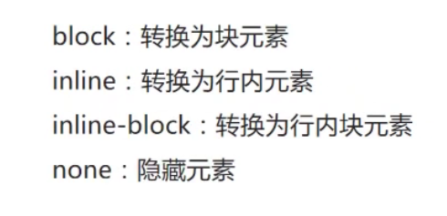
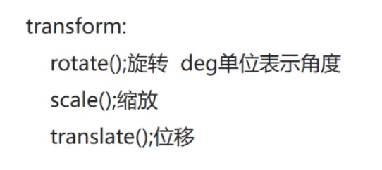
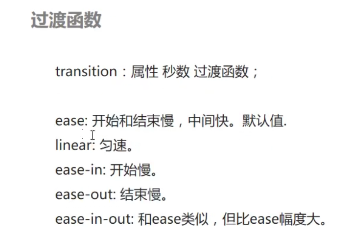
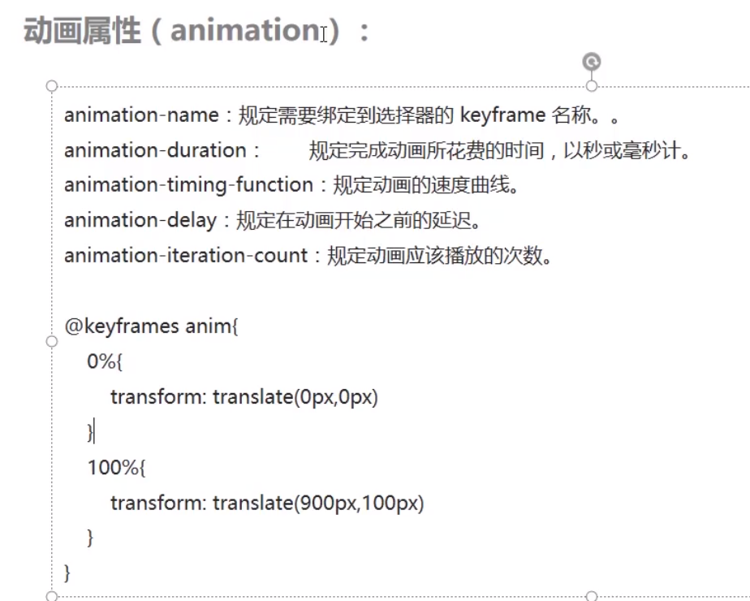
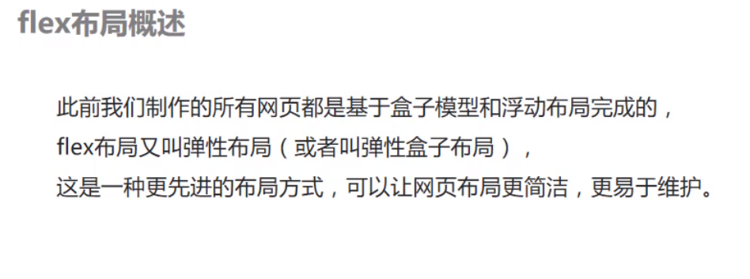
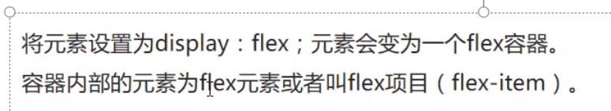
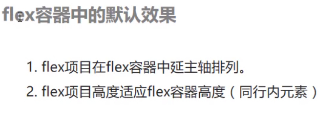
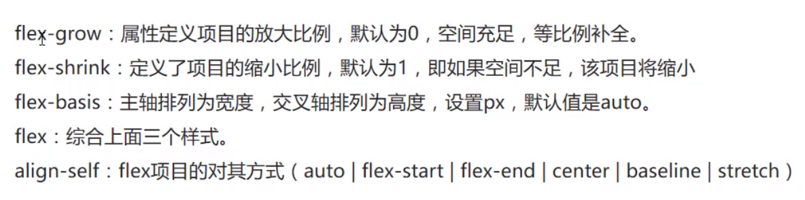
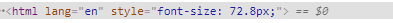

# css学习

## 1.box模型


定义一个class为box的div

```html
<div class="box"></div>
```


使用通配符‘*’可以使得元素边距初始化

```css
    /* 通配符 '*' 使得元素边距初始化 */
*{
    padding: 0;
    margin: 0;
}
.box{
    width: 100px;
    height: 100px;
    border: 1px solid red;
}
```

### margin(外边距)

表示两个div的边框之间的距离

```css
margin:10;
margin:10 10;
margin:10 10 10 10
```

1.表示div元素的上下左右外边距均为10px

2.表示div元素的上下，左右外边距分别为10px

3.表示div元素的上、右、下、左的外边距分别为10px


### padding(内边距)

表示div内容到边框之间的距离

```css
padding:10;
padding:10 10;
padding:10 10 10 10
```

1.表示div元素的上下左右内边距均为10px

2.表示div元素的上下，左右内边距分别为10px

3.表示div元素的上、右、下、左的内边距分别为10px

### border(边框)

表示div元素的边框

```css
border: 1px solid red;
```

表示边框的 宽度(border-width) 边框样式(border-style) 边框颜色(border-color)

### box-sizing(盒子大小)

```css
box-sizing:border-box;
```

若定义box-sizing为border-box,则盒子的大小会固定，**不会随着padding和border的改变而改变**

### 元素的宽度和高度计算

默认情况：

元素的实际宽度 = border-left + boder-right + width + padding-left + padding-right

元素的实际高度 = border-top+ boder-bottom+ height+ padding-top+ padding-bottom

**若不定义 box-sizing为border-box,元素的宽度和高度会随着padding和border的改变而改变**

设置**box-size:border-box**:

元素的实际宽度 = width 

元素的实际高度 = height

**若定义 box-sizing为border-box,元素的宽度和高度不会随着padding和border的改变而改变**

### 使box居中显示

```css
    .box{
        width: 300px;
        height: 300px;
        border: 1px solid red;
        margin: 0 auto;
    }
```

设置margin：auto可以使得元素的左右外边距距离相等

```css
margin: 0 auto;
```


## 2.浮动布局

### HTML元素的分类


#### display属性



```css
display:block
```

可以将不能设置宽度和高度的行内元素变得可以设置高度和宽度，例如a、span

```css
display:none
```

可以将元素隐藏

### float浮动布局

```css
float:left
```

将元素设置为浮动元素(float),块元素可以在同一行显示

```css
.container{
    width: 300px;
    height: 300px;
    border: 1px solid red;
    float: left;
}
.side{
    width: 100px;
    height: 300px;
    border: 1px solid red;
    float: left;
}
```


#### float浮动布局的特性

##### 脱离文档流

会使的元素“飘起来”，不占位

例如：在float布局的元素下添加一个div，则此div会与float元素重叠

```html
 	<div class="container">内容</div>
    <div class="side">侧栏</div>
    <div class="box"></div>
```

```css
.container{
    width: 300px;
    height: 300px;
    border: 1px solid red;
    float: left;
}
.side{
    width: 100px;
    height: 300px;
    border: 1px solid red;
    float: left;
}
.box{
    width: 500;
    height: 300px;
    background-color: yellow;
}
```


#### 解决float元素不占位的方案

##### 添加空div清除浮动

**clear：both**

```css
clear:both
```

代码：

```html
    <div class="container">内容</div>
    <div class="side">侧栏</div>
    <div class="clear"></div>
    <div class="box"></div>
```

```css
.container{
    width: 300px;
    height: 300px;
    border: 1px solid red;
    float: left;
}
.side{
    width: 100px;
    height: 300px;
    border: 1px solid red;
    float: left;
}
.box{
    width: 500;
    height: 300px;
    background-color: yellow;
}
.clear{
    clear: both;
}
```


##### 

##### 利用伪元素选择器实现


```css
.clear::before,.clear::after{
    display: block;
    clear: both;
    content: '';
}
```

**可以避免繁琐的添加div，使得页面更加直观**

## 3.CSS定位

### 

### 绝对定位(absolute)

#### 特性

**脱离文档流**

默认参照物为浏览器视窗的**左上角**

```html
   <div class="containner">
        <div class="box">
        1
        </div>
        <div class="box position">
        2
        </div>
        <div class="box fixed">
        3  
        </div>
    </div>
```

```css
.position{
    position: absolute;
    left: 20%;
    top: 20%;
}
```


**以浏览器左上角为参照物**

### 相对定位(relative)

#### 特性

**不脱离文档流**

默认参照物为**此元素原位置**

### 固定定位(fixed)

**脱离文档流**

默认参照物为浏览器**视窗位置**

```html
 <div class="containner">
        <div class="box">
        1
        </div>
        <div class="box position">
        2
        </div>
        <div class="box fixed">
        3  
        </div>
    </div>
```

```css
.fixed{
    position: fixed;
    left: 40%;
    top: 0%;
}
```


默认参照物为浏览器**视窗位置**,不会随着滚动条的移动而移动 

## 4.CSS3新增样式


### 圆角

**border-radius**：左上 右上 右下 左下

如果设置两个值，第一个值表示左上和右下，第二个值表示右上和左下


```html
<div class="radius"></div>
```

```css
.radius{
    height: 300px;
    width: 300px;
    background-color: red;
    border: 1px solid black;
    margin: 0 auto;
}
```


在样式中添加 border-radius: 50%;

```css
.radius{
    height: 300px;
    width: 300px;
    background-color: red;
    border: 1px solid black;
    margin: 0 auto;
    border-radius: 50%; 
}
```

得到


**将角度设置为50%可以得到圆形**

### 阴影

**box-shadow**: x轴偏移量 y轴偏移量 模糊半径 阴影颜色(不设置颜色默认为黑色)

box-shadow:10px 20px 30px blue

```html
<div class="box"></div>
```

```css
.box{
        height: 300px;
        width: 300px;
        background-color: chartreuse;
        margin: 0 auto;
        border-radius: 50%;
        /* box-shadow: 10px 10px 10px blue; */
    }
```


**添加box-shadow后：**

```css
.box{
        height: 300px;
        width: 300px;
        background-color: chartreuse;
        margin: 0 auto;
        border-radius: 50%;
        box-shadow: 10px 10px 10px blue;
    }
```


### 形变



#### 旋转(rotate)

**旋转前:**

```html
<div class="transform"></div>
```

```css
   .transform{
        width: 300px;
        height: 300px;
        margin: 0 auto;
        background-color: red;
    }
```


**旋转后**:

```css
  .transform{
        width: 300px;
        height: 300px;
        margin: 100px auto;
        background-color: red;
        transform: rotate(50deg);
    }
```


#### 缩放(scale)

transform:scale(**倍数**)

缩放前：

```html
<div class="transform"></div>
```

```css
  .transform{
        width: 300px;
        height: 300px;
        margin: 100px auto;
        background-color: red;
        /* transform: rotate(50deg); */
    }
```


缩放后:

```css
.transform{
        width: 300px;
        height: 300px;
        margin: 100px auto;
        background-color: red;
        /* transform: rotate(50deg); */
        /* 放大1.5倍 */
        transform: scale(1.5);
    }
```


#### 位移(translate)

**transform:translate(x坐标移动的距离,y坐标移动的距离)**

**距离可以为像素值也可以为百分比**

位移前:

```html
 <div class="transform"></div>
```

```css
 .transform{
        width: 300px;
        height: 300px;
        margin: 100px auto;
        background-color: red;
        /* transform: rotate(50deg); */
        /* 放大1.5倍 */
        /* transform: scale(1.5); */
        /* transform: translate(100px,100px); */
    }
```


位移后:

```css
    .transform{
        width: 300px;
        height: 300px;
        margin: 100px auto;
        background-color: red;
        /* transform: rotate(50deg); */
        /* 放大1.5倍 */
        /* transform: scale(1.5); */
        transform: translate(100px,100px);
    }
```


#### 使得div垂直水平居中的方法

将元素设置为绝对定位，然后用偏移量位移

**transform: translate(-50%,-50%);**

```css
 .transform{
        width: 300px;
        height: 300px;
        background-color: red;
        position: absolute;
        left: 50%;
        top: 50%;
        transform: translate(-50%,-50%);
    }
```


## 5.过渡效果

### transition




#### 举例

##### 1.实现下拉菜单效果

```html
<ul class="menu">
        <li>
            书籍
            <ul class="sub-menu">
                <li>js书籍</li>
                <li>js书籍</li>
                <li>js书籍</li>
            </ul>
        </li>
        <li>
            书籍
            <ul class="sub-menu">
                <li>js书籍</li>
                <li>js书籍</li>
                <li>js书籍</li>
            </ul>
        </li>
        <li>
            书籍
            <ul class="sub-menu">
                <li>js书籍</li>
                <li>js书籍</li>
                <li>js书籍</li>
            </ul>
        </li>
    </ul>
```

```css
*{
    padding: 0;
    margin: 0;
}
li{
    list-style: none;
}
.menu>li{
    float: left;
    border: 1px solid red;
    height: 30px;
    background-color: blue;
    color: #fff;
    line-height: 30px;
}
.menu>li:hover >.sub-menu>li{
    height: 30px;
}
.sub-menu>li{
    height: 0;
    overflow: hidden;
    background-color: red;
    transition: height 0.5s;
```

**overflow**:hidden可以将超出限界的元素隐藏

鼠标悬停前:


鼠标悬停后(有过渡效果):


##### 2.实现滚动导航效果

```html
<ul class="menu">
        <li>
            <p class="show">首页</p>
            <p class="click">电影</p>
        </li>
        <li>
            <p class="show">首页</p>
            <p class="click">电影</p>
        </li>
        <li>
            <p class="show">首页</p>
            <p class="click">电影</p>
        </li>
    </ul>
```

```css
 *{
        margin: 0;
        padding: 0;
    }
    .menu{
        width: 300px;
        margin: 100px auto;
    }
    .menu>li{
        float: left;
        list-style: none;
        border: 1px solid red;
        height: 30px;
        line-height: 30px;
        overflow: hidden;
    }
    .menu>li:hover >.show{
        /* height: 60px; */
        margin-top: -30px;
        transition: 0.5s;
    }
    .show{
        background-color: red;
    }
    .click{
        background-color: yellow;
    }
```

鼠标悬停前:


鼠标悬停后(有过渡效果):


##### 3.实现百度菜单效果

```html
<ul class="menu">
        <li>
            <p class="show">首页</p>
            <p class="click">电影</p>
        </li>
        <li>
            <p class="show">首页</p>
            <p class="click">电影</p>
        </li>
        <li>
            <p class="show">首页</p>
            <p class="click">电影</p>
        </li>
    </ul>
```

```css
*{
    margin: 0;
    padding: 0;
}
.menu{
    position: fixed;
    top: 50%;
    right: 10%;
}
.menu>li{
    list-style: none;
    border: 1px solid red;
    height: 30px;
    line-height: 30px;
    overflow: hidden;
    position: relative;
    
}
.show{
    background-color: brown;
}
.click{
    background-color: chartreuse;
    position: absolute;
    left: 0;
    top: 0;
    transform: rotate(45deg);
    transform-origin: -30px 30px;
    transition:transform 0.5s;
}
.menu>li:hover>.click{
    transform: rotate(0);
    
}
```

鼠标悬停前:


鼠标悬停后(有过渡效果):


## 6.动画效果

### 动画属性(animation)




**可以简写成**:

**transform:animation-name** **animation-duration animation-timing-function animation-delay animation-iteration-count**

#### 举例

##### 1.实现一个div旋转的动画效果

```html
<div class="box"></div>
```

```css
 @keyframes anim{
        0%{
            
        }
        100%{
            transform: rotate(360deg);
        }
    }
    .box{
        height: 200px;
        width: 200px;
        background-color: red;
        margin: 200px auto;
        animation: anim 3s ease infinite;
    }
```


> 注:**需要将animation-name绑定到需要添加动画效果的元素中才能生效**


##### 2.实现唱片旋转效果

```html
<div class="box">
        
</div>
```

```css
  @keyframes anim{
         0%{
            transform: rotate(0deg);
        }
        100%{
            transform: rotate(360deg);
        }
    }
    .box{
        width: 300px;
        height: 300px;
        margin: 200px auto;
        border-radius: 50%;
        overflow: hidden;
        animation: anim 3s linear infinite;
    }
```


## 7.flex布局

### 概述



### 基本概念






### 举例

设置**display: flex**之前

> **容器内的元素会默认垂直排列(沿着主轴排列)**


设置**display: flex之后;**

> **flex容器内的flex-item将会默认水平排列**

```html
<div class="container">
        <div class="item"></div>
        <div class="item"></div>
        <div class="item"></div>
    </div>
```

```css
*{
    margin: 0;
    padding: 0;
}
.container{
        display: flex;
        margin: 200px auto;
        height: 400px;
        width: 800px;
        background-color: cornflowerblue;
}
.item{
    width: 100px;
    height: 100px;
    background-color: red;
    border: 1px solid black;
}
```


**如果不给item设置高度**

> flex-item会默认撑满容器


### 设置flex容器


#### flex-direction


##### 举例

```html
<div class="container">
        <div class="item"></div>
        <div class="item"></div>
        <div class="item"></div>
    </div>
```

```css
*{
    margin: 0;
    padding: 0;
}
.container{
        display: flex;
        margin: 200px auto;
        height: 400px;
        width: 800px;
        background-color: cornflowerblue;
        flex-direction: row-reverse;
}
.item{
    width: 100px;
    /* height: 100px; */
    background-color: red;
    border: 1px solid black;
}
```

> **需要给item设置宽度**

###### 1.flex-direction:row


###### 2.flex-direction:row-reverse


###### 3.flex-direction: column

> **需要给item设置高度**


###### 4.flex-direction: column-reverse;


#### justify-content


##### 举例

```html
<div class="container">
        <div class="item"></div>
        <div class="item"></div>
        <div class="item"></div>
    </div>
```

```css
*{
    margin: 0;
    padding: 0;
}
.container{
        display: flex;
        margin: 200px auto;
        height: 400px;
        width: 800px;
        background-color: cornflowerblue;
       
}
.item{
    width: 100px;
    height: 100px;
    background-color: red;
    border: 1px solid black;
}
```

###### 1.justify-content: start


###### 2.justify-content: end

> **与flex-direction:row-reverse不同的是,justify-content: end不会改变item的排列顺序**


###### 3.justify-content: center


###### 4.justify-content: space-between


###### 5.justify-content: space-around

##### 

#### align-item


##### 举例

```html
 <div class="container">
        <div class="item">1</div>
        <div class="item">2</div>
        <div class="item">3</div>
    </div>
```

```css
*{
    margin: 0;
    padding: 0;
}
.container{
        display: flex;
        margin: 200px auto;
        height: 400px;
        width: 800px;
        background-color: cornflowerblue;
        align-items: flex-start;
}
.item{
    width: 100px;
    height: 100px;
    background-color: red;
    border: 1px solid black;
}
```

###### 1.align-items: flex-start


###### 2.align-items: flex-end


###### 3.align-items: center


###### 4.align-items: stretch

> 若不设置item高度值，item会默认撑满容器


### flex项目



`flex-gorw`和`flex-shrink`放大和缩小规则:**剩余空间**(超出空间)✖**元素数据比例**

注意:是计算得到**剩余空间**(超出空间)后再**按比例分配扩大(缩小)**

#### **举例**

```html
<div class="container">
        <div class="item">1</div>
        <div class="item big">2</div>
        <div class="item">3</div>
    </div>
```

```css
*{
    margin: 0;
    padding: 0;
}
.container{
        display: flex;
        margin: 200px auto;
        height: 400px;
        width: 800px;
        background-color: cornflowerblue;
        /* flex-direction: column-reverse; */
        /* justify-content: space-around; */
        align-items: stretch;
}
.item{
    /* flex-shrink: ; */
    flex-grow: 1;
    /* width: 300px; */
    /* height: 100px; */
    background-color: red;
    border: 1px solid black;
}
.big{
    flex-grow: 3;
}
```


##### 1.flex-grow


##### 2.flex-shrink


##### 3.flex-basis

> **表示flex-item在主轴排列的高度**


##### 4.flex

> **flex:flex-grow  flex-shrink flex-basis**

**flex:1**常用，用于设置flex容器内元素的排列大小


##### 5.align-self

> **和align-item基本一致，区别是align-self定位在flex-item，而align-self定位在flex容器**

## 8.grid布局

### 概述

**1.flex布局是一维布局，grid布局是二维布局.**

**2.flex考虑的是项目按行或列布局，grid布局需要同时考虑行和列.**

**flex布局**：


**grid布局：**


### 基本概念

> **grid-template-columns可以设置容器的列数以及相应列的宽度**
>
> **grid-template-rows可以设置容器的行数以及相应行的高度**
>
> 可以按照像素设置行列的宽高，也可以按照比例来设置(**fr**)

### 容器属性

> 与flex属性相似


#### 1.justify-items

> 单元格内元素在单元格中的横向排列方式(包括start，center，end等)

```html
<div class="container">
        <div class="item">1</div>
        <div class="item">2</div>
        <div class="item">3</div>
        <div class="item">4</div>
        <div class="item">5</div>
        <div class="item">6</div>
        <div class="item">7</div>
        <div class="item">8</div>
        <div class="item">9</div>
    </div>
```

```css
.container{
    width: 800px;
    height: 500px;
    margin: 200px auto;
    border: 1px solid red;
    display: grid;
    grid-template-columns:100px 100px 100px;
    grid-template-rows: 100px 100px 100px;
    justify-items: start;
    /* align-items: center; */
}
.item{
    border: 1px solid red;
}
```


#### 2.align-items

> 单元格内元素在单元格中的纵向排列方式(包括start，center，end等)

```html
   <div class="container">
        <div class="item">1</div>
        <div class="item">2</div>
        <div class="item">3</div>
        <div class="item">4</div>
        <div class="item">5</div>
        <div class="item">6</div>
        <div class="item">7</div>
        <div class="item">8</div>
        <div class="item">9</div>
    </div>
```

```css
.container{
    width: 800px;
    height: 500px;
    margin: 200px auto;
    border: 1px solid red;
    display: grid;
    grid-template-columns:100px 100px 100px;
    grid-template-rows: 100px 100px 100px;
    /*justify-items: start;*/
     align-items: center; 
}
.item{
    border: 1px solid red;
}
```


#### 3.justify-content

> 整个单元格在整个容器中的横向排列方式(包括start，center，end等)

```css
.container{
    width: 800px;
    height: 500px;
    margin: 200px auto;
    border: 1px solid red;
    display: grid;
    grid-template-columns:100px 100px 100px;
    grid-template-rows: 100px 100px 100px;
    /* justify-items: start; */
    /* align-items: center; */
    justify-content: center;
}
.item{
    border: 1px solid red;
}
```


#### 4.align-content

> 整个单元格在整个容器中的纵向排列方式(包括start，center，end等)

```css
.container{
    width: 800px;
    height: 500px;
    margin: 200px auto;
    border: 1px solid red;
    display: grid;
    grid-template-columns:100px 100px 100px;
    grid-template-rows: 100px 100px 100px;
    /* justify-items: start; */
    /* align-items: center; */
    /* justify-content: center; */
    align-content: center;
}
.item{
  
```


#### 5.grid-auto-columns

> **设置溢出列的尺寸**

#### 6.grid-auto-rows

> **设置溢出行的尺寸**
>
> 

### 项目属性


#### 1.grid-column

> 合并单元格的列

```html
<div class="container">
        <div class="big item">1</div>
        <div class="item">2</div>
        <div class="item">3</div>
        <div class="item">4</div>
        <div class="item">5</div>
        <div class="item">6</div>
        <div class="item">7</div>
        <div class="item">8</div>
        <div class="item">9</div>
    </div>
```

```css
.container{
    width: 800px;
    height: 500px;
    margin: 200px auto;
    border: 1px solid red;
    display: grid;
    grid-template-columns:100px 100px 100px;
    grid-template-rows: 100px 100px 100px;
    /* justify-items: start; */
    /* align-items: center; */
    /* justify-content: center; */
    align-content: center;
}
.big{
    grid-column: 1 / 3;
}
.item{
    border: 1px solid red;
}
```


#### 2.grid-row

> 合并单元格的行

```css
.container{
    width: 800px;
    height: 500px;
    margin: 200px auto;
    border: 1px solid red;
    display: grid;
    grid-template-columns:100px 100px 100px;
    grid-template-rows: 100px 100px 100px;
    /* justify-items: start; */
    /* align-items: center; */
    /* justify-content: center; */
    align-content: center;
}
.big{
    grid-column: 1 / 3;
    grid-row: 1 / 3;
}
.item{
    border: 1px solid red;
}
```


#### 3.justify-self

> 与justify-item类似，区别是justify-items作用在整个容器，justify-self作用在具体的元素

```css
.container{
    width: 800px;
    height: 500px;
    margin: 200px auto;
    border: 1px solid red;
    display: grid;
    grid-template-columns:100px 100px 100px;
    grid-template-rows: 100px 100px 100px;
    /* justify-items: start; */
    /* align-items: center; */
    /* justify-content: center; */
    align-content: center;
}
.big{
    grid-column: 1 / 3;
    grid-row: 1 / 3;
    justify-self: start;
}
.item{
    border: 1px solid red;
}
```


#### 4.align-self

> 与align-item类似，区别是align-items作用在整个容器，align-self作用在具体的元素


### 举例

#### 1.用grid布局画出一个九宫格

```html
<div class="container">
        <div class="item">1</div>
        <div class="item">2</div>
        <div class="item">3</div>
        <div class="item">4</div>
        <div class="item">5</div>
        <div class="item">6</div>
        <div class="item">7</div>
        <div class="item">8</div>
        <div class="item">9</div>
    </div>
```

```css
.container{
    width: 800px;
    height: 500px;
    margin: 200px auto;
    border: 1px solid red;
    display: grid;
    grid-template-columns:100px 100px 100px;
    grid-template-rows: 100px 100px 100px;
}
.item{
    border: 1px solid red;
}
```


#### 2.实现一个页面布局效果

```html
 <div class="container">
        <div class="item header">header</div>
        <div class="item doc">doc</div>
        <div class="item blogs">blogs</div>
        <div class="item videos">videos</div>
        <div class="item aside">aside</div>
        <div class="item footer">footer</div>
    </div>
```

```css
    .container{
        display: grid;
        height: 800px;
        width: 800px;
        margin: 200px auto;
        border: 1px solid red;
        grid-template-columns: 400px 150px;
        grid-template-rows: 50px 100px 100px 100px 50px;
    }
    .item{
        border: 1px solid red;
    }
    .header{
        grid-column: 1 / 3;
    }
    .aside{
        grid-row: 2 / 4;
        grid-column: 2 / 3;
    }
    .blogs{

    }
    .footer{
        grid-column: 1 / 3
    }
    .videos{
        grid-template-columns: 1 / 2;
    }
```


## 9.响应式布局

### 概述

**响应式页面就是使用同一套代码，在不同的设备中展现出不同的效果**

### 属性

#### 媒体查询

**通过@media定义样式，浏览器窗口满足指定条件，才会应用此样式**


##### 举例

```html
<div class="box"></div>
```

```css
.box{
        width: 300px;
        height: 300px;
        background-color: red;
    }
    @media screen and (max-width:600px) {
        .box{
            width: 200px;
            height: 200px;
            background-color: yellow;
        }
    }
```

当浏览器视窗大于600px时


**当浏览器视窗小于600px时**


### 特点


## 10.rem、em、px

### 概述


### 属性

#### em

> **元素相对于父级的font-size值的大小**
>
> **例如父级的font-size=100px**
>
> **则元素的1em=100px  0.1em=10px**

#### rem

> 页面内元素相对于html标签的font-size值
>
> **例如html标签的font-size=100px**
>
> **则元素的1em=100px  0.1em=10px**

### 设置全局font-size变量(移动端使用可以非常方便)

创建js文件，并加入以下代码，可以让页面的fontsize根据设计稿的宽度cilentwidth的变化二等比例变化

页面需要将js引入

```javascript
(function(doc, win) {
    var docEl = doc.documentElement,
        resizeEvt = 'orientationchange' in window ? 'orientationchange' : 'resize',
        recalc = function() {
            var clientWidth = docEl.clientWidth;//clientWidth是设计稿宽度
            if (!clientWidth) return;
            docEl.style.fontSize = 100 * (clientWidth / 750) + 'px';
        };
    if (!doc.addEventListener) return;
    win.addEventListener(resizeEvt, recalc, false);
    doc.addEventListener('DOMContentLoaded', recalc, false);
})(document, window);
```


### 举例

```html
<div class="container"></div>
```

```css
    .container{
        width: 3rem;
        height: 3rem;
        background-color: red;
    }
```

引入js文件之前 

html标签的font-size默认为0


引入js文件之后 

html标签的font-size改变




## 11.伪类选择器

### 1.结构伪类选择器


**first-child** :选取属于其父元素的首个子元素的指定选择器

**:last-child** :选取属于其父元素的最后一个子元素的指定选择器

**:nth-child(n)** ： 匹配属于其父元素的第 N 个子元素，不论元素的类型

**:nth-last-child(n)** ：选择器匹配属于其元素的第 N 个子元素的每个元素，不论元素的类型，从最后一个子元素开始计数。 n 可以是数字、关键词或公式

## 12.css3渐变

### 1.线性渐变

为了创建一个线性渐变，你必须至少定义两种颜色节点。颜色节点即你想要呈现平稳过渡的颜色。同时，你也可以设置一个起点和一个方向（或一个角度）。

**语法**:`background-image: linear-gradient(direction, color-stop1, color-stop2, ...);`

direction:起点或方向

**默认情况下**,线性渐变的方向时**从上到下**的

```
background-image: background:linear-gradient(red,orange,yellow,green,teal,blue,purple,red) ;
```


我们可以自定义方向,方式可以是css给定的属性，也可以是角度值deg

**从左到右**

```
background-image: linear-gradient(to right, red , yellow);
```

**对角**

```
background-image: linear-gradient(to bottom right, red, yellow);
```

**使用角度值deg**

角度是指水平线和渐变线之间的角度，逆时针方向计算。换句话说，0deg 将创建一个从下到上的渐变，90deg 将创建一个从左到右的渐变。

```
background-image: linear-gradient(angle, color-stop1, color-stop2);
```

**使用透明度**

CSS3 渐变也支持透明度（transparent），可用于创建减弱变淡的效果。

下面的实例演示了从左边开始的线性渐变。起点是完全透明，慢慢过渡到完全不透明的红色：

```
background-image: linear-gradient(to right, rgba(255,0,0,0), rgba(255,0,0,1));
```

**重复的线性渐变**

repeating-linear-gradient() 函数用于重复线性渐变：

例子

```
background-image: repeating-linear-gradient(red, yellow 10%, green 20%);
```

### 2.径向渐变

**径向渐变由它的中心定义。**

为了创建一个径向渐变，你也必须至少定义两种颜色节点。颜色节点即你想要呈现平稳过渡的颜色。同时，你也可以指定渐变的中心、形状（圆形或椭圆形）、大小。默认情况下，渐变的中心是 center（表示在中心点），渐变的形状是 ellipse（表示椭圆形），渐变的大小是 farthest-corner（表示到最远的角落）。

```
background-image: radial-gradient(shape size at position, start-color, ..., last-color);
```

**默认情况**下,径向渐变的颜色节点是**均匀分布**的

```
background-image:radial-gradient(red,yellow,green)
```


也可以**自定义**径向渐变的颜色分布

```
background-image: radial-gradient(red 5%, yellow 15%, green 60%);
```


我们可以给渐变设置形状

shape 参数定义了形状。它可以是值 **circle** 或 **ellipse**。其中，circle 表示**圆形**，ellipse 表示**椭圆形**。**默认值是ellipse**

```
background-image: radial-gradient(circle, red, yellow, green);
```

**不同尺寸大小关键字的使用**

size 参数定义了渐变的大小。它可以是以下四个值：

- **closest-side**
- **farthest-side**
- **closest-corner**
- **farthest-corner**

```
background-image: radial-gradient(closest-side at 60% 55%, red, yellow, black);
```

**重复的径向渐变**

repeating-radial-gradient() 函数用于重复径向渐变：

```
background-image: repeating-radial-gradient(red, yellow 10%, green 15%);
```

### 3.圆锥渐变

**圆锥渐变的起始点是图形中心，渐变方向以顺时针方向绕中心旋转实现渐变效果**

**语法**:`background-image: conic-gradient(from angle at position, start-color, ..., last-color )`

**第一个参数**

`第一个参数可以为空,默认的角度为0deg,锥心为形状的中心点`

**from angle** ：起始的角度，可选，默认为从上到下

**position** ：圆锥锥点的位置

**第二个参数**

**from angle** ：起始的角度，可选，默认为从上到下

**position** ：圆锥锥点的位置

---


我们可以**改变起始的角度**，如

`background-image: conic-gradient(from -90deg, #69f, #fd44ff);`


**改变锥心位置**：

`background-image: conic-gradient(from -90deg at 80px120px, #69f, #fd44ff)`


---


与线性、径向渐变一样，可以设颜色及渐变的起始位置。位置接受的参数有百分比和角度。例如：

**百分比方式**:

`background-image: conic-gradient(#69f 10%, #fd44ff10%);`

**角度方式**:

`background-image: conic-gradient(#69f 36deg, #fd44ff 36deg);`


重复圆锥渐变

与线性、径向渐变一样，圆锥渐变也有重复的属性。

`background-image: repeating-conic-gradient(#69f 0 36deg, #fd44ff 36deg 72deg)`

### 4.示例

```javascript
 	<!-- 圆锥渐变 -->
    <div class="box color1"></div>
    <!-- 线性渐变 -->
    <div class="line color2"></div>
    <!-- 径向渐变 -->
    <div class="line color3"></div>
```

```css
    .line{
        width: 200px;
        height: 100px;
        margin-bottom: 10px;
    }
    .box{
        width: 200px;
        height: 200px;
        border-radius: 50%;
    }
    .color1{
        background: conic-gradient(red,orange,yellow,green,teal,blue,purple,red);
    }
    .color2{
        background:linear-gradient(red,orange,yellow,green,teal,blue,purple,red) ;
    }
    .color3{
        background-image: radial-gradient(red 5%, yellow 15%, green 60%);
    }
```


## 13.label

带有两个输入字段和相关标记的简单 HTML 表单：

```
<form>
  <label for="male">Male</label>
  <input type="radio" name="sex" id="male" />
  <br />
  <label for="female">Female</label>
  <input type="radio" name="sex" id="female" />
</form>
```

**注释**：**"for" 属性可把 label 绑定到另外一个元素**。请把 "for" 属性的值设置为相关元素的 id 属性的值。

#### 定义和用法

<label> 标签为 input 元素定义标注（标记）。

label 元素不会向用户呈现任何特殊效果。不过，它为鼠标用户改进了可用性。**如果您在 label 元素内点击文本，就会触发此控件**。就是说，当用户选择该标签时，浏览器就会自动将焦点转到和标签相关的表单控件上。

<label> 标签的 for 属性应当与相关元素的 id 属性相同。

#### 示例

```html
<label for="input1">
    <input id="input1"></input>
</label>
```

当我们点击label区域时,浏览器会将焦点聚集在id为**input1**的输入框中

如下动图 当我们点击**非复选框框的红色label区域**时,复选框仍然选中


## 14.层叠上下文

> 参考:[彻底搞懂CSS层叠上下文、层叠等级、层叠顺序、z-index - 掘金 (juejin.cn)](https://juejin.cn/post/6844903667175260174#heading-1)


首先，`z-index`属性值并不是在任何元素上都有效果。它**仅在**定位元素（定义了`position`属性，且属性值为非`static`值的元素）上有效果。

判断元素在`Z轴`上的堆叠顺序，不仅仅是直接比较两个元素的`z-index`值的大小，这个堆叠顺序实际由元素的**层叠上下文**、**层叠等级**共同决定。


### 1.什么是层叠上下文

层叠上下文(stacking context)，是HTML中一个三维的概念。在CSS2.1规范中，每个盒模型的位置是三维的，分别是平面画布上的`X轴`，`Y轴`以及表示层叠的`Z轴`。一般情况下，元素在页面上沿`X轴Y轴`平铺，我们察觉不到它们在`Z轴`上的层叠关系。而一旦元素发生堆叠，这时就能发现某个元素可能覆盖了另一个元素或者被另一个元素覆盖。

如果一个元素含有层叠上下文，(也就是说它是层叠上下文元素)，我们可以理解为这个元素在`Z轴`上就“高人一等”，最终表现就是它离屏幕观察者更近。

> **具象的比喻**：你可以把层叠上下文元素理解为理解为**该元素当了官**，而其他非层叠上下文元素则可以理解为普通群众。凡是“当了官的元素”就比普通元素等级要高，也就是说元素在`Z轴`上更靠上，更靠近观察者。

### 2.什么是层叠等级

那么，层叠等级指的又是什么？层叠等级(stacking level，叫“层叠级别”/“层叠水平”也行)

- 在同一个层叠上下文中，它描述定义的是该层叠上下文中的层叠上下文元素在`Z轴`上的上下顺序。
- 在其他普通元素中，它描述定义的是这些普通元素在`Z轴`上的上下顺序。

说到这，可能很多人疑问了，不论在层叠上下文中还是在普通元素中，层叠等级都表示元素在`Z轴`上的上下顺序，那就直接说它描述定义了所有元素在`Z轴`上的上下顺序就OK啊！为什么要分开描述？

为了说明原因，先举个栗子：

> **具象的比喻**：我们之前说到，处于层叠上下文中的元素，就像是元素当了官，等级自然比普通元素高。再想象一下，假设一个官员A是个省级领导，他下属有一个秘书a-1，家里有一个保姆a-2。另一个官员B是一个县级领导，他下属有一个秘书b-1，家里有一个保姆b-2。a-1和b-1虽然都是秘书，但是你想一个省级领导的秘书和一个县级领导的秘书之间有可比性么？甚至保姆a-2都要比秘书b-1的等级高得多。谁大谁小，谁高谁低一目了然，所以根本没有比较的意义。只有在A下属的a-1、a-2以及B下属的b-1、b-2中相互比较大小高低才有意义。

**再类比回“层叠上下文”和“层叠等级”，就得出一个结论：**

1. 普通元素的层叠等级优先由其所在的层叠上下文决定。
2. 层叠等级的比较只有在当前层叠上下文元素中才有意义。不同层叠上下文中比较层叠等级是没有意义的。

### 3.如何产生“层叠上下文”

前面说了那么多，知道了“层叠上下文”和“层叠等级”，其中还有一个最关键的问题：到底如何产生层叠上下文呢？如何让一个元素变成层叠上下文元素呢？

其实，层叠上下文也基本上是有一些特定的CSS属性创建的，一般有3种方法：

1. `HTML`中的根元素`<html></html>`本身j就具有层叠上下文，称为“根层叠上下文”。
2. 普通元素设置`position`属性为**非**`static`值并设置`z-index`属性为具体数值，产生层叠上下文。
3. CSS3中的新属性也可以产生层叠上下文。

---

上面说了那么多，可能你还是有点懵。这么多概念规则，来点最实际的，有没有一个“套路”当遇到元素层叠时，能很清晰地判断出他们谁在上谁在下呢？答案是——肯定有啊！

1. 首先先看要比较的两个元素是否处于同一个层叠上下文中
   1. 如果是，谁的层叠等级大，谁在上面
   2. 如果两个元素不在统一层叠上下文中，请先比较他们所处的层叠上下文的层叠等级
2. 当两个元素层叠等级相同、层叠顺序相同时，在DOM结构中后面的元素层叠等级在前面元素之上

## 15.让div宽高等比例缩放

方法:设置div宽度未百分比,高度为0,利用padding-bottom将div撑开

```html
<div class="scale">
    <div class="banner">
        元素
    </div>
</div>
```

```css
.scale {
    width: 100%; // 宽度100%同步父元素宽度，是为了随外部元素宽度自适应
    padding-bottom: 20%; // padding-bottom值为半分比时受父元素宽度影响，20%就是相对于父元素宽度的20%，其实自适应等比例的宽高主要是保证宽高比一定，利用padding-bottom百分比的这一特点就能实现宽高的联动
    height: 0; // 设定为0是为了高度让padding-bottom来撑起
    position: relative; // 让该元素成为一个能等比缩放的"模具", 让子元素的宽高都跟随这个元素变动，就能实现子元素的等比缩放了。
    .banner {
        position: absolute; // 跟随父元素"模具"
        width: 100%; // 跟随模具的宽
        height: 100%; // 跟随模具的高
        background-color: 499e56;
    }
}
```

