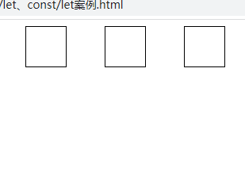

# javaScipt ES6语法


## 1.let、const

### 1.let

#### 1.特性

- 变量不能重复声明

```javascript
let star = '张三'
let star = '张三三'//不能重复声明变量
```

- 只能作用在块级作用域

```javascript
{
    let star = '张三'
    console.log(star)//张三
}
console.log(star)//会报错,即star只能存在于定义它的块级作用域中
```

- 不存在变量提升

```javascript
console.log(star)//error
let star = '张三'
```

- 不影响作用域链

```javascript
//在同一大的作用域内,函数fn中可以调用star
{
    let star = '张三'
    function fn(){
        console.log(star)
    }
    fn()
}
```

---

#### 2.案例

需求:点击item框,修改item的背景色,页面初始为


要实现的效果为



我们要知道js的回调函数是**异步执行**的,而**var**是可以重复声明的，当我们循环遍历item，并为item添加点击onclick回调函数时，循环立即执行，而回调函数会在我们点击item之后执行，所以**当我们点击item时,实际上循环已经完成了**,**此时i的值为3**，而item数组中的最大index为2，故当我们点击item时，item是不会变色的

解决的办法第一个是在回调函数中使用this来修改item的样式，即**this.style.background = ’pink**，这样的话,当我们点击item，js会帮我们寻找回调函数的this指向,这样就能准确的定位到每一个item

而第二个解决办法就是将循环定义的var修改为let

let只能作用在块级作用域，每循环遍历一次都会产生一个作用域块,每个作用域块中的let都只作用域它所处的作用域，所以当我们点击item时，第一个item的i为0 第二个为1 第三个为2，互相不受影响

```html
<div class="container">
        <div class="item"></div>
        <div class="item"></div>
        <div class="item"></div>
    </div>
```

```javascript
let items = document.getElementsByClassName('item')
//方式一
    for (var i = 0; i < items.length; i++) {
        items[i].onclick = function(){
            //items[i].style.background = 'pink' 此时i已为3 页面触发无效
            this.style.background = 'pink'
        }
        
    }
//方式二
	 for (let i = 0; i < items.length; i++) {
        items[i].onclick = function(){
            items[i].style.background = 'pink'
        }
        
    }
```


### 2.const

#### 1.特性

- 必须赋初值

- 常量建议用大写

- 常量的值不能修改

- 对于数组和对象的元素修改，不算做对常量的修改

  如果sonst定义的变量是一个对象或者数组,只要它指向的地址值没有发生改变，就不算对常量的修改

  ```javascript
  const team = ['a','b','c']
  team.push('d')//这个操作是没有问题的,往数组中添加元素并没有更改team‘指向的地址值,不算做为常量的修改 
  ```

  

- 作用在块级作用域

## 2.解构赋值

解构赋值是对赋值运算符的扩展。

他是一种针对数组或者对象进行模式匹配，然后对其中的变量进行赋值。

在代码书写上简洁且易读，语义更加清晰明了；也方便了复杂对象中数据字段获取。

### 1.数组的解构

**基本**

```javascript
let [a, b, c] = [1, 2, 3];
// a = 1
// b = 2
// c = 3
```

**可嵌套**

```javascript
let [a, [[b], c]] = [1, [[2], 3]];
// a = 1
// b = 2
// c = 3
```

**可忽略**

```javascript
let [a, , b] = [1, 2, 3];
// a = 1
// b = 3
```

**不完全解构**

```javascript
let [a = 1, b] = []; // a = 1, b = undefined
```

**剩余运算符**

```javascript
let [a, ...b] = [1, 2, 3];
//a = 1
//b = [2, 3]
```

**字符串**

```javascript
let [a, b, c, d, e] = 'hello';
// a = 'h'
// b = 'e'
// c = 'l'
// d = 'l'
// e = 'o'
```

**解构默认值**

当解构模式有匹配结果，且匹配结果是 undefined 时，会触发默认值作为返回结果。

```javascript
let [a = 2] = [undefined]; // a = 2
```

```javascript
let [a = 3, b = a] = [];     // a = 3, b = 3
let [a = 3, b = a] = [1];    // a = 1, b = 1
let [a = 3, b = a] = [1, 2]; // a = 1, b = 2
```


```javascript
	//1.数组的解构
    const F4 = ['赵本山','小沈阳','刘能','宋小宝']
    let [zhao,xiao,liu,song] = F4
    console.log(zhao);//赵本山
    console.log(xiao);//小沈阳
    console.log(liu);//刘能
    console.log(song);//宋小宝
```


### 2.对象的解构

**基本**

```javascript
let { foo, bar } = { foo: 'aaa', bar: 'bbb' };
// foo = 'aaa'
// bar = 'bbb'
 
let { baz : foo } = { baz : 'ddd' };
// foo = 'ddd'
```

**可嵌套可忽略**

```javascript
let obj = {p: ['hello', {y: 'world'}] };
let {p: [x, { y }] } = obj;
// x = 'hello'
// y = 'world'
let obj = {p: ['hello', {y: 'world'}] };
let {p: [x, {  }] } = obj;
// x = 'hello'
```

**不完全解构**

```javascript
let obj = {p: [{y: 'world'}] };
let {p: [{ y }, x ] } = obj;
// x = undefined
// y = 'world'
```

**剩余运算符**

```javascript
let {a, b, ...rest} = {a: 10, b: 20, c: 30, d: 40};
// a = 10
// b = 20
// rest = {c: 30, d: 40}
```

**解构默认值**

```javascript
let {a = 10, b = 5} = {a: 3};
// a = 3; b = 5;
let {a: aa = 10, b: bb = 5} = {a: 3};
// aa = 3; bb = 5;
```

```javascript
    const zhao = {
        name:'赵本山',
        age:'不详',
        xiaoping:function(){
            console.log("我可以演小品");
        }
    }
    let {name,age,xiaoping} = zhao
    console.log(name);//赵本山
    console.log(age);//不详
    xiaoping()//我可以演小品
```

## 3.模板字符串

- 使用· ·符号而不是‘ ’来引入字符串
- 内容中可以出现换行符(回车即换行)

```javascript
let str = `<ul>
			<li><li>
			<ul`
```


- 可以进行变量拼接,格式必须为${xxx}

```javascript
let a = '吴亦凡'
let out = `${a}进去了`
```

## 4.对象的简化写法

介绍:ES6允许在大括号里直接写入变量和函数作为对象的属性和方法

如果对象中定义的变量名与对象外部需要引入的变量名一样,可以直接写入变量名作为对象的属性和方法

```javascript
let name = '小明'
let change = function(){
    console.log("我是小明")
}
const student = {
    name, //相当于name:name
    change//相当于change:change
}
```

## 5.箭头函数

#### 1.使用

基本使用:

```javascript
let fn = (a,b) => {
    return a+b
}
fn(1,2)
```

简化使用:

​	

```javascript
//当函数的形参有且只有一个时:
let fn = n =>{
    return n*n
}
//当代码体只有一条语句时
let fn1 = x => x*x
```

箭头函数的this指向:

- this是静态的,this始终指向函数声明时所在的作用域下的this的值,不受call的影响

```javascript
function getName(){
    console.log(this.name)
}
function getName2 = () =>{
    console.log(this.name)
}
window.name = '小明'
const person = {
    name:'小红'
}
//直接调用:由于两个函数声明时所在的作用域都是window ,所以两个函数的this指向都是window
getName()//小明
getName2()//小明
//call方法调用:call方法可以传入对象,普通定义的函数的this会变为person,而箭头函数的this不会随之改变
getName.call(school)//小明
getName2.call(school)//小红
```

---

### 2.实例

需求:点击div 2后颜色变成粉色

```html
<div id="ad"></div>
```

```javascript
 const ad = document.getElementById('ad')
    ad.addEventListener('click',function(){
        setTimeout(()=>{
            this.style.background = 'pink'
        },2000)
        
    })
```

我们分析一下上方代码,由于setTimeOut是的作用在window上的方法,它的this指向是window,如果我们在延时函数中使用this来修改div的style是无效的,因为window上并没有style属性,我们需要通过箭头函数来指定它的this指向为**ad**，这样的话我们使用this来修改ad的style就可以成功

## 6.函数参数的默认值

- 给形参定义初始值,位置要靠后,当我们没有给形参传递具体值时,形参会使用初始值，如果传递了具体值,形参为传入的值

```javascript
function add (a,b,c=10){
    return a+b+c
}
console.log(add(1,2,3))//6
console.log(add(1,2))//13

```


- 可以与解构赋值相结合

```javascript
function connect({host="127.0.0.1",username,password,port}){
    console.log(host)// 127.0.0.1
    console.log(username) // root
    console.log(password) // root
    console.log(port)//3306
}
//调用函数
connect({
    username:'root',
    password:;'root',
    port:3306
})
```


## 7.rest参数和剩余运算符的使用

**剩余运算符**:把逗号隔开的值序列组合成一个数组

ES6引入rest参数,用于获取函数的实参，代替arguments

rest与arguments的区别:

- rest是一个参数,必须作为定义形参,而arguments不需要定义形参也可以获取
- rest会将形参转换成数组，而arguments是一个伪数组
- rest参数必须要放到形参的最后

```javascript
	 function fn(){
        console.log(arguments);
    }
    function fn1(...args){
        console.log(args);
    }
	function fn2(a,b,...args){
        console.log(a)
        console.log(b)
        console.log(args)
    }
    fn('张三','李四','王五')//伪数组,包含一些方法
    fn1('张三','李四','王五')//数组实例 ['张三','李四'，‘王五’]
	fn2(1,2,3,4,5,6)// 1 2 [3,4,5,6]
```

·

## 8.扩展运算符

格式: [...]

方法：数组或类数组对象展开成一系列用逗号隔开的值

```javascript
const arr1 =['a','b','c']
const arr2 =['1','2','3']
const arr3 = [...arr1,...arr2]
console.log(arr3)//['a','b','c','1','2','3']
```

```javascript
let s = '12345'
let arr = [...s]
console.log(arr);[1,2,3,4,5]
```


## 9.Symbol

### 1.介绍

Symbol是Es6新增的第七种原始数据类型,在Es6之后,javascript所包含的原始数据类型分别为**Number**、**String**、**Object**、**null**、**Boolean**、**undefined**、**Symbol**

symbol 英文意思为 符号、象征、标记、记号，在 js 中更确切的翻译应该为 **独一无二的值**

基本创建方法

**需要注意的是通过 Symbol 方法创建值的时候不用使用 new 操作符，原因是通过 new 实例化的结果是一个 object 对象，而不是原始类型的 symbol**

```javascript
const s =Symbol()
```

Symbol方法接收一个参数,表示对生成的symbol值的一种**描述**

```javascript
const s = Symbol('123')
```

即使是传入相同的参数，生成的 symbol 值也是不相等的，因为 Symbol 本来就是独一无二的意思

```javascript
const foo = Symbol('foo');
const bar = Symbol('foo');
console.log(foo === bar); // false
```

若属性为Symbol类型，则该属性不会出现在for...in、for...of中，也不会通过使用Object.keys()、Object.getOwnPropertyName()得到，若想要得到，则需要使用Object.getOwnPropertySymbol()

```javascript
let name = Symbol("jyy");
let obj = {
  name : "beijing",
  [name] : "hebei"
};
for(let item in obj){
  console.log(item);  // name 不能遍历Symbol类型属性
}
console.log(Object.keys(obj));  // [ 'name' ] 不能得到Symbol类型属性
console.log(Object.getOwnPropertyNames(obj)); // [ 'name' ] 不能得到Symbol类型属性
console.log(Object.getOwnPropertySymbols(obj)); // [ Symbol(jyy) ]  只得到Symbol类型属性
```

.将对象的属性设置为Symbol类型

注意对象中Symbol属性名必须存在,比如name已在外部定义,我们才能在对象中设置name为Symbol属性

```javascript
let name = Symbol("zzm");
let obj = {
  name : "beijing",
  [name] : "hebei"
};
console.log(obj); // { name: 'beijing', [Symbol(zzm)]: 'hebei' }
console.log(obj.name);  // beijing
console.log(obj["name"]); //beijing
console.log(obj[name]); //hebei
```


---

### 2.Symbol的方法

Symbol.for：Symbol.for 方法可以检测上下文中是否已经存在使用该方法且相同参数创建的 symbol 值，如果存在则返回已经存在的值，如果不存在则新建。

```javascript
const a1 = symbol('123')
const a2 = symbol('123')
console.log(a1===a2)//false

const s1 = Symbol.for('foo');//此时不存在参数为‘foo'的symbol,则新建一个Symbol类型并存入symbol表中
const s2 = Symbol.for('foo');//此时存在参数为'foo'的Symbol,则直接返回已经存在的Symbol
console.log(s1 === s2); // true 两个变量指向的Sybmol相同 返回true
```

Symbol.keyFor 方法返回一个使用 Symbol.for 方法创建的 symbol 值的 key

```javascript
const foo = Symbol.for("foo");
const key = Symbol.keyFor(foo);
console.log(key) // "foo"

```

### 3.Symbol的内置属性值

**Symbol.hasInstance**：其它对象使用instanceof运算符的时候会使用该属性名指向的内部方法。

**Symbol.isConcatSpreadable**:可以直接定义为对象属性或继承而来，它是布尔类型。它可以控制数组或类似数组（array-like）的对象的行为：
	1.对于数组对象，默认情况下，用于concat时，会按数组元素展开然后进行连接（数组元素作为新数组的元素）。重置Symbol.isConcatSpreadable可以改变默认行为。
	2.对于类似数组的对象，用于concat时，该对象整体作为新数组的元素，重置Symbol.isConcatSpreadable可改变默认行为。
	
**Symbol.species**：species 访问器属性允许子类覆盖对象的默认构造函数。

**Symbol.match**：指定了匹配的是正则表达式而不是字符串。String.prototype.match() 方法会调用此函数。此函数还用于标识对象是否具有正则表达式的行为。
		比如， String.prototype.startsWith()，String.prototype.endsWith() 和 String.prototype.includes() 
	这些方法会检查其第一个参数是否是正则表达式，是正则表达式就抛出一个TypeError。现在，如果 match symbol 设置为false（或者一个 假值），就表示该对象不打算用作正则表达式对象。

**Symbol.replace**：这个属性指定了当一个字符串替换所匹配字符串时所调用的方法。

**Symbol.search**：指定了一个搜索方法，这个方法接受用户输入的正则表达式，返回该正则表达式在字符串中匹配到的下标，这个方法由以下的方法来调用 String.prototype.search()。

**Symbol.split**：指向 一个正则表达式的索引处分割字符串的方法。

**Symbol.iterator**：为每一个对象定义了默认的迭代器。该迭代器可以被 for...of 循环使用。

**Symbol.toPrimitive**：是一个内置的 Symbol 值，它是作为对象的函数值属性存在的，当一个对象转换为对应的原始值时，会调用此函数。

**Symbol.toStringTag**：是一个内置 symbol，它通常作为对象的属性键使用，对应的属性值应该为字符串类型，这个字符串用来表示该对象的自定义类型标签，通常只有内置的 Object.prototype.toString() 方法会去读取这个标签并把它包含在自己的返回值里。

**Symbol.unscopables**：指用于指定对象值，其对象自身和继承的从关联对象的 with 环境绑定中排除的属性名称。


## 10.迭代器

### 1.定义

JavaScript 原有的表示“集合”的数据结构，主要是数组（`Array`）和对象（`Object`），ES6 又添加了`Map`和`Set`。这样就有了四种数据集合，用户还可以组合使用它们，定义自己的数据结构，比如数组的成员是`Map`，`Map`的成员是对象。这样就需要一种统一的接口机制，来处理所有不同的数据结构。

**遍历器**（Iterator）就是这样一种机制。它是一种接口，为各种不同的数据结构提供统一的访问机制。任何数据结构只要部署 Iterator 接口，就可以完成遍历操作（即依次处理该数据结构的所有成员）。

**Iterator** 的作用有三个：一是为各种数据结构，提供一个统一的、简便的访问接口；二是使得数据结构的成员能够按某种次序排列；三是 ES6 创造了一种新的遍历命令`for...of`循环，Iterator 接口主要供`for...of`消费。

**Iterator** 的遍历过程是这样的。

（1）创建一个指针对象，指向当前数据结构的起始位置。也就是说，遍历器对象本质上，就是一个指针对象。

（2）第一次调用指针对象的`next`方法，可以将指针指向数据结构的第一个成员。

（3）第二次调用指针对象的`next`方法，指针就指向数据结构的第二个成员。

（4）不断调用指针对象的`next`方法，直到它指向数据结构的结束位置。

每一次调用`next`方法，都会返回数据结构的当前成员的信息。具体来说，就是返回一个包含`value`和`done`两个属性的对象。其中，`value`属性是当前成员的值，`done`属性是一个布尔值，表示遍历是否结束。

**介绍**:迭代器是一种特殊对象，它具有一些专门为迭代过程设计的专有接口，所**有的迭代器对象都有一个next()方法，每次调用都返回一个结果对象**。结果对象有两个属性：一个是**value**，表示下一个将要返回的值；另一个是**done**，它是一个布尔类型的值，当没有更多可返回数据时返回true。迭代器还会保存一个内部指针，用来指向当前集合中值的位置，每调用一次next()方法，都会返回下一个可用的值

---

使用es5的语法创建一个迭代器

```javascript
function createIterator(items){
        let index= 0;
        return{
            next:function(){
                if(index<items.length){
                    const result = {value:items[index],done:false}
                    index++
                    return result
                }else{
                    return {value:items[index],done:'done'}
                }
            }
        }
    }
    var iterator = createIterator([1, 2, 3]);
    console.log(iterator.next()); //{value: 1, done: false}
    console.log(iterator.next()); //{value: 2, done: false}
    console.log(iterator.next()); //{value: 3, done: false}
    console.log(iterator.next()); //{value: undefined, done: done}
```

createIterator()方法返回的对象有一个next()方法，每次调用时，items数组的下一个值会作为value返回。当i为3时，done变为true；

### 2.具有默认lterator接口的数据结构

Iterator 接口的目的，就是为所有数据结构，提供了一种统一的访问机制，即`for...of`循环（详见下文）。当使用`for...of`循环遍历某种数据结构时，该循环会自动去寻找 Iterator 接口。

一种数据结构只要部署了 **Iterator** 接口，我们就称这种数据结构是“**可遍历的**”（iterable）。

ES6 规定，默认的 Iterator 接口部署在数据结构的`Symbol.iterator`属性，或者说，一个数据结构只要具有`Symbol.iterator`属性，就可以认为是“可遍历的”（iterable）。`Symbol.iterator`属性本身是一个函数，就是当前数据结构默认的遍历器生成函数。执行这个函数，就会返回一个遍历器。至于属性名`Symbol.iterator`，它是一个表达式，返回`Symbol`对象的`iterator`属性，这是一个预定义好的、类型为 Symbol 的特殊值，所以要放在方括号内

总之:**通过调用含有迭代器的数据结构的`[Symbol.lterator]`方法,就可以获取这个数据结构的迭代器**

对于以下几种数据接口或者类型,是具有原生iterator接口的：

- Array
- Map
- Set
- String
- TypedArray
- 函数的 arguments 对象
- NodeList 对象

**为什么对象(object)不具备lterator遍历器?**

对象（Object）之所以没有默认部署 Iterator 接口，是因为对象的哪个属性先遍历，哪个属性后遍历是不确定的，需要开发者手动指定。本质上，遍历器是一种线性处理，对于任何非线性的数据结构，部署遍历器接口，就等于部署一种线性转换。不过，严格地说，对象部署遍历器接口并不是很必要，因为这时对象实际上被当作 Map 结构使用，ES5 没有 Map 结构，而 ES6 原生提供了。

如果需要在对象上添加迭代器，就必须在对象上自定义[Symbol.lterator]方法,让其返回一个迭代器

### 3.调用lterator的场合

- **解构赋值**

  对数组和 Set 结构进行解构赋值时，会默认调用`Symbol.iterator`方法。

- **拓展运算符**

  扩展运算符（…）也会调用默认的 Iterator 接口。

- **yield***

  `yield*`后面跟的是一个可遍历的结构，它会调用该结构的遍历器接口。

- **其他场合**

  由于数组的遍历会调用遍历器接口，所以任何接受数组作为参数的场合，其实都调用了遍历器接口。下面是一些例子。

  - for…of
  - Array.from()
  - Map(), Set(), WeakMap(), WeakSet()（比如`new Map([['a',1],['b',2]])`）
  - Promise.all()
  - Promise.race()

## 11.生成器

### 1.定义

介绍:生成器是一种返回迭代器的函数，通过function关键字后的星号(*)来表示，函数中会用到新的关键字yield。星号可以紧挨着function关键字，也可以在中间添加一个空格

基本使用

```javascript
// 生成器
function *createIterator() {
    yield 1;
    yield 2;
    yield 3;
}
// 生成器能像正规函数那样被调用，但会返回一个迭代器
let iterator = createIterator();
console.log(iterator.next().value); // 1
console.log(iterator.next().value); // 2
console.log(iterator.next().value); // 3
```

createlterator()前的**星号**表明它是一个生成器；**yield**关键字也是ES6的新特性，**可以通过它来指定调用迭代器的next()方法时的返回值及返回顺序**。生成迭代器后，连续3次调用它的next()方法返回3个不同的值，分别是1、2和3。生成器的调用过程与其他函数一样，最终返回的是创建好的迭代器

　使用**yield**关键字可以返回任何值或表达式，所以可以通过生成器函数批量地给迭代器添加元素。例如，可以在循环中使用yield关键字

```javascript
function *createIterator(items) {
    for (let i = 0; i < items.length; i++) {
        yield items[i];
    }
}
let iterator = createIterator([1, 2, 3]);
console.log(iterator.next()); // "{ value: 1, done: false }"
console.log(iterator.next()); // "{ value: 2, done: false }"
console.log(iterator.next()); // "{ value: 3, done: false }"
console.log(iterator.next()); // "{ value: undefined, done: true }"
// 之后的所有调用
console.log(iterator.next()); // "{ value: undefined, done: true }"
```


---


生成器的一个很大的功能就是执行异步任务

下面我们来模拟获取数据的异步任务:现在我们要获取用户数据、订单数据、商品数据三类数据,要求在获取到用户数据后获取订单数据，最后获取商品数据

```javascript
   function getUsers(){
       setTimeout(()=>{
           let data = '用户数据'
           iterator.next(data)
       },1000)
   }
   function getOrders(){
       setTimeout(()=>{
           let data = '订单数据'
           iterator.next(data)
       },1000)
   }
   function getGoods(){
       setTimeout(()=>{
           let data = '商品数据'
           iterator.next(data)
       },1000)
   }
   function * gen(){
       const users = yield getUsers()
       console.log(users);//用户数据
       const orders = yield getOrders()
       console.log(orders);//订单数据
       const goods = yield getGoods()
       console.log(goods);//商品数据
   }
   let iterator = gen()
   iterator.next()
```


我们在获取到数据后,调用迭代器的next方法,这样就能保证数据是一步一步获取的,达到了同步执行异步任务的效果

## 12.promise

### 1.介绍

> **Promise** 对象是一个代理对象（代理一个值），被代理的值在Promise对象创建时可能是未知的。它允许你为异步操作的成功和失败分别绑定相应的处理方法（handlers）。 这让异步方法可以像同步方法那样返回值，但并不是立即返回最终执行结果，而是一个能代表未来出现的结果的promise对象

### 2.Promise的三种状态

1. pending(待定的)
2. fulfilled(已解决的)
3. rejected(已拒绝的)

### 3.示例

1.创建Promise实例

```javascript
var promise = new Promise(function(resolve, reject){
    // ... some code
    if (/* 异步操作成功 */) {
        resolve(value);
    } else {
        reject(error);
    }
})
```

2.then用法

```javascript
function sleep(ms) {
    return new Promise(function(resolve, reject) {
        setTimeout(resolve, ms);
    })
}
sleep(500).then( ()=> console.log("finished"));//等待了500ms后打印 ’finishied‘
```

3.链式使用

```javascript
    var p = new Promise(function(resolve,reject){
        resolve(1)
    })
    p.then(function(value){
        console.log("第一个then",value);//1
        return value*2
    }).then(function(value){
        console.log("第二个then",value);//2
    }).then(function(value){
        console.log("第三个then",value);//undefined 上一个then没有返回promise对象,得不到形参
        return Promise.resolve('resolve')
    }).then(function(value){
        console.log("第四个then",value);//上一个then传递了promise对象,可以接收到参数
        return Promise.reject('reject')
    }).then(function(value){
        console.log("resolve",value);//上一个then返回的是reject的promise对象,故第五个then中的函数不执行
    }).catch(function(reject){
        console.log("reject",reject);//捕获reject错误
    })
```

4.关于promise的执行顺序

**同步任务-->异步微任务-->异步宏任务**

当我们new一个Promise时，传入的回调函数为同步代码 ，会立即执行，而.then() .catch()里的为异步微任务。setTimeout这类的延时函数为异步宏任务

```javascript
// 由于Promise传入的回调函数是同步任务 故会在执行栈立即执行
        const p = new Promise((resolve, reject) => { 
            // 发现宏任务，放入浏览器宿主环境等待执行
            setTimeout(() => {
                console.log('异步执行完了');
                resolve('成功')
            }, 2000)
        })
 
        // .then()为微任务 等待当前所有同级的同步任务和宏任务执行完再执行
        p.then((res) => console.log('res', res)) 
 
        // 同步任务立即执行
        console.log('p', p);
```

### 4.Promise的缺点

- 1.无法取消Promise,一旦新建它就会立即执行，无法中途取消
- 2.如果不设置回调函数，Promise内部抛出的错误，不会反映到外部
- 3.当处于pending状态时，无法得知目前进展到哪一个阶段，是刚刚开始还是即将完成

### 5.promise.all

> Promise.all() 方法接收一个promise的iterable类型（注：Array，Map，Set都属于ES6的iterable类型）的输入，并且只返回一个[`Promise`](https://developer.mozilla.org/zh-CN/docs/Web/JavaScript/Reference/Global_Objects/Promise)实例， 那个输入的所有promise的resolve回调的结果是一个数组。这个[`Promise`](https://developer.mozilla.org/zh-CN/docs/Web/JavaScript/Reference/Global_Objects/Promise)的resolve回调执行是在所有输入的promise的resolve回调都结束，或者输入的iterable里没有promise了的时候。它的reject回调执行是，只要任何一个输入的promise的reject回调执行或者输入不合法的promise就会立即抛出错误，并且reject的是第一个抛出的错误信息。

```javascript
const promise1 = Promise.resolve(3);
const promise2 = 42;
const promise3 = new Promise((resolve, reject) => {
  setTimeout(resolve, 100, 'foo');
});

Promise.all([promise1, promise2, promise3]).then((values) => {
  console.log(values);
});
// expected output: Array [3, 42, "foo"]

```

[参数](https://developer.mozilla.org/zh-CN/docs/Web/JavaScript/Reference/Global_Objects/Promise/all#参数)

- iterable

  一个[可迭代](https://developer.mozilla.org/en-US/docs/Web/JavaScript/Reference/Iteration_protocols#The_iterable_protocol)对象，如 [`Array`](https://developer.mozilla.org/zh-CN/docs/Web/JavaScript/Reference/Global_Objects/Array) 或 [`String`](https://developer.mozilla.org/zh-CN/docs/Web/JavaScript/Reference/Global_Objects/String)。

[返回值](https://developer.mozilla.org/zh-CN/docs/Web/JavaScript/Reference/Global_Objects/Promise/all#返回值)

- 如果传入的参数是一个空的可迭代对象，则返回一个**已完成（already resolved）**状态的 [`Promise`](https://developer.mozilla.org/zh-CN/docs/Web/JavaScript/Reference/Global_Objects/Promise)。
- 如果传入的参数不包含任何 `promise`，则返回一个**异步完成（asynchronously resolved）** [`Promise`](https://developer.mozilla.org/zh-CN/docs/Web/JavaScript/Reference/Global_Objects/Promise)。注意：Google Chrome 58 在这种情况下返回一个**已完成（already resolved）**状态的 [`Promise`](https://developer.mozilla.org/zh-CN/docs/Web/JavaScript/Reference/Global_Objects/Promise)。
- 其它情况下返回一个**处理中（pending）**的[`Promise`](https://developer.mozilla.org/zh-CN/docs/Web/JavaScript/Reference/Global_Objects/Promise)。这个返回的 `promise` 之后会在所有的 `promise` 都完成或有一个 `promise` 失败时**异步**地变为完成或失败。 见下方关于“Promise.all 的异步或同步”示例。返回值将会按照参数内的 `promise` 顺序排列，而不是由调用 `promise` 的完成顺序决定。

[说明](https://developer.mozilla.org/zh-CN/docs/Web/JavaScript/Reference/Global_Objects/Promise/all#说明)

此方法在集合多个 `promise` 的返回结果时很有用。

完成（Fulfillment）：
如果传入的可迭代对象为空，`Promise.all` 会同步地返回一个已完成（resolved）状态的`promise`。
如果所有传入的 `promise` 都变为完成状态，或者传入的可迭代对象内没有 `promise`，`Promise.all` 返回的 `promise` 异步地变为完成。
在任何情况下，`Promise.all` 返回的 `promise` 的完成状态的结果都是一个数组，它包含所有的传入迭代参数对象的值（也包括非 `promise` 值）。

失败/拒绝（Rejection）：
如果传入的 `promise` 中有一个失败（rejected），`Promise.all` 异步地将失败的那个结果给失败状态的回调函数，而不管其它 `promise` 是否完成。

[示例](https://developer.mozilla.org/zh-CN/docs/Web/JavaScript/Reference/Global_Objects/Promise/all#示例)

[`Promise.all` 的使用](https://developer.mozilla.org/zh-CN/docs/Web/JavaScript/Reference/Global_Objects/Promise/all#promise.all_的使用)

`Promise.all` 等待所有都完成（或第一个失败）。

```
var p1 = Promise.resolve(3);
var p2 = 1337;
var p3 = new Promise((resolve, reject) => {
  setTimeout(resolve, 100, 'foo');
});

Promise.all([p1, p2, p3]).then(values => {
  console.log(values); // [3, 1337, "foo"]
});
```

Copy to Clipboard

如果参数中包含非 `promise` 值，这些值将被忽略，但仍然会被放在返回数组中（如果 `promise` 完成的话）：

```javaScript
// this will be counted as if the iterable passed is empty, so it gets fulfilled
var p = Promise.all([1,2,3]);
// this will be counted as if the iterable passed contains only the resolved promise with value "444", so it gets fulfilled
var p2 = Promise.all([1,2,3, Promise.resolve(444)]);
// this will be counted as if the iterable passed contains only the rejected promise with value "555", so it gets rejected
var p3 = Promise.all([1,2,3, Promise.reject(555)]);

// using setTimeout we can execute code after the stack is empty
setTimeout(function(){
    console.log(p);
    console.log(p2);
    console.log(p3);
});

// logs
// Promise { <state>: "fulfilled", <value>: Array[3] }
// Promise { <state>: "fulfilled", <value>: Array[4] }
// Promise { <state>: "rejected", <reason>: 555 }
```

总结:

- 传入一个promise数组
- 如果传入的参数含有非promise,这些值将被忽略，但仍然会被放在返回数组中（如果 `promise` 完成的话）：
- 如果数组中的promise都成功,则返回一个数组
- 如果存在某一个promise失败,则返回失败的回调
- **也就是说 谁跑的慢,以谁为准执行回调**

有了all，你就可以并行执行多个异步操作，并且在一个回调中处理所有的返回数据，是不是很酷？*有一个场景是很适合用这个的，一些游戏类的素材比较多的应用，打开网页时，预先加载需要用到的各种资源如图片、flash以及各种静态文件。所有的都加载完后，我们再进行页面的初始化。*


作者：蔓蔓雒轩
链接：https://juejin.cn/post/6844903607968481287
来源：稀土掘金
著作权归作者所有。商业转载请联系作者获得授权，非商业转载请注明出处。

```javascript

const promise1 = new Promise((resolve, reject) => {
    console.log("promise1");
    resolve(1);
});
const promise2 = new Promise((resolve, reject) => {
    resolve(2);
});
const promise3 = new Promise((resolve, reject) => {
    // reject(3);
    resolve(3);
});

let p = Promise.all([promise1,promise2,promise3])

p.then((res) => {
    // 三个都成功则成功  
    console.log("res",res); //[1,2,3]
},(err) => {
    // 只要有失败，则失败
    console.log("err",err);
})

var p1 = Promise.all([1,2,3])
.then((res) => {console.log(res);})
console.log(p1); // [1,2,3]
```


### 6.promise.race

**`Promise.race(iterable)`** 方法返回一个 promise，一旦迭代器中的某个promise解决或拒绝，返回的 promise就会解决或拒绝。


**race的使用场景**：比如我们可以用race给某个异步请求设置超时时间，并且在超时后执行相应的操作，代码如下：

**用法与promise.all类似,传入promise数组**

```javascript
const promise1 = new Promise(function(resolve, reject) {
    // resolve(1);
    reject(1);
})

const promise2 = new Promise(function(resolve, reject) {
    resolve(2);
})

const promise3 = new Promise(function(resolve, reject) {
    resolve(3);
})

const p = Promise.race([promise1,promise2,promise3])

p
.then((data) => {
    console.log("data",data);
})
.catch((err) => {
    console.log("err",err);//1
})
```


## 13.Set

### 介绍

ES6 提供了新的数据结构 **Set**。它类似于**数组**,，但是**成员的值都是唯一的，没有重复的值。**集合实现了ierator接口,所以可以使用【拓展运算符】和[for..of..]遍历

Set本质上是一个**对象**

由于set集合中的值是唯一的,所以可以用来过滤数组

```javascript
let s = new Set(['a','b','b','a'])
console.log(s)//{'a', 'b'}

```


### 方法

创建set

```javascript
let s = new Set()
console.log(typeof s)//Object
```

添加数据

```javascript
s.add('123')
```

删除元素

```javascript
s.delete('123')
```

检测set集合中是否包含某个元素

```javascript
console.log(s.has('123'))
```

获取set集合中的元素个数

```java
console.log(map.size())
```

---

### 实例

需求:获取两个数组的交集、并集、差集

```javascript
let arr = [1,2,3,4,5,4,3,2,1]
let arr2 = [4,5,6,5,6]
//求交集
let result = [...new Set(arr)].filter((item)=>{
    return new Set(arr2).has(item)
})
console.log(result);
//求并集
let result1 = new Set([...arr,...arr2])
console.log(result1);
//求差集
let result2 = [...result1].filter((item)=>{
    return new Set(result).has(item)?false:true
})
console.log(result2);
```


## 14.Map

### 介绍

Map是一个es6中新的数据结构,一个map就是一个**键值对集合**,每个键值对由 **key**和**value**组成,**其中key是唯一的，不能重复**

Map的本质是一个对象 

### 使用方法:

创建Map

```javascript
let m = new Map()
console.log(typeof m)//object
```

向Map中添加元素

```javascript
m.set('name','小张')//添加字符串
m.set('change',function(){//添加方法
    console.log("我是小张!!")
})
let key = {
    school:'朝阳小学'
}
m.set('key',['北京','上海','深圳'])//添加对象作为key，数组作为value
```

向Map中获取元素

```javascript
console.log(m.get('name'))//小张
console.log(m.get('change'))//function(){...}
console.log(m.get('key'))//['北京','上海','深圳']
```

检测map集合中是否包含某个元素,返回Boolean值

```javascript
console.log(m.has('name'))//true
```


向Map中删除元素

```javascript
m.delete('name')
```

清空Map

```javascript
m.clear()
```

遍历map

打印出来的每个v都是数组形式,**数组的第一个值是键名,第二个值是键值**

```javascript
for(let v of m){
    console.log(v)
}
```

获取map中键值对的数量

```javascript
console.log(m.size)
```


## 15.使用map对对象数组去重

```javascript
//使用 map  
function unique(arr) {
        const map = new Map()
        return arr.filter( item => !map.has(JSON.stringify(item)) && 				       	 map.set(JSON.stringify(item), 1))
    }
  	let objArr = [
        {name:'张振明',age:19},
        {name:'张振明',age:19},
        {name:'张振明',age:18},
    ]
	console.log(unique(objArr)); 
//使用 set，Array.map()是数组的一个方法,其功能是返回一个经过处理的新数组,不是es6的新数据结构map
//过程是 先将数组中的元素转化成字符串,然后通过将数组转换成set集合对其进行去重,然后将set转换回数组,最后将数组中的字符串元素转化成正常的对象
function unique(arr) {
  return [...new Set(arr.map(e => JSON.stringify(e)))].map(e => JSON.parse(e))
}
```

## 16.class

### 1.介绍

es6引入了class的概念作为对象的模板,通过class关键字可以定义类

class可以看作一个语法糖,它的绝大部分功能都可以通过es5实现,但是class写法更接近面向编程

### 2.使用

定义类

**constructor**是类的默认方法,在我们创建类的实例化对象时被调用

```javascript
  class Phone{
        constructor(x,y){
            this.x = x
            this.y = y
            console.log("创建类的实例化对象时调用我")
        }
    }
let phone = new Phone() //此时自动调用Phone类的constructor方法
```

类的公共属性、静态属性、实例属性

**公共属性**:构造函数和实例对象都能调用的属性

**静态属性**:class 本身的属性，即直接定义在类内部的属性（ Class.propname ），不需要实例化。

**实例属性**:定义在实例对象（ this ）上的属性。

```javascript
  class Phone{
        constructor(brand,price){
            this.brand = brand
            this.price = price
        }
      	static a = 1//这是静态属性,实例对象不能调用
        b = 2 //这是实例属性,可以在实例对象中调用
        call(){//构造函数的方法,实例对象也拥有此方法
            console.log("我是撒杯");
        }
    }
    Phone.prototype.c = 3;//这是公共属性 实例和类都能调用
```

### 3.类的继承

当我们的一个构造函数需要调用另一个构造函数的方法或者属性时,需要用到继承

下面我们尝试使用**es5**的原型链继承实现此需求

```javascript

    function phone(brand,price){
        this.brand = brand
        this.price = price
        this.call = function(){
            console.log("我可以打电话");
        }
    }
    
    function smartPhone(brand,price,color,size){
        //通过call方法使用phone中的属性
        phone.call(this,brand,price)
        this.color = color
        this.size = size

    }
	//通过原型链的继承实现对phone构造函数的方法的继承
    smartPhone.prototype = new phone()
    smartPhone.prototype.constructor = smartPhone
	
    smartPhone.prototype.playGame =function(){
        console.log("我可以玩游戏");
    }

    const oppo = new smartPhone("oppo",1999,'blue',1.7)
    console.log(oppo);
    oppo.call()
```

使用es6来实现此需求

```javascript
    class phone{
        constructor(brand,price){
            this.brand = brand
            this.price = price
        }
        call(){
            console.log("我可以打电话");
        }
    }
    class smartPhone extends phone{
        constructor(brand,price,color,size){
            super(brand,price)
            this.color = color
            this.sieze = size
        }
        playGame(){
            console.log("我可以玩游戏");
        }
    }
    const xiaomi = new smartPhone('小米',1999,'red','1.5')
    console.log(xiaomi);

```

使用**extends**来标识父类和子类,使用**super**来调用父类的默认方法

对比es5和es6的方法,显而易见es6的class更符合**面向对象**编程的规则,更加容易理解

---

### 4.class的getter和setter

当需要获取price时会调用getter方法

当需要修改price的值时会调用setter方法

```javascript

    class Phone{
        a = 1
        get price(){
            console.log("价格属性被读取了");
            return this.a
        }
        set price(newVal){
            console.log("价格属性被修改了");
            this.a = newVal
        }
         

    }
    let s = new Phone()
    console.log(s.price);//1
    s.price = '2'
    console.log(s.price);//2

```

## 17.Number数值的拓展

### 1.方法

1.二进制和八进制表示

​	二进制使用前缀0b

​	八进制使用前缀0o

```javascript
    let b = 0b1010 //二进制,在二进制数字前加上前缀0b
    let o = 0o777   //八进制,在八进制数字前加上前缀0o
    console.log(b,o);//10 511 表示转化成十进制后的数
```

2.检测一个数是否为有限数 Number.isFinite()

```javascript
 	console.log(Number.isFinite(100));//true
    console.log(Number.isFinite(100/0));//flase
    console.log(Number.isFinite(Infinity));//false
```

3.判断一个数是否为NaN Number.isNaN()

```javascript
console.log(Number.isNaN(123));//false
```

4.将字符串转化成整数或者浮点数

​	转化成整数:Number.parseInt()

​	转化成浮点数:Number.parsFloat()

​	这两个方法只能将**第一个数值**抽取

```javascript
    console.log(Number.parseInt('5211314love'));//5211314
    console.log(Number.parseFloat('3.1415926牛逼'));//3.1415926
    console.log(Number.parseInt('520love1314'));//520
    console.log(Number.parseInt('3.1415926牛逼'));//3
```

5.判断一个数是否为整数 Number.idInteger()

```javascript
	console.log(Number.isInteger(5));//true
    console.log(Number.isInteger(2.5));//false
```

6.将数字的小数部分抹掉 Math.trunc()

```javascript
	console.log(Math.trunc(3.1415926));//3
    console.log(Math.trunc(-3.5));//-3

```

7.判断一个数是正数 负数还是 0 Math.sign()

正数返回1 0返回0 负数返回-1

```javascript
	console.log(Math.sign(100));//1
    console.log(Math.sign(0));//0
    console.log(Math.sign(-100));//-1
```


## 18对象方法拓展

### 1.Object.js

判断两个值是否完全相等

与 === 功能类似,不同的是 === 判断两个NaN是false,而Object.js则是true

```javascript
console.log(Object.is(100,100)) // true
console.log(Object.is(NaN,NaN)) //true
console.log(NaN === NaN ) //false
```


### 2.Object.assign

将两个对象进行合并,如果两个对象有相同的属性,则后者覆盖前者,如果没有,则将新的书属性添加

```javascript
const student1 = {
    name:'小明',
    age:19,
    grade:1
}
const student2 = {
    name:'小红',
    age:10,
    money:1000
}
const result = Object.assign(student1,student2)
console.log(result)//{name:'小红',age:10,grade:1,money:1000}
```


### 3.Object.setPrototypeOf Object.getPrototypeOf

Object.setPrototypeOf:设置原型对象

Object.getPrototypeOf:获取原型对象

```javascript
const school = {
    name:'朝阳小学'
}
const cities = {
    xiaoqu:['北京','上海','深圳']
}
Object.setPrototypeOf(school,cities)
Object.getPrototypeOf(school)
```

对school设置原型对象后


## 19.es6中模块的导入与导出

### 1.export导出

#### 1.分别暴露

```javascript
//分别暴露 m1.js
export const a = 1
export function fun(){
    console.log("我是分别暴露的函数");
}
```


#### 2.统一暴露

```javascript
//统一暴露 m2.js
let school = '朝阳小学'
function getSchool(){
    console.log(school);
}
export {school,getSchool}
```


#### 3.默认暴露

暴露的值是一个名为default的对象,所以要以default.xxx的方式引用

```javascript
//默认暴露 m3.js
export default {
    school:'大哥大',
    change:function(){
        console.log("我们可以改变世界!");
    }
}
```


### 2.import导入

#### 1.通用导入方式 

方式为 import * as xx(修改引用名) from ‘xxx’(要引入的模块的地址)

```javascript
import * as m1 from './js/m1.js'
console.log(m1.a)
m1.fun()
import * as m3 from './js/m3.js'
console.log(m3);
console.log(m3.default.school);
```

#### 2.解构赋值的形式导入

方式为import {a,b}(es6中解构赋值的形式获取模块暴露的变量) from ’xxx‘(要引入的模块的地址) 

```javascript
	import {a,fun} from './js/m1.js'
    console.log(a);
    import {school,getSchool} from './js/m2.js'
    console.log(school);
    import {default as m3} from './js/m3.js'//将默认暴露的default对象用变量m3来接收
    m3.change()
```


#### 3.简便形式 针对默认暴露

针对默认暴露 不需要像通用导入和解构赋值一样使用default.属性来调用

```javascript
   import m3 from './js/m3.js'
    console.log(m3);
    console.log(m3.school)
    m3.change()
```


## 17.async/await

### 1.介绍

  async 是一个修饰符，async 定义的函数会默认的返回一个Promise对象resolve的值，因此对async函数可以直接进行then操作,返回的值即为then方法的传入函数

```javascript
async function fun(){
        return new Promise((resolve,reject)=>{
            // resolve("执行成功!")
            reject('执行失败!')
        })
    }   
    fun().then(resolve=>{
        console.log("resolve:",resolve);
    },reject=>{
        console.error("reject",reject);
    })
```

await 也是一个修饰符，

await 关键字 只能放在 async 函数内部， await关键字的作用 就是获取 Promise中返回的内容， 获取的是Promise函数中resolve或者reject的值

如果await 后面并不是一个Promise的返回值，则会按照同步程序返回值处理

```javascript
    function add(a){
        return new Promise((resolve,reject)=>{
            setTimeout(()=>{
                resolve(a+10)
            },1000) 
        })
    }

    async function fun(){
        const a = await add(10)
        console.log(a);
        const b = await add(a)
        console.log(b);
        const c = await add(b)
        console.log(c);
    }   
    fun()//一秒钟后返回20 再过一秒返回30 再过一秒返回40
```

### 2.功能

结合async与await可以更方便的对异步函数进行同步操作

使用场景可以是:用户调用函数,需要从数据库中拿到数据,再对数据进行整理最后打印到页面,因为ajax请求本身是异步函数,我们需要对ajax请求添加await关键字将请求同步,从而拿到数据再对其操作，如果不使用async/await或者promise(async/await实际就是对promise的封装),函数会在没有拿到数据的时候就执行下面的操作，会导致页面渲染出错

```javascript
//async/await 代码执行顺序为 发起ajax请求 => console.log(...)
async getData(){
    const responce = await ....//(ajax请求请求,获取后端数据)
    console.log(responce.data)//此时已经拿到数据,可以正常输出
}
// 代码执行顺序为 consloe.log => 发起ajax请求
  getData(){
    const responce =  ....//(ajax请求,获取后端数据)
    console.log(responce.data)//执行此方法时 responce没有获取到数据,输出会错误
}
```

## 18.find方法

find() 方法返回的结果内存指向依然是 memoList 所指向的内存地址

## 19.proxy

### 1.概述

**Proxy** 对象用于创建一个对象的代理，从而实现基本操作的拦截和自定义（如属性查找、赋值、枚举、函数调用等）。

Proxy 可以理解成，在目标对象之前架设一层“**拦截**”，外界对该对象的访问，都必须先通过这层拦截，因此提供了一种机制，可以对外界的访问进行过滤和改写。Proxy 这个词的原意是代理，用在这里表示由它来“代理”某些操作，可以译为“**代理器**”。

### 2.创建proxy实例

`const p = new Proxy(target, handler)`

参数:

**target**：要使用 `Proxy` 包装的目标对象（可以是任何类型的对象，包括原生数组，函数，甚至另一个代理）。

**handler**:一个通常以函数作为属性的对象，各属性中的函数分别定义了在执行各种操作时代理 `p` 的行为。

示例:

```javascript

let obj = {};

//代理obj对象
const p = new Proxy(obj,{
    get(...){
        
    },
    set(...){
        
    },
    ...
    
})

```

### 3.Proxy的实例方法

#### 1.**get**

get方法用于拦截对象的读取属性操作

当获取代理对象上的某个属性时,或先调用get方法，并返回get方法的返回值

**参数**

**target**:目标对象

**property**:被获取的属性名

**receiver**:Proxy或者继承Proxy的对象

**返回值**

get方法可以返回任何值

```javascript
let person = {
    name:'张三'
}

let proxy = new Proxy(person,{
    get(target,propKey,receiver){
        console.log(target,propKey,receiver);
        return '李四';
    }

})
proxy.name //李四
```

#### 2.set

`set`方法用来设置属性值操作的捕获器

`set`方法用来拦截某个属性的赋值操作，可以接受四个参数，依次为`目标对象`、`属性名`、`属性值`和 `Proxy` 实例本身，其中最后一个参数可选。

参数

**target**:目标对象

**property**:被获取的属性名

**value**：新属性值

**receiver**:Proxy或者继承Proxy的对象

**返回值**

**true**:代表成功

**false**:代表失败

```javascript
let person = {
    name:'张三'
}

let proxy = new Proxy(person,{
    get(target,propKey,proxy){
        console.log(target,propKey,proxy);
        return target[propKey];
    },
    set(target,propKey,propValue,receiver){
        console.log(target,propKey,propValue,receiver);
        target[propKey] = propValue;
        return true;
    }

})

proxy.name = '王五'
console.log(proxy.name);//王五
console.log(person.name);//王五
```

上述代码中,通过对proxy的name属性重新赋值,会调用set方法拦截

#### 3.apply

`apply`方法拦截函数的调用、`call`和`apply`操作。

`apply`方法可以接受三个参数，分别是目标对象、目标对象的上下文对象（`this`）和目标对象的参数数组。

**参数**

**target**:目标对象

**thisArg**:被调用时的上下文对象

**argumentsList**:被调用时的参数数组

**返回值**

apply方法可以返回任何值


```javascript
let Name = function(params) {
    return `我是张三`
}
let proxy = new Proxy(Name,{
    apply(target,thisArg,args){
        console.log("apply",target,thisArg,args);
        return '我是李四'
    }

})
proxy() //我是李四
```

#### 4.has

`has`方法用来拦截`HasProperty`操作，即判断对象是否具有某个属性时，这个方法会生效。典型的操作就是`in`运算符。

`has`方法可以接受两个参数，分别是目标对象、需查询的属性名。

下面的例子使用`has`方法隐藏某些属性，不被`in`运算符发现。

```javascript
var handler = {
  has (target, key) {
    if (key[0] === '_') {
      return false;
    }
    return key in target;
  }
};
var target = { _prop: 'foo', prop: 'foo' };
var proxy = new Proxy(target, handler);
'_prop' in proxy // false
```

值得注意的是，`has`方法拦截的是`HasProperty`操作，而不是`HasOwnProperty`操作，即`has`方法不判断一个属性是对象自身的属性，还是继承的属性。

另外，虽然`for...in`循环也用到了`in`运算符，但是`has`拦截对`for...in`循环不生效。

#### 5.construct

`construct`方法用于拦截`new`命令，下面是拦截对象的写法。

```javascript
var handler = {
  construct (target, args, newTarget) {
    return new target(...args);
  }
};
```

`construct`方法可以接受三个参数。

- `target`：目标对象
- `args`：构造函数的参数对象
- `newTarget`：创造实例对象时，`new`命令作用的构造函数（下面例子的`p`）

```javascript
var p = new Proxy(function () {}, {
  construct: function(target, args) {
    console.log('called: ' + args.join(', '));
    return { value: args[0] * 10 };
  }
});
(new p(1)).value
// "called: 1"
// 10
```

`construct`方法返回的必须是一个对象，否则会报错。

```javascript
var p = new Proxy(function() {}, {
  construct: function(target, argumentsList) {
    return 1;
  }
});
new p() // 报错
// Uncaught TypeError: 'construct' on proxy: trap returned non-object ('1')
```

#### 6.deleteProperty

`deleteProperty`方法用于拦截`delete`操作，如果这个方法抛出错误或者返回`false`，当前属性就无法被`delete`命令删除。

```javascript
var handler = {
  deleteProperty (target, key) {
    invariant(key, 'delete');
    delete target[key];
    return true;
  }
};
function invariant (key, action) {
  if (key[0] === '_') {
    throw new Error(`Invalid attempt to ${action} private "${key}" property`);
  }
}
var target = { _prop: 'foo' };
var proxy = new Proxy(target, handler);
delete proxy._prop
// Error: Invalid attempt to delete private "_prop" property
```

上面代码中，`deleteProperty`方法拦截了`delete`操作符，删除第一个字符为下划线的属性会报错。

注意，目标对象自身的不可配置（configurable）的属性，不能被`deleteProperty`方法删除，否则报错。

#### 7.defineProperty()

`defineProperty()`方法拦截了`Object.defineProperty()`操作。

```javascript
var handler = {
  defineProperty (target, key, descriptor) {
    return false;
  }
};
var target = {};
var proxy = new Proxy(target, handler);
proxy.foo = 'bar' // 不会生效
```

上面代码中，`defineProperty()`方法内部没有任何操作，只返回`false`，导致添加新属性总是无效。注意，这里的`false`只是用来提示操作失败，本身并不能阻止添加新属性。

注意，如果目标对象不可扩展（non-extensible），则`defineProperty()`不能增加目标对象上不存在的属性，否则会报错。另外，如果目标对象的某个属性不可写（writable）或不可配置（configurable），则`defineProperty()`方法不得改变这两个设置。

#### 8.getOwnPropertyDescriptor()

`getOwnPropertyDescriptor()`方法拦截`Object.getOwnPropertyDescriptor()`，返回一个属性描述对象或者`undefined`。

```javascript
var handler = {
  getOwnPropertyDescriptor (target, key) {
    if (key[0] === '_') {
      return;
    }
    return Object.getOwnPropertyDescriptor(target, key);
  }
};
var target = { _foo: 'bar', baz: 'tar' };
var proxy = new Proxy(target, handler);
Object.getOwnPropertyDescriptor(proxy, 'wat')
// undefined
Object.getOwnPropertyDescriptor(proxy, '_foo')
// undefined
Object.getOwnPropertyDescriptor(proxy, 'baz')
// { value: 'tar', writable: true, enumerable: true, configurable: true }
```

上面代码中，`handler.getOwnPropertyDescriptor()`方法对于第一个字符为下划线的属性名会返回`undefined`。

#### 9.getPrototypeOf()

`getPrototypeOf()`方法主要用来拦截获取对象原型。具体来说，拦截下面这些操作。

- `Object.prototype.__proto__`
- `Object.prototype.isPrototypeOf()`
- `Object.getPrototypeOf()`
- `Reflect.getPrototypeOf()`
- `instanceof`

下面是一个例子。

```javascript
var proto = {};
var p = new Proxy({}, {
  getPrototypeOf(target) {
    return proto;
  }
});
Object.getPrototypeOf(p) === proto // true
```

上面代码中，`getPrototypeOf()`方法拦截`Object.getPrototypeOf()`，返回`proto`对象。

注意，`getPrototypeOf()`方法的返回值必须是对象或者`null`，否则报错。另外，如果目标对象不可扩展（non-extensible）， `getPrototypeOf()`方法必须返回目标对象的原型对象。

#### 10.isExtensible()

`isExtensible()`方法拦截`Object.isExtensible()`操作。

```javascript
var p = new Proxy({}, {
  isExtensible: function(target) {
    console.log("called");
    return true;
  }
});
Object.isExtensible(p)
// "called"
// true
```

上面代码设置了`isExtensible()`方法，在调用`Object.isExtensible`时会输出`called`。

注意，该方法只能返回布尔值，否则返回值会被自动转为布尔值。

这个方法有一个强限制，它的返回值必须与目标对象的`isExtensible`属性保持一致，否则就会抛出错误。

```javascript
Object.isExtensible(proxy) === Object.isExtensible(target)
```

下面是一个例子。

```javascript
var p = new Proxy({}, {
  isExtensible: function(target) {
    return false;
  }
});
Object.isExtensible(p)
// Uncaught TypeError: 'isExtensible' on proxy: trap result does not reflect extensibility of proxy target (which is 'true')
```

#### 11.ownKeys()

`ownKeys()`方法用来拦截对象自身属性的读取操作。具体来说，拦截以下操作。

- `Object.getOwnPropertyNames()`
- `Object.getOwnPropertySymbols()`
- `Object.keys()`
- `for...in`循环

下面是拦截`Object.keys()`的例子。

```javascript
let target = {
  a: 1,
  b: 2,
  c: 3
};
let handler = {
  ownKeys(target) {
    return ['a'];
  }
};
let proxy = new Proxy(target, handler);
Object.keys(proxy)
// [ 'a' ]
```

上面代码拦截了对于`target`对象的`Object.keys()`操作，只返回`a`、`b`、`c`三个属性之中的`a`属性。

下面的例子是拦截第一个字符为下划线的属性名。

```javascript
let target = {
  _bar: 'foo',
  _prop: 'bar',
  prop: 'baz'
};
let handler = {
  ownKeys (target) {
    return Reflect.ownKeys(target).filter(key => key[0] !== '_');
  }
};
let proxy = new Proxy(target, handler);
for (let key of Object.keys(proxy)) {
  console.log(target[key]);
}
// "baz"
```

注意，使用`Object.keys()`方法时，有三类属性会被`ownKeys()`方法自动过滤，不会返回。

- 目标对象上不存在的属性
- 属性名为 Symbol 值
- 不可遍历（`enumerable`）的属性

```javascript
let target = {
  a: 1,
  b: 2,
  c: 3,
  [Symbol.for('secret')]: '4',
};
Object.defineProperty(target, 'key', {
  enumerable: false,
  configurable: true,
  writable: true,
  value: 'static'
});
let handler = {
  ownKeys(target) {
    return ['a', 'd', Symbol.for('secret'), 'key'];
  }
};
let proxy = new Proxy(target, handler);
Object.keys(proxy)
// ['a']
```

上面代码中，`ownKeys()`方法之中，显式返回不存在的属性（`d`）、Symbol 值（`Symbol.for('secret')`）、不可遍历的属性（`key`），结果都被自动过滤掉。

`ownKeys()`方法还可以拦截`Object.getOwnPropertyNames()`。

```javascript
var p = new Proxy({}, {
  ownKeys: function(target) {
    return ['a', 'b', 'c'];
  }
});
Object.getOwnPropertyNames(p)
// [ 'a', 'b', 'c' ]
```

`for...in`循环也受到`ownKeys()`方法的拦截。

```javascript
const obj = { hello: 'world' };
const proxy = new Proxy(obj, {
  ownKeys: function () {
    return ['a', 'b'];
  }
});
for (let key in proxy) {
  console.log(key); // 没有任何输出
}
```

上面代码中，`ownkeys()`指定只返回`a`和`b`属性，由于`obj`没有这两个属性，因此`for...in`循环不会有任何输出。

`ownKeys()`方法返回的数组成员，只能是字符串或 Symbol 值。如果有其他类型的值，或者返回的根本不是数组，就会报错。

```javascript
var obj = {};
var p = new Proxy(obj, {
  ownKeys: function(target) {
    return [123, true, undefined, null, {}, []];
  }
});
Object.getOwnPropertyNames(p)
// Uncaught TypeError: 123 is not a valid property name
```

上面代码中，`ownKeys()`方法虽然返回一个数组，但是每一个数组成员都不是字符串或 Symbol 值，因此就报错了。

如果目标对象自身包含不可配置的属性，则该属性必须被`ownKeys()`方法返回，否则报错。

```javascript
var obj = {};
Object.defineProperty(obj, 'a', {
  configurable: false,
  enumerable: true,
  value: 10 }
);
var p = new Proxy(obj, {
  ownKeys: function(target) {
    return ['b'];
  }
});
Object.getOwnPropertyNames(p)
// Uncaught TypeError: 'ownKeys' on proxy: trap result did not include 'a'
```

上面代码中，`obj`对象的`a`属性是不可配置的，这时`ownKeys()`方法返回的数组之中，必须包含`a`，否则会报错。

另外，如果目标对象是不可扩展的（non-extensible），这时`ownKeys()`方法返回的数组之中，必须包含原对象的所有属性，且不能包含多余的属性，否则报错。

```javascript
var obj = {
  a: 1
};
Object.preventExtensions(obj);
var p = new Proxy(obj, {
  ownKeys: function(target) {
    return ['a', 'b'];
  }
});
Object.getOwnPropertyNames(p)
// Uncaught TypeError: 'ownKeys' on proxy: trap returned extra keys but proxy target is non-extensible
```

上面代码中，`obj`对象是不可扩展的，这时`ownKeys()`方法返回的数组之中，包含了`obj`对象的多余属性`b`，所以导致了报错。

#### 12.preventExtensions()

`preventExtensions()`方法拦截`Object.preventExtensions()`。该方法必须返回一个布尔值，否则会被自动转为布尔值。

这个方法有一个限制，只有目标对象不可扩展时（即`Object.isExtensible(proxy)`为`false`），`proxy.preventExtensions`才能返回`true`，否则会报错。

```javascript
var proxy = new Proxy({}, {
  preventExtensions: function(target) {
    return true;
  }
});
Object.preventExtensions(proxy)
// Uncaught TypeError: 'preventExtensions' on proxy: trap returned truish but the proxy target is extensible
```

上面代码中，`proxy.preventExtensions()`方法返回`true`，但这时`Object.isExtensible(proxy)`会返回`true`，因此报错。

为了防止出现这个问题，通常要在`proxy.preventExtensions()`方法里面，调用一次`Object.preventExtensions()`。

```javascript
var proxy = new Proxy({}, {
  preventExtensions: function(target) {
    console.log('called');
    Object.preventExtensions(target);
    return true;
  }
});
Object.preventExtensions(proxy)
// "called"
// Proxy {}
```

#### 13.setPrototypeOf()

`setPrototypeOf()`方法主要用来拦截`Object.setPrototypeOf()`方法。

下面是一个例子。

```javascript
var handler = {
  setPrototypeOf (target, proto) {
    throw new Error('Changing the prototype is forbidden');
  }
};
var proto = {};
var target = function () {};
var proxy = new Proxy(target, handler);
Object.setPrototypeOf(proxy, proto);
// Error: Changing the prototype is forbidden
```

上面代码中，只要修改`target`的原型对象，就会报错。

注意，该方法只能返回布尔值，否则会被自动转为布尔值。另外，如果目标对象不可扩展（non-extensible），`setPrototypeOf()`方法不得改变目标对象的原型。
