##              1.立即执行函数

### 1.定义

立即执行函数往往只会**执行一次**,是一个匿名函数

### 2.使用方法

```javascript
 (function(a,b){
        console.log("A"+a);
        console.log("B"+b);
    })(100,200);//100和200分别对应传递的形参a和b
```


## 2.变量的声明提前

### 1.变量的声明提前

#### 1.定义

使用 **var**关键字声明的变量，会在所有代码执行前声明(但是不会赋值)

如果声明的变量不使用**var**关键字，则变量不会被声明提前

#### 2.示例

使用var定义变量，a会提前声明，但是a的值不会提前声明

```javascript
console.log("a的值:"+a);//a的值:undefined
var a = 1
```

上述代码等价于

```javascript
var a
console.log("a的值:"+a);//a的值:undefined
a = 1
```

------

不使用任何关键字声明变量

如果不使用关键字声明变量，并且在输出之后定义a的值，就会报错

```javascript
console.log("a的值:"+a);//a is not defined
a = 1
```

如果不使用关键字声明变量，在输出之前定义a的值，a申明为全局作用域，可以在任何区域使用

```javascript
a = 1
console.log("a的值:"+a);//a的值:1
```


### 2.函数的声明提前

#### 1.定义

使用**函数声明形式**创建的函数**function 函数名(){}**，它会在所有的代码执行之前就被创建

使用**函数表达式**创建的函数，不会被声明提前，不能在声明前调用

#### 2.示例

使用**函数声明形式**创建函数,不论函数在什么位置，都在会代码执行之前就被创建,所以我们可以在函数声明之前调用函数


```javascript
fun()//fun被调用了
function fun(){
    console.log("fun被调用了");
}
```

上述代码等价于

```javascript
function fun(){
    console.log("fun被调用了");
}
fun()//fun被调用了
```

------

使用**函数表达式**创建的函数，不会被声明提前，不能在声明前调用

```javascript
fun2()//fun2 is not a function
var fun2 = function(){
    console.log("fun2被调用了");
}
```

**注意**：如果在函数内部定义元素**不使用关键字**,如以下情况

如果在全局输出a时已经执行了函数,那么a已经被定义到全局，在全局输出a时可以成功输出

```javascript
function foo(){
    a = 2
    console.log(a);//2
}
foo()
console.log(a);//2
```

如果在全局输出a时没有执行过函数,那么此时a并没有被定义，在全局输出a时会报错

```javascript
function foo(){
    a = 2
    console.log(a);//2
}

console.log(a);//a is not defined
foo()
```


## 3.作用域

作用域指一个变量的作用的范围

### 1.全局作用域

#### 1.定义

1.直接编写在script标签中的JS代码，都在全局作用域

2.全局作用域在页面打开时创建，在页面关闭时销毁

3.在全局作用域中有一个全局对象window，它代表的是一个浏览器的窗口，它由浏览器创建，我们可以直接使用

4.在全局作用域中:

​	创建的变量都会作为window对象的属性保存

​	创建的函数都会作为window对象的方法保存

5.全局作用域中的变量都是全局变量，在页面的任意部分都可以访问到

#### 2.示例

**如果不使用关键词声明a，a会定义在window中**

```javascript
a = 1
console.log("a",a);//a 1
console.log("window中的a",window.a);//window中的a 1

```


### 2.函数作用域

#### 1.定义

1.调用函数时创建函数作用域，函数执行完毕之后，函数作用域销毁

2.每调用一个函数就会创建一个新的函数作用域，它们之间是相互独立的

3.在函数作用域中可以访问到全局作用域的变量，在全局作用域中无法访问到函数作用域的变量

4.当在函数作用域操作一个变量时，它会现在自身作用域中寻找这个变量，如果有就直接使用，如果没有则向上一级作用域中寻找，直到寻找到全局作用域，如果全局作用域依然没有找到，则会报错

5.在函数中要想访问全局变量，要使用window.xxx

#### 2.示例

在函数中输出a会优先输出函数内定义的a，在全局作用域中输出的a只会输出在全局作用域中定义的a

```javascript
    var a = 1//在全局作用域定义a
    fun()
    function fun(){
        var a = 2//在函数中定义a
        console.log("在函数中输出a",a);//2
    }
    console.log("在全局作用域输出a",a);//1
```

## 4.this指向

### 1.定义

1.解析器在调用函数每次都会向函数内部传递一个隐含的参数，这个隐含的参数就是this，this指向的是一个对象，这个对象称为函数执行的上下文对象

2.根据函数调用方式的不同，this会指向不同的对象

​	1.以函数形式调用时，this指向永远是**window**

​	2.以方法的形式调用时，this指向**调用方法的那个对象**

### 2.示例

当我们直接调用fun1()函数时，this的指向为window

当我们通过obj1对象调用fun1()时，this的指向为obj1

```javascript
  		var obj1={
            name:'孙悟空',
            sayName:fun1
        }
        var obj2={
            name:'沙和尚',
            sayName:fun2
        }
        function fun1(){
            console.log("我是孙悟空");
        }

        function fun2(){
            console.log("我是沙和尚");
        }
        window.fun1()//等价于fun1() this指向window
        obj1.sayName() //this指向obj1对象
```

---

当我们分别调用两个对象中的方法时，this的指向是这个对象的定义域

```javascript
 		let obj1={
            name:'孙悟空',
            sayName:fun1
        }
        let obj2={
            name:'沙和尚',
            sayName:fun1
        }
        function fun1(){
            console.log(this.name);
        }

        obj1.sayName() //孙悟空
        obj2.sayName() //沙和尚
```


## 5.var、let、const的区别

### 1.var

如果使用关键字var声明一个变量，那么这个变量就属于当前的函数作用域，如果声明是发生在任何函数外的顶层声明，那么这个变量就属于全局作用域

示例:

```javascript
var a = 1; //此处声明的变量a为全局变量
function foo(){
   var a = 2;//此处声明的变量a为函数foo的局部变量
   console.log(a);//2
}
foo();
console.log(a);//1
```

---


如果声明变量时,不使用关键字，该变量就会变成全局变量

```javascript
var a = 1; //此处声明的变量a为全局变量
function foo(){
   a = 2;//此处的变量a也是全局变量
   console.log(a);//2
}
foo();
console.log(a);//2
```

注意:**va**r声明的变量存在**提升**

### 2.提升

提升是指无论var出现在作用域的哪个位置，这个声明都属于当前的整个作用域，在其中到处都可以访问到，只有变量声明才会提升，对变量赋值并不会提升

```javascript
console.log(a);//undefined
var a = 1;
```

等价于

```javascript
var a;
console.log(a);//undefined
a = 1;
```

而如果对未声明过的变量进行操作，就会报错

```javascript
console.log(b);//假设b未声明过，Uncaught ReferenceError: b is not defined
```


### 3.let

let声明的变量，有以下几个特点

​	1.let声明的变量具有块作用域的特征

​	2.在同一个块作用域，不能重复声明变量

​	3.let声明的变量不存在变量提升(声明提前)，也就是说let声明存在暂时性死区

示例：

```javascript
let a = 1;
console.log(a);//1
console.log(b);//Uncaught ReferenceError: b is not defined
let b = 2;//b不会声明提前
```

```javascript
function foo(){
    let a = 1;
    let a = 2;//Uncaught SyntaxError: Identifier 'a' has already been declared
}
```

var和let区别的例子

当循环执行完之后再进行输出，此时i的值已经变成10，因为i是由var声明的，**var是全局作用域**，有变量提升的作用，所以在for中定义一个变量，全局可以使用，循环中的每一次给变量i赋值都是给全局变量i赋值。

延时函数需要在0.1秒后执行，此时var定义的值已经变成10，并且这个值是全局的，所以会输出10个10

```javascript
for (var i = 0; i < 10; i++) {
    setTimeout(function(){
        console.log(i);
    },100)
};
```

**let是块级作用域**,只能在代码块中起作用，在js中一个{}中的语句我们也称为叫一个**代码块**，每次循环会产生一个代码块，**每个代码块中的都是一个新的变量i**

延时函数需要在0.1秒后执行，但是let作用域只能在代码块中起作用，值并不是全局的，所以当执行延时函数时，会打印出每个代码块中的i的值

所以会输出0-9

```javascript
for (let i = 0; i < 10; i++) {
    setTimeout(function(){
        console.log(i);
    },100)
};
```


### 4.const

const具备let具备的所有特点，并且增加了一个特点，即const定义的变量，一旦定义后就不能修改，即const声明的为常量

举例:

```javascript
const a = 1;
console.log(a);//1
a = 2;
console.log(a);//Uncaught TypeError: Assignment to constant 
```

但是const声明的变量的内部内容可以改变,如

```javascript

const obj = {a:1,b:2};
console.log(obj.a);//1
obj.a = 3;
console.log(obj.a);//3
```

所以准确的说，是 const 声明创建一个值的只读引用。但这并不意味着它所持有的值是不可变的，只是变量标识符不能重新分配

### 5.总结

1. var 声明的变量属于函数作用域，let 和 const 声明的变量属于块级作用域；
2. var 存在变量提升现象，而 let 和 const 没有此类现象；
3. var 变量可以重复声明，而在同一个块级作用域，let 变量不能重新声明，const 变量不能修改。

## 6.使用工厂方法创建函数

通过定义一个方法，每次需要新的函数时调用这个方法获得新函数

使用场景:当需要创建多个数据重复的对象或其他数据时，可以使用工厂方法

```javascript
 const createPerson = (name)=>{
    let obj = {}
    obj.name = name
    obj.sex = '男'
    obj.sayName =()=>{
        console.log(obj.name);
    }
    return obj 
 }
 let wukong = createPerson('悟空')
 let shaseng = createPerson('沙僧')
 console.log(wukong);
```

## 7.构造函数

### 1.定义

1.构造函数和普通函数的区别就是调用方式不同，普通函数是直接调用，而构造函数需要使用new关键字来调用

2.构造函数的执行流程

​	1.立刻创建一个新的对象

​	2.将新建的对象设置位函数中的this，再构造函数中可以使用this来引用新建的对象

​	3.逐行执行函数中的代码

​	4.将新建的对象作为返回值返回

### 2.示例

使用new创建新的对象，此时this指向就是per

```javascript
function Person() {
    this.name = "齐白石"
    this.gender = "男"
    this.getName = ()=>{
        console.log("我是齐白石");
    }
}
let per = new Person()
per.getName()// 我是齐白石
console.log(per.name)//齐白石
```

## 8.原型对象

### 1.定义

1.每创建一个函数，解析器都会向函数中添加一个属性**prototype**，这个属性对应着一个对象，这个对象就是**原型对象**

2.当函数以构造函数的形式调用时，他所创建的对象中都会有一个隐含的属性指向该构造函数的原型对象，我们可以通过 **__ proto__**来访问属性

3.原型对象就相当于一个公共的区域，所有同一个类的实例都可以访问到这个原型对象，我们可以将对象中共有的内容统一设置到原型对象中

4.当我们访问对象的一个属性或方法时，它会先在对象自身中寻找，如果有就直接使用，如果没有则会去原型对象中寻找，如果找到则直接使用,**如果仍然没有则去原型的原型对象中去找，直到找到Object的模型（Object的原型对象）**，**Object模型没有原型**，如果在Object模型中依然没有找到，则返回null

### 2.示例

使用构造函数创建的对象与构造函数自身都指向同一个原型对象，即

**Person.prototype === per.___proto_**__

```javascript
function Person(){
    this.name = "孙行者"
}
let per = new Person()
Person.prototype.a = 1
console.log(per.name);//孙行者
console.log(per.__proto__.a);// 1
console.log(Person.prototype === per.__proto__);//true
```

每个构造函数或者由其创建的对象都有一个**hasOwnProperty**方法，用来寻找对象中是否存在某个属性

当我们使用**hasOwnProperty**方法寻找**hasOwnProperty**属性时,会发现构造函数的原型并没有此属性，我们从构造函数中的原型中寻找，直到找到Object的原型对象，才找到这个属性

```javascript
function Person(){
    this.name = "孙悟空"
}
let per = new Person()
console.log( per.hasOwnProperty('name'));//true
console.log(per.hasOwnProperty('hasOwnProperty'));//false 寻找per中该属性
console.log(per.__proto__.hasOwnProperty('hasOwnProperty'));//false 寻找per的原型对象的属性，也就是Object模型
console.log(per.__proto__.__proto__.hasOwnProperty('hasOwnProperty'));//true 寻找per的原型对象的原型对象中该属性，也就是Object的原型对象
console.log(per.__proto__.__proto__.__proto__);//null Object的原型对象的原型对象为空
```

## 9.toString和JSON.stringify的区别

拿数组为例

toString将数组转换为一个字符串，没有‘[]’括号

JSON.stringify将数组转换成一个Json字符串,携带‘[]’

```javascript
const arr = ['a','b','c']
console.log(arr.toString());//a,b,c
console.log(JSON.stringify(arr));["a","b","c"]
```

那数组为例 tostring将数组转换成一个字符串每日有

## 10.数组

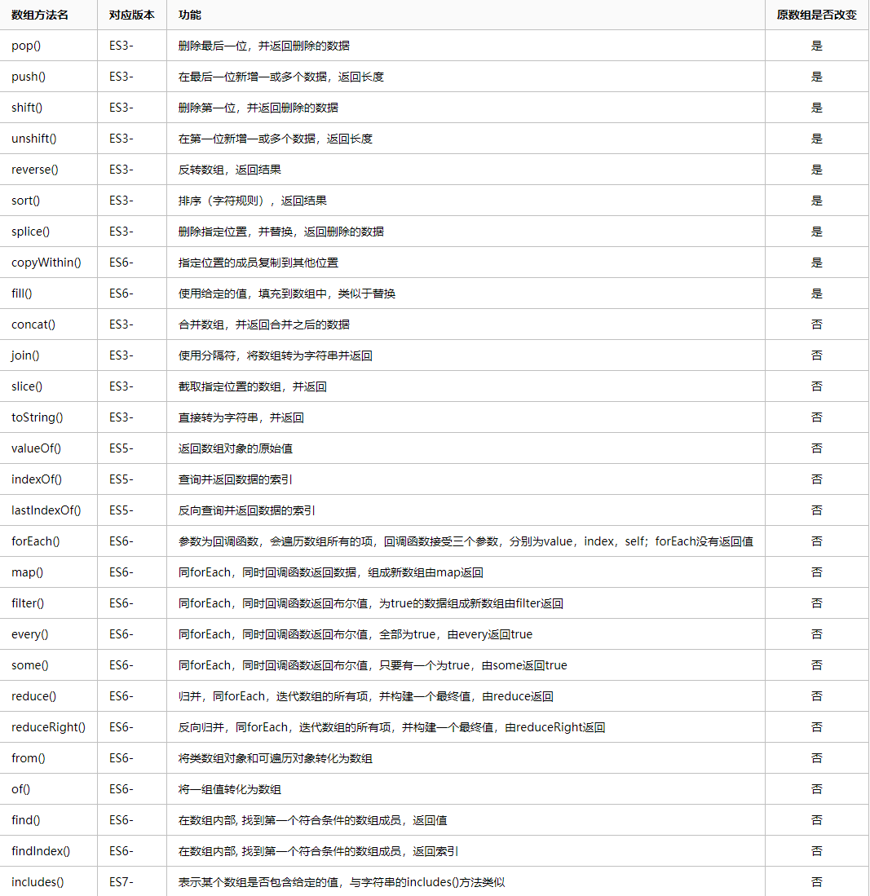


## 11.函数对象的方法call()和apply()

### 1.定义

call()和apply()

​	1.这两个方法都是函数对象的方法，需要通过函数对象来调用

​	2.当对函数调用call()和apply()都会调用函数执行

​	3.**在调用call()和apply()可以将一个对象指定为第一个参数,此时这个对象将会成为函数执行时的this**

​	4.call()方法可以将实参再对象之后依次传递

​	5.apply()方法需要将手机惨封装到一个数组中统一传递

---


this的情况

​	1.以函数形式调用时，this永远都是window

​	2.以方法的形式调用时，this是调用方法的对象

​	3.以构造函数的形式调用时，this是新创建的那个对象

​	4.使用call和apply调用时，this是传过去的指定的对象,如果不传递对象，this就是window

### 2.示例


```javascript
		function fun(a,b){
            console.log(this);
            console.log(a,b);
        } 
        let obj = {
            name:'张振明',
            fun:fun
        }
        let obj2 = {
            name:'shh'
        }
        fun(1,2)// window 1 2
        obj.fun(1,2)// obj 1 2
        fun.call()//window undefined undefined
        fun.call(obj,1,2)//obj 1 2
        obj.fun.call(obj2,1,2)//obj2 1 2
        fun.apply(obj,[1,2])// obj 1 2
```

## 12.arguments

### 1.定义

在调用函数时，浏览器每次都会传递进两个隐含的参数:

​	1.函数的上下文对象this

​	2.封装实参的对象this

​		1.**arguments**是一个**类数组对象**，**它也可以通过索引来操作数据，也可以获取长度**

​		2.在调用函数时，我们所传递的实参都会在argument中保存

​		3.arguments.length可以用来获取实参的长度

​		4.**我们即使不定义形参也可以通过arguments来使用实参**

​			arguments[0]  表示第一个实参

​			arguments[1]  表示第二个实参

​		5.arguments中存在一个属性叫做callee

​			这个属性对应当前正在指向的函数的对象

### 2.示例

```javascript
function fun(){
    console.log(this);//window
    console.log(arguments);// { '0': 1, '1': 2 }
    console.log(arguments.length); 2
    console.log(arguments.callee);//将fun()的内容打印出来
}
fun(1,2)//不论我们是否在函数内定义形参，依然可以使用arguments来获取实参
```

## 13.Date()

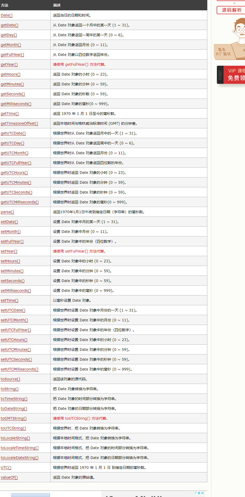

## 14.Math

### 1.定义

Math是一个**工具类**，和其它对象不同，它不是一个构造函数，它封装了数学运算相关的属性和方法

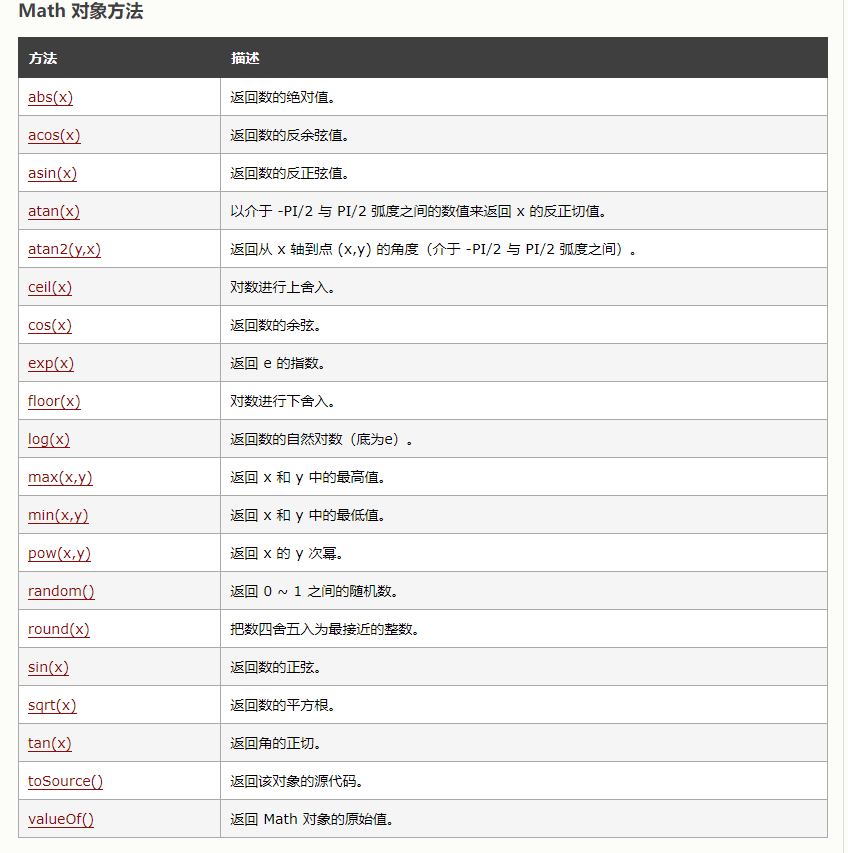

## 15.字符串方法

```javascript
 //1.charAt() 查找返回指定位置的字符
      var str = "abcdefg";
      var s = str.charAt(5); // 下标为5的字符
      console.log(s); //f

      // 2.charcodeAt()查找返回指定位置字符的unicdoe码
      var str = "abcdefg";
      var s = str.charCodeAt(5); // 下标为5的字符的unicdoe码
      console.log(s); //102

      // 3.concat()连接字符串
      var str = "abc";
      var str1 = str.concat("1", "2", "3", "dsdafsdafsad");
      console.log(str1); //abc123dsdafsdafsad

      // 4.slice()字符串截取
      var str = "abcdefghijklmn";
      var str1 = str.slice(1, 5);
      console.log(str1); //bcde

      // 5.split()将字符串转换为数组
      var str = "abcdefg";
      var str1 = str.split("-");
      var str2 = str.split("");
      console.log(str); //abcdefg
      console.log(str1); //["abcdefg"]
      console.log(str2); //["a", "b", "c", "d", "e", "f", "g"]

      // 6.substring()字符串截取
      var str = "abcdefghijklm";
      var str1 = str.substring(1, 3); //从下边1开始到下边3结束, 不包括下标3那一项
      var str2 = str.substring(3, 1);
      console.log(str1); //bc
      console.log(str2); //bc

      // 7.substr()字符串截取
      var str = "abcdefghijklm";
      var str1 = str.substr(2, 6); //从下标2开始往后数6个数
      console.log(str1); //cdefgh

      // 8.indexOf() 遍历字符串 查找包含第一个参数的字符串，如包含返回第一位的下标，停止查找，如没有返回 -1。第二个参数表示从此下标开始查找。
      var str = "abcdefabcjklm";
      var a = str.indexOf("abc");
      var b = str.indexOf("abc", 1);
      console.log(a); //0
      console.log(b); //6

      // 9.toUpperCase 转大写
      var str = "aAbBcCdD";
      console.log(str.toUpperCase()); //AABBCCDD

      // 10.toLowerCase 转小写
      var str = "aAbBcCdD";
      console.log(str.toLowerCase()); //aabbccdd

      // 11.replace()替换字符串 只能匹配一次
      var str = "今天天天天气好好";
      var str1 = str.replace("天天", "**");
      console.log(str1); //今**天天气好好

      // 12.match()查找字符串
      var str = "今天天气好好";
      var result = str.match("天天");
      console.log(result); //["天天", index: 1, input: "今天天气好好", groups: undefined]
      var st = str.match("金");
      console.log(st); // null

      // 13.search() 查找字符串返回下标
      var str = "今天天气天天好好";
      var result = str.search("气");
      console.log(result); //3
      var res = str.search("地");
      console.log(res); //-1

      //  14.startsWith 判定一个字符串是否以另一个字符串开头
      var str = "hello world";
      var result = str.startsWith("he");
      console.log(result); //true
      var result = str.startsWith("he", 1); //当为两个参数时，第二个表示开始位数。
      console.log(result); //flase

      // 15.endsWith 判定一个字符串是否以另一个字符串结尾
      var str = "hello world";
      //检测尾部
      var result = str.endsWith("world");
      console.log(result); //true
      //检测指定位置是否以指定字符结尾
      var result1 = str.endsWith("wo", 8);
      console.log(result1); //true

      // 16.includes 检测是否包含指定字符串
      var str = "hello world";
      var result = str.includes("o");
      console.log(result); //true
      var result1 = str.includes("o", 8);
      console.log(result1); //false
      var res = str.includes("o", 7);
      console.log(res); //true

      //  17.repeat  重复字符串
      var str = "haha";
      var str1 = str.repeat(3);
      console.log(str1); //hahahahahaha
```

## 16.正则表达式

### 1.字符串和正则表达式的相关方法

#### 1.split

##### 1.定义

1.可以将一个字符串拆分为一个数组

2.方法中可以传递一个正则表达式作为参数，这样方法会根据正则表达式拆分字符串

3.不需要全局符号**g**，也可以对所有符合正则表达式规则的字符匹配

##### 2.示例

```javascript
let str = '1a2b3c4d5e6f'
console.log(str.split(/[A-Z]/i));//['1','2','3','4','5','6']
```


#### 2.match

##### 1.定义

1.可以根据正则表达式，从一个字符串中将符合条件的内容提取出来

2.默认情况下match只会找到第一个符合要求的内容，找到以后就停止检索，我们可以设置正则表达式为全局匹配模式，这样就会匹配到所有的内容

##### 2.示例

```javascript
//match方法
let str2 = `1a2b3c4d5e6f7G`
console.log(str2.match(/[a-z]/gi));//['a','b','c','d','e','f','G']//修饰符g和i可以同时使用，且不受顺序影响
```


#### 3.replace

##### 1.定义

1.可以将字符串中指定内容替换为新的内容

2.参数

​	1.被替换的内容

​	2.新的内容

##### 2.示例

```javascript
//replace方法
let str3 = `abcABC12345678abc`
console.log(str3.replace(/abc/g,"=_="));// =_=ABC12345678=_=
```


#### 4.search

##### 1.定义

1.可以搜索字符串中是否含有指定内容

2.如果搜索到指定内容，则会返回**第一次**出现的索引，如果没有搜索到则返回**-1**

3.可以接受一个正则表达式作为参数，会根据正则表达式检索字符串


##### 2.示例

```javascript
// search方法
let str1 = 'abb hello acc abc'
console.log(str1.search(/a[A-Z]c/i));//10
```

### 2.量词

#### 1.定义

1.通过量词可以设置一个内容出现的次数

2.量词只对它前边的一个内容起作用

3.{n} 正好出现n次

4.{m,n} 出现m-n次

5.{m,} m次以上

6.+ 至少一个,相当于{1,}

7.* 0个或多个,相当于{0,}

8.? 0个或1个，相当于{0,1}

9.^a 检查一个字符串中是否以a开头

10.a$ 检查一个字符串中是否以a结尾

#### 2.示例

```javascript
 const reg = /a{3}/
 console.log(reg.test("aabc"));//false
 console.log(reg.test("aaabc"));//true

 const reg1 = /ab{3}/
 console.log(reg1.test("ababab"));//false
 console.log(reg1.test("abbb"));//true

 const reg2 = /(ab){3}/
 console.log(reg2.test("ababab"));//true
 console.log(reg2.test("abbb"));//false

const reg3 = /ab?a/
console.log(reg3.test('abba'))//true

const reg4 = /a{2,3}/
console.log(reg4.test('aaa'))//true
console.log(reg4.test('aaaa'))//false

//判断电话号码是否合法
const reg5 = /^1[3-9][0-9]{9}$/
console.log(reg5.test('17576260472'));//true
```

## 17.DOM(Doucoment Object Model)

### 1.DOM

1.什么是DOM？

​	1.DOM,全称Document Obkect Model文档对象模型

​	2.JS中通过DOM来对HTML文档进行操作

​	3.文档

​		文档表示的就是整个页面的HTML网页文档

​	4.对象

​		对象表示将网页中的每一部分都转换成了一个对象

​	5.模型

​		使用模型来表示对象之间的关系，这样方便我们获取对象


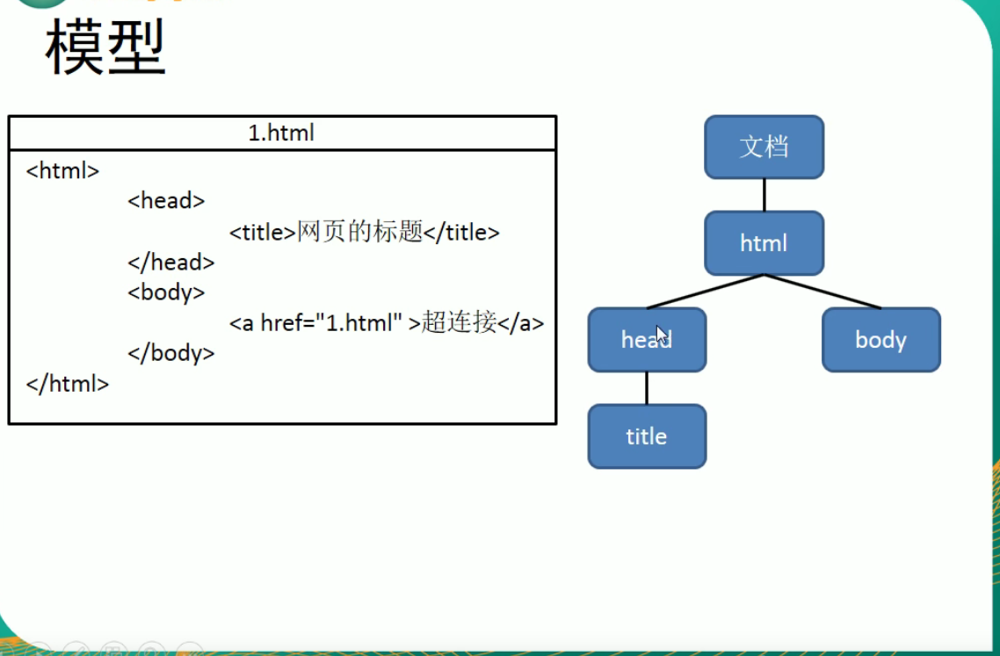

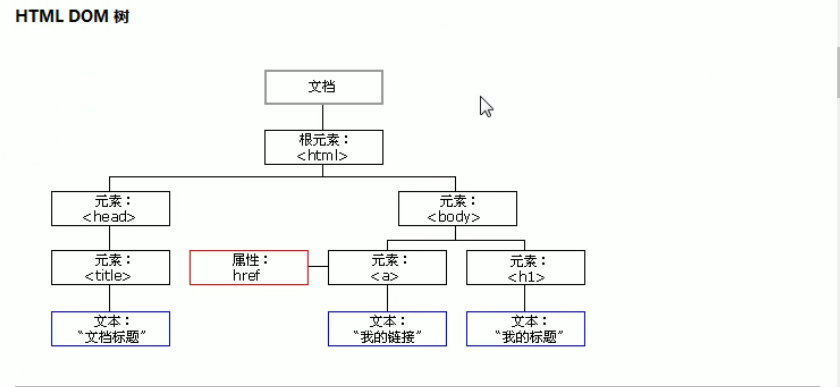

### 2.node节点

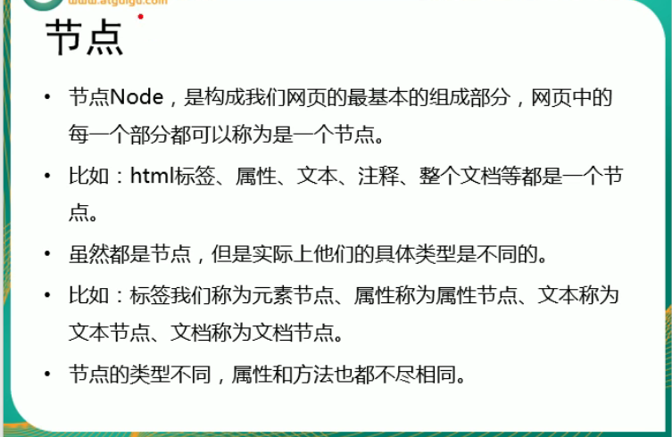

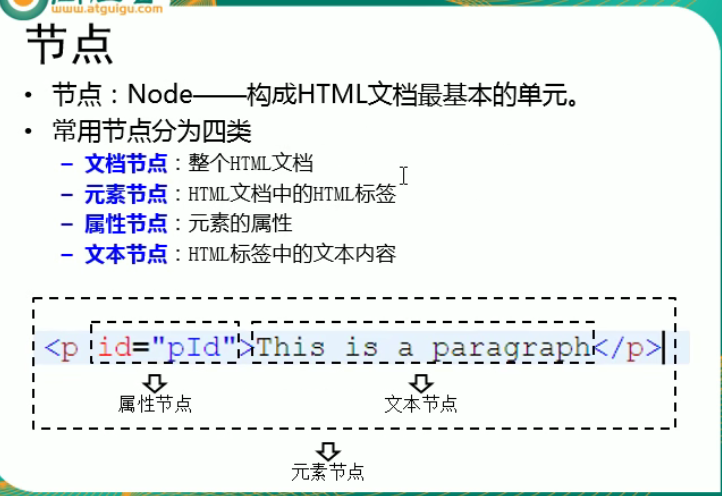

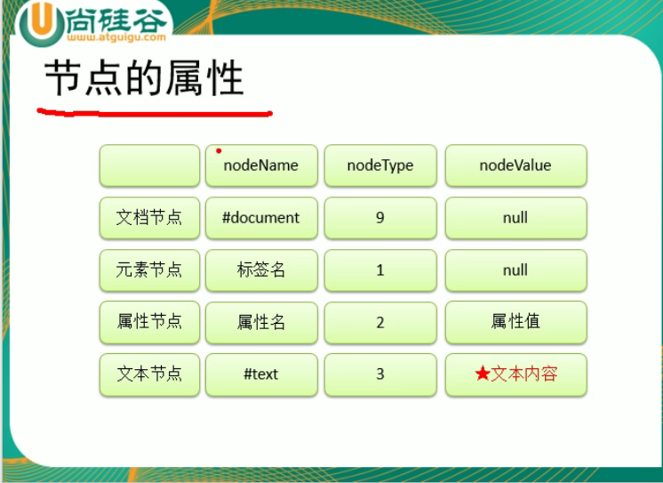

### 3.示例

```html
<button id="btn">我是一个按钮</button>
```

```javascript
  let element = document.getElementById('btn')
    // element.innerHTML = '我不是一个按钮'
    console.log(element.innerHTML)
```

效果

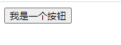

```javascript
 let element = document.getElementById('btn')
     element.innerHTML = '我不是一个按钮'
    console.log(element.innerHTML)
```

效果

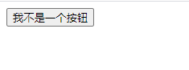

### 4.DOM查询

#### 1.获取元素节点

1.getElementById()

通过Id属性获取一个元素节点对象

2.getElmentsByTagName

通过标签名获取一组元素节点对象

3.getElementsByName()

通过name属性获取一组元素节点对象

4.innnerHTML方法适用于获取元素内部的HTML代码的，对于**< input/>**这样的自结束标签是不能使用innnerHTML方法的

5.如果需要读取元素节点属性,例如:元素.id 元素.name 元素.value,但是读取class属性名只能用元素.className

6.getElementsByClassName

可以根据class属性值获取一组元素节点对象,获取到的对象会封装到数组中

#### 2.示例

```html
<body>
    <input class="ipt" type="text" value="张三">
    <input class="ipt" type="text" value="李四">
    <button id="btn">按钮</button>
</body>
```

```javascript
<script>
    let btn = document.getElementById('btn')
    let inputs = document.getElementsByTagName('input')
    btn.onclick = function(){
        for (let i = 0; i < inputs.length; i++) {
            console.log(inputs[i].className);
        }
    }
</script>
```

#### 3.获取元素节点的子节点

1.childNodes

​	属性，表示当前节点的所有子节点，会获取包括文本节点在内的所有节点，DOM标签间空白也会被当成文本节点

2.children

​	属性，可以获取当前元素的所有子元素，不包括文本节点

3.firstChild

​	属性，表示当前节点的第一个子节点，会获取包括文本节点在内的节点

4.firstElementChild

​	属性，可以获取不包括文本节点在内的第一个子节点

5.lastChild

​	属性，表示当前节点的最后一个子节点，会获取包括文本节点在内的节点

6.lastElementChild

​	属性，可以获取不包括文本节点在内的最后一个一个子节点

#### 4.示例

```html
<body>
    <ul id="lists">
        <li class="lis">A</li>
        <li class="lis">B</li>
        <li class="lis">C</li>
        <li class="lis">D</li>
        <li class="lis">E</li>
    </ul>
    <button id="btn">按钮</button>
</body>
```

```javascript
<script>
    let btn = document.getElementById('btn')
    btn.onclick = function(){
        let lists = document.getElementById('lists')
        console.log(lists.childNodes.length);11
        console.log(lists.children.length);5
        console.log(lists.firstElementChild); html标签
    }
</script>
```

#### 5.获取父节点和兄弟节点

1.parentNode

​	属性，表示当前节点的父节点

2.previousSibling

​	属性，表示当前节点的前一个兄弟节点,包括空文本节点

3.previousElementSibling

​	属性，表示当前节点的前一个兄弟节点,不包括空文本节点

4.nextSibling

​	属性，表示当前节点的后一个兄弟节点,包括空文本节点

5.nextElementSibling

​	属性，表示当前节点的后一个兄弟节点,不包括空文本节点

#### 6.示例

```html
<body>
    <ul id="lists">
        <li class="lis">A</li>
        <li class="lis"><span>B<span>b</span></span></li>
        <li id="C">C</li>
        <li class="lis">D</li>
        <li class="lis">E</li>
    </ul>
    <button id="btn">按钮</button>
</body>
```

```javascript
<script>
    let btn = document.getElementById('btn')
    btn.onclick = function(){
        let lists = document.getElementById('lists')
        let C = document.getElementById('C')
        console.log(C.parentNode.innerHTML);
        console.log(C.previousElementSibling.innerHTML);// <span>B<span>b</span></span>
        console.log(C.previousElementSibling.innerText);//Bb
    }
</script>
```

#### 7.DOM查询的剩余方法

1.获取body标签

​	在document中有一个属性body，它保存的是body的引用

```javascript
let body = document.getElementByTagName('body')
let body = documenr.body
```

2.获取html标签

```javascript
let html = document.documentElement
```

3.获取页面所有元素

```javascript
let all = document.all //已经弃用
```

4.document.querySelector()

使用**css选择器**来查询一个元素节点对象，使用该方法最多返回一个元素，如果满足条件的元素有多个，那么它只会返回第一个

```javascript
let div = document.querySelector(".box1 div")//
let div = document.querySelector(".#box1")//
```

5.document.querySelectorAll()

​	与document.querySelector()使用方法相同，但是他会将所有符合条件的元素封装到一个数组中返回，即使符合条件的元素是只有一个，他也会返回一个数组

```javascript
let div = document.querySelectorAll(".#box1")//
```

#### 8.DOM增删改

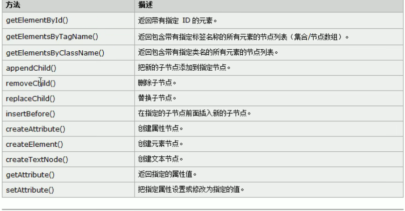

示例

```html
<body>
    <div class="box">
        <ul class="city">
            <li id="beijing">北京</li>
            <li>香港</li>
            <li>上海</li>
        </ul>
        <button id="addCitya">使用appendChild方法增加一个城市节点</button>
        <button id="addCityb">使用innerHTML方法增加一个城市节点</button>
        <button id="addCityInsert">增加一个城市节点并插入到北京节点之前</button>
        <button id="replaceCity">增加新的城市节点并替换北京节点</button><br>
        <button id="removeCity">删除北京节点</button>
        
    </div>
</body>
```

```javascript
 //构造函数
    function myClick(idStr,fun){
        const btn = document.getElementById(idStr)
        btn.onclick = fun
    }
    //增加一个城市节点
    myClick("addCitya",function(){
        const li =  document.createElement('li')
        const cityText = document.createTextNode('广州')
        li.appendChild(cityText)
        const city = document.getElementsByClassName('city')
        city[0].appendChild(li)//节点+appendChild(要插入的新子节点) ,会插入到所有子节点的末尾
    })
    myClick('addCityb',function(){
        const city = document.getElementsByClassName('city')
        city[0].innerHTML += "<li>广州</li>"
    })
    //增加一个城市节点并插入到北京节点之前
    myClick("addCityInsert",function(){
        const newli =  document.createElement('li')
        const cityText = document.createTextNode('广州')
        newli.appendChild(cityText)
        const bjli = document.getElementById('beijing')
        const city = document.getElementsByClassName('city')
        city[0].insertBefore(newli,bjli)//节点名.insertBefore(要插入的新子节点,插入的目标旧子节点)
    })
    //增加新的城市节点并替换北京节点
    myClick("replaceCity",function(){
        const newli =  document.createElement('li')
        const cityText = document.createTextNode('广州')
        newli.appendChild(cityText)
        const bjli = document.getElementById('beijing')
        const city = document.getElementsByClassName('city')
        city[0].replaceChild(newli,bjli)
    })
    //删除北京节点
    myClick('removeCity',function(){
        const bjli = document.getElementById('beijing')
        const city = document.getElementsByClassName('city')
        city[0].removeChild(bjli)
    })
```

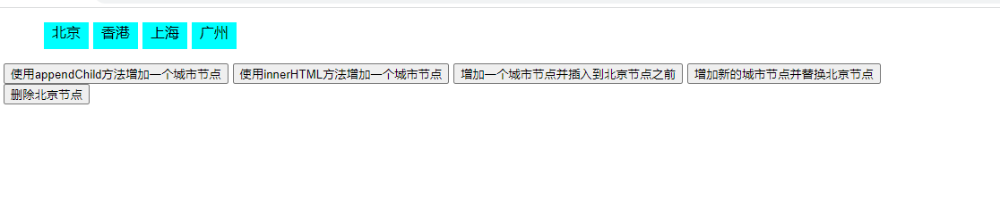

#### 9.操作内联样式 

语法:元素.style.样式名 = 样式值

注意:

1.css属性需要使用驼峰命名法

2.通过style属性设置和读取的都是**内联样式**

**什么是内联样式?为什么要设置成内联样式？**

在标签内style中直接定义的是内联样式，内联样式的优先级较高

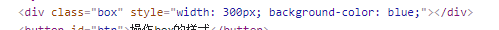


示例

```html
<body>
    <div class="box"></div>
    <button id="btn">操作box的样式</button>
</body>
```

```javascript
<script>
    const box =document.getElementsByClassName('box')[0]
    const btn = document.getElementById('btn')
    btn.onclick = function(){
      box.style.width = '300px'  
      box.style.backgroundColor = 'blue'
    }
    
</script>
```

```css
<style>
    .box{
        width: 200px;
        height: 200px;
        background-color: red;
    }
</style>
```


#### 10.获取元素的生效样式

1.  IE8及以下:元素.**getCurrentStyle**.样式属性

2. 非IE浏览器:**getComputedStyle**(元素).样式属性

   ***

   示例

   ```html
    <div class="box"></div>
       <button id="btn">获取box的当前生效样式</button>
   ```

   ```javascript
   
       const btn = document.getElementById("btn")
       const box = document.getElementsByClassName('box')[0]
       btn.onclick = function(){
           //当使用IE或者其他浏览器时都能获取到当前生效样式
         console.log(getComputedStyle(box).width||box.getCurrentStyle.width);  
         console.log(getComputedStyle(box).backgroundColor);  
       }
       
   
   ```

   ```css
   .box{
       width: 200px;
       height: 300px;
       background-color: red;
   }
   ```

   

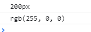

#### 11.取消事件冒泡

属性：cancelBubble

给需要取消事件冒泡的元素设置cancelBubble属性，即可取消事件冒泡

---

```html
  <div class="box">
        <span>来呀</span>
    </div>
```

```javascript
const span = document.getElementsByTagName('span')[0]
const box = document.getElementsByClassName('box')[0]
box.onclick = function(e){
    alert("hellobox")
}
span.onclick = function(e){
    alert("hellospan")
    e.cancelBubble = true//给span设置cancelBubble属性为true
}
```

设置cancelBubble属性为true之前，点击span,会先弹出“hellospan”弹出框，然后弹出"hellobox"

设置cancelBubble属性为true之后，点击span,只会弹出“hellospan”弹出框

#### 12.事件委派

1.指将事件统一绑定给元素的共同祖先元素，这样当后代元素上的事件触发时，会一直冒泡到祖先元素，

从而通过祖先元素的响应函数来处理事件

2.事件委派是利用了冒泡，通过委派可以减少事件绑定的次数，提高程序的性能

---

点击任意一个超链接，都能执行函数，出现弹出框

```html
<ul>
        <li> <a href="javascript:;" class="link">超链接1</a></li>
        <li> <a href="javascript:;" class="link">超链接2</a></li>
        <li> <a href="javascript:;" class="link">超链接3</a></li>
    </ul>
```

```javascript
    const ul = document.getElementsByTagName('ul')[0]
    ul.onclick = function(event){
        //如果点击的element的类名是link，则弹框(防止点到非超链接的地方时弹框)
        if(event.target.className == 'link'){
          alert("hello")  
        }
        
    }
```

#### 13.事件的绑定

1.addEventListener

​	通过这个方法可以为元素绑定响应函数，且绑定的函数可以是多个

​	响应函数会按照函数的绑定顺序执行

​	参数

​	1.事件的方法

​	2.回调函数，当事件触发时该函数会被调用

​	3.是否在捕获阶段触发事件，需要一个布尔值，默认为false

---

```html
<button id="btn">触发事件</button>
```

```javascript
 const btn = document.getElementById('btn')
    btn.addEventListener('click',()=>{
        alert('1')
    })
    btn.addEventListener('click',()=>{
        alert('2')
    })
    btn.addEventListener('click',()=>{
        alert('3')
    })
```

## 18.BOM(Browser Object Model)

### 1.定义

1.Window

​	代表的是整个浏览器的窗口，同时window也是网页中的全局对象

2.Navigator

​	代表的是当前浏览器的信息，通过该对象可以来·识别不同的浏览器

3.Location

​	代表当前浏览器的地址栏信息，通过Location可以获取地址栏信息，或者操作浏览器跳转页面

4.History

​	代表浏览器的历史记录，可以通过该对象来操作浏览器的历史记录，在浏览器关闭后失效

5.Screen

​	代表用户的屏幕信息，通过该对象可以获取到用户的显示器相关信息

## 19.定时器

### 1.setInterval

1.在指定延时时间后执行某个操作，**并且操作每隔指定延迟时间后会再次执行**，直到使用clearInterval来清除定时器

### 2.setTimeout

1.在指定延时时间后执行某个操作，**在执行完操作后就停止**

### 3.用法

分别使用setInterval和setTimeout来延时操作，setInterval的操作会每隔1s执行一次，而setTimeout的操作在延迟一秒执行之后就不再执行

```html
 <div class="time">
        <p>当前的计时:</p>
        <h1 id="nowtime">0</h1>
        <h1 id="anowtime">0</h1>
    </div>
```


```javascript
const nowtime = document.getElementById('nowtime')
    const anowtime = document.getElementById('anowtime')
    let s = 0
    setInterval(()=>{
        s++
        nowtime.innerHTML = s
    },1000)
    setTimeout(()=>{
        s++
        anowtime.innerHTML = s
    },1000)
```

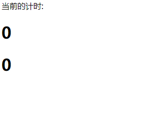


