# JavaScript高级

## 1.数据类型

### 1.定义

#### 1.分类

1.基本(值)类型

- String:任意字符串	
- Number:任意的数字
- Boolean:true/false
- undefined:undefined
- null:null

2.对象(引用)类型

- Object:任意对象
- Function:一种特别的**对象**(可以执行)
- Array:一种特别的**对象**(通过数值下标寻找,内部数据是有序的)

#### 2.判断

- typeof:可以判断:undefined/Number/String/Boolean类型以及Function类型

- instanceof:判断对象的具体类型，返回值是布尔值

- ===:可以判断undefined/null类型

  

疑问:为什么typeof方法不能判断null类型?

	typeof null 返回一个object，typeof null返回Object是一个不能去修正的的bug,因为这会破坏现有的代码。
	第一代JavaScript引擎中的JavaScript值表示为32位的字符。最低的3位作为一种标识，表示值是对象、整数、浮点数或者布尔值。
	对象的标示是000。而为了表现null值，引擎使用了机器语言NULL指针，该字符的所有位都是0。而typeof就是检测值的标志位，这就是为什么它会被认为是一个对象的原因。
### 2.示例

定义基本类型和对象类型

```javascript
	const a  = new Number(2)
    const b = new String(3)
    const c = new Boolean('assa')
    const d = undefined
    const e = null
    console.log(a); //2
    console.log(b); //'3'
    console.log(c); //true 当值为0或false时打印false,其余有效值均为true
    console.log(d); //undefined
    console.log(e); //null

    const obj = new Object()
    const fun = new Function()
    const array = new Array()
    console.log(obj); //{}
    console.log(fun); // ƒ anonymous(){}
    console.log(array);//[]
```

---

判断基本类型和对象类型(定义的变量与上例相同)

```javascript
 	//判断基本类型和对象类型
    console.log(typeof a);//'number'
    console.log(typeof b);//'string'
    console.log(typeof c);//'boolean'
    console.log(typeof d);//'undefined'
    console.log(typeof e);//'object'
    console.log(typeof obj);//'object'
    console.log(typeof fun);//'function'
    console.log(typeof array);//'object'

	console.log(obj instanceof Object);//true
    console.log(fun instanceof Function);//true
    console.log(array instanceof Array);//true

	console.log(d === undefined);//true
    console.log(e === null);//true

    const obj1 ={
        b1:[1,'abc',console.log],
        b2:{name:'zzm',age:'19'},
        b3:function(){
            return '我是一个函数'
        },
        b4:function(){
            return function(){
                return '我是b4函数中的函数'
            }
        }
    }
    console.log(window.console.log === obj1.b1[2]);//true
    obj1.b1[2]('输出xxx')//与console.log('输出xxx')是一样的
    console.log(obj1.b2.name);//'zzm'
    console.log(obj1.b3());//'我是一个函数'
    console.log(obj1.b4()());//'我是b4函数中的函数'  使用函数需要在 函数名+'()' ,b4函数的返回值仍是一个函数，所以要使用obj1.b4()+'()'来调用这个嵌套的函数

```

### 3.相关问题

1.undefined与null的区别?

- undefined代表定义了但没有赋值
- null代表定义且赋值了,值为null

2.什么时候给变量赋值为null？

- 初始赋值，表明将要赋值类型为对象
- 结束前，让对象成为垃圾对象(被垃圾回收器回收

```javascript
const obj = null//初始赋值表明将要赋值为对象
obj = {a:1,b:2}//使用时将obj赋值为对象
obj = null//结束前，让对象成为垃圾对象(被垃圾回收器回收
```

3.严格区别变量类型·与数据类型?

- 数据的类型
  - 基本类型
  - 对象类型
- 变量的类型(变量内存值的类型)
  - 基本类型:保存的就是基本类型的数据,例如const a=1
  - 引用类型:保存的是地址值,例如const b = {a:1},b保存的是对象在内存中的地址值，而不是对象本身

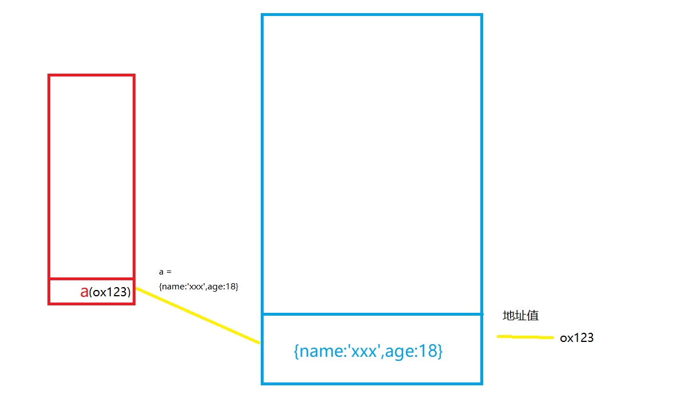

我们将蓝色内存块中的对象数据赋值给a时，a中保存的实际上是对象的地址值

## 2.数据-变量-内存

### 1.定义

- 什么是数据?
  - 存储在内容中代表特定信息的二进制编码,本质为01001...
  - 数据的特点:可传递，可运算
  - 一切皆数据
  - 内存中所有操作的目标:数据
    - 算术运算
    - 逻辑运算
    - 赋值
    - 运行函数
- 什么是内存?
  - 内存条通电后产生的可存储数据的空间(临时的)
  - 内存的产生和死亡:内存条(电路板)==>通电==>产生内存空间==>存储数据==>处理数据==>断电==>内存空间和数据都消失
  - 一块内存中包含
    - 内部存储的数据
    - 地址值
  - 内存分类
    - 栈:全局变量/局部变量
    - 堆:对象
- 什么是变量?
  - 可变化的量，由变量名和变量值组成
  - 每个变量都对应一块小内存,变量名用来查找对应的内存,变量值就是内存中保存的数据
- 内存，数据，变量三者之间的关系
  - 内存是用来存储数据的空间
  - 变量是内存的标识

### 2.示例

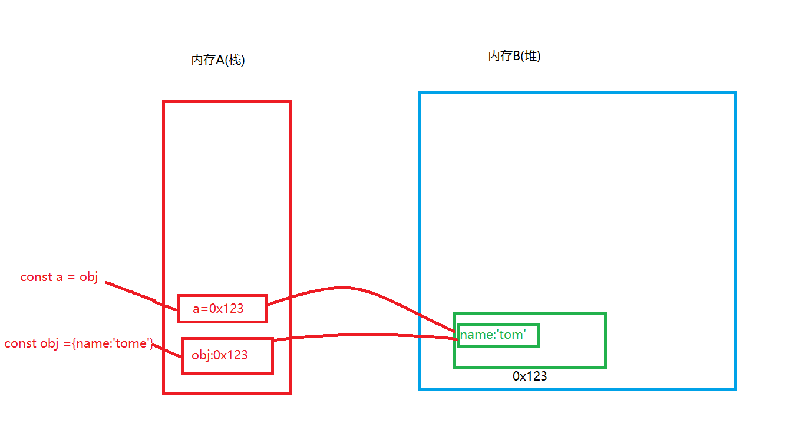

我们定义一个变量名为obj的对象时,内存块A中产生一块小内存存储变量名以及对象的地址值0x123，内存块B中产生一块小内存存储对象的地址值以及对象中包含的数据

若此时我们定义一个a，并将obj赋值给a，那么此时内存块A中产生一块小内存存储变量名a以及obj中存储的地址值，也就是内存B中变量的地址值0x123(而不是内存A中obj本身的地址值),这样就使得内存块A中的两个小内存块都与内存块B中的内存块建立起了联系

### 3.相关问题

1.let a = xxx,a内存中到底保存的是什么?

- 如果xxx是基本数据，保存的就是这个数据
- 如果xxx是对象，保存的就是这个对象在堆内存中的地址值
- 如果xxx是变量,保存的是xxx的内存内容(如果xxx的内存内容是基本数据，那么a中保存的就是基本数据，如果xxx的内存内容是对象，那么a中保存的就是这个对象在堆内存中的地址值)

```javascript
 	const a = 3
    const b = {name:'tom'}
    const c = a
    const d = b
    console.log(a);//3
    console.log(b);//{name:'tom'}
    console.log(c);//3 
    console.log(d);//{name:'tom'}
```

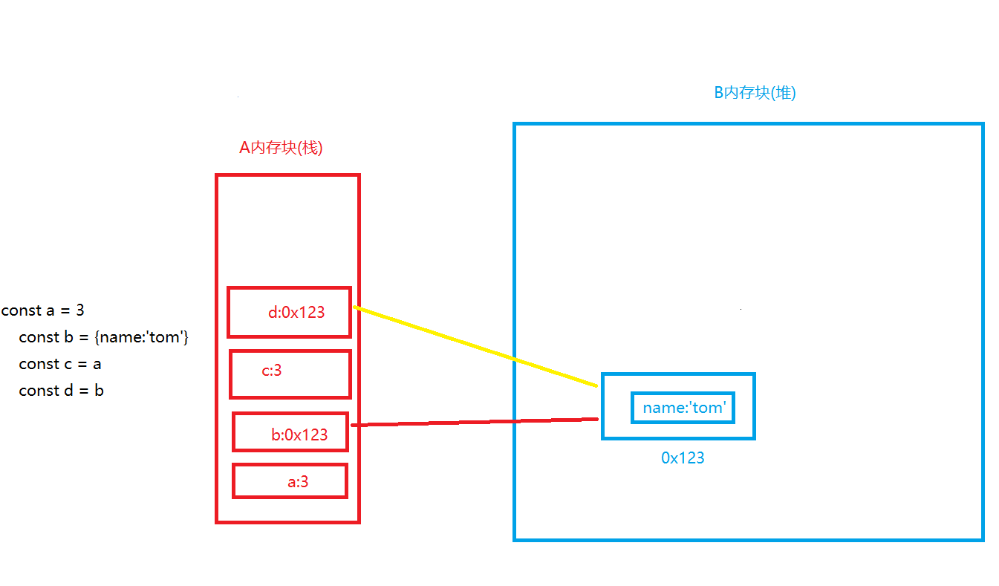

我们定义变量a为3，此时3是一个常量,a中保存的是常量3

定义b为变量，此时B中生成存放对象的内存,b中保存的是B内存块中的对象的地址值

当定义c=a时,c中保存的是a中的内存数据,也就是3

当定义d=b时,d中保存的时b中的内存数据,也就是存放在B中的对象的内存的地址值0x123，此时d和b都与B中的内存建立起了联系

注意:如果定义变量的值为数组或者函数,其存储的原理与对象是一样的,因为数组和函数都属于对象

---

2.关于引用变量赋值问题

```javascript
	const obj1 = {name:'Tom'}
    const obj2 = obj1
    obj2.age = 14
    obj2.name ='Bob'
    console.log(obj1);//{name: 'Bob', age: 14}
    function fun(obj){
        obj.name = 'Alice'
    }
    fun(obj1)
    console.log(obj1);//{name: 'Alice', age: 14}

```

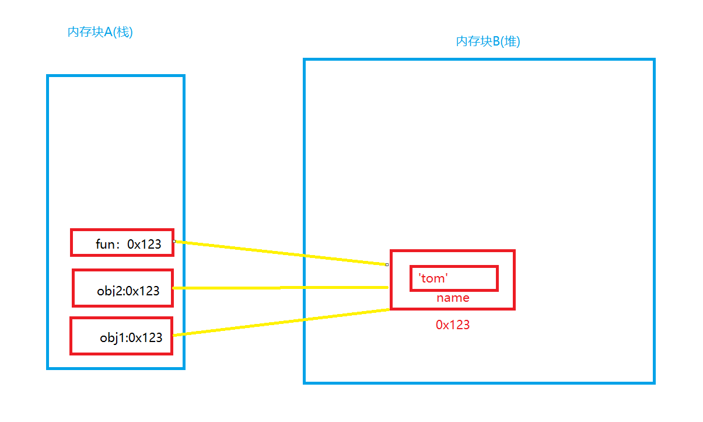

由上述第一个问题解释我们已知，当给变量a赋值为另一个变量b且这个b变量为对象时，a和b都会与堆内存中的存放变量的内存建立联系

当修改obj2的值时，实际上是修改内存块B中地址值为0x123的内存的内容,而我们定义的obj1和fun()中存储的地址值均为0x123,故而**我们修改三者中任意一个的值,其余两个变量内容都会改变,因为我们更改的是源数据**

---

```javascript
	let obj1 = {name:'Tom'}
    let obj2 = obj1
    function fun(obj){
        obj={name:'Alice'}
    }
    obj2 = {name:'Bob'}
    fun(obj1)
    console.log(obj1);//{name: 'Tom'}
```

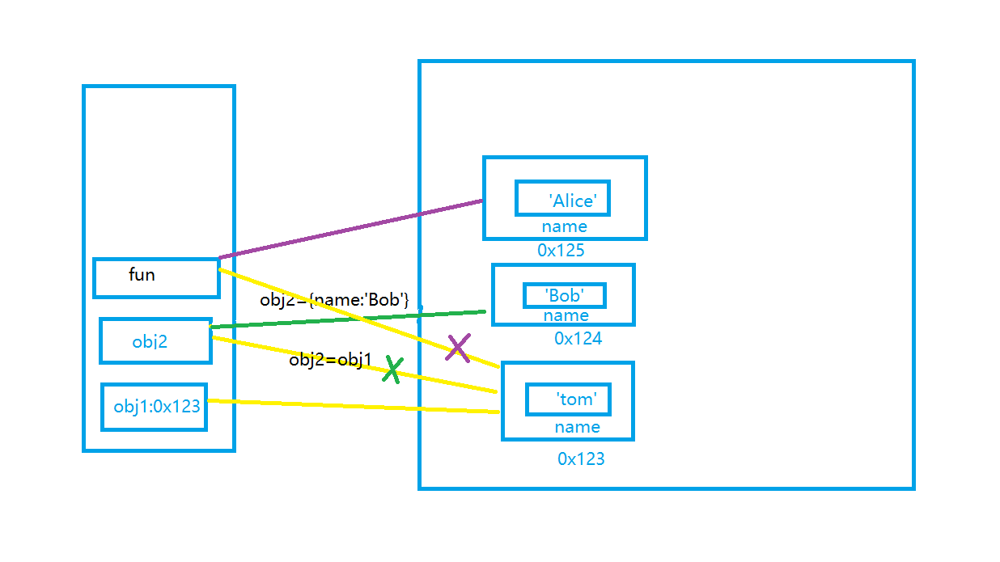

上述代码与上例不同的是,我们将obj1赋值给obj2后,将obj2修改为一个新的对象，此时obj2中存放的地址值已经变成了新的内存块的地址值,obj2与地址值为0x123内存已经没有联系,函数fun与obj2类似,修改成新的对象后,fun与0x123内存已经没有联系

---

3.在js调用函数传递变量参数时，是值传递还是引用传递?

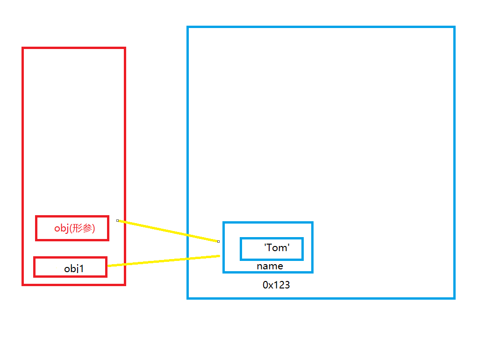

```javascript
	let obj1 = {name:'Tom'}
    function fun(obj){
        ...
    } 
    fun(obj1)
```


调用函数传递的变量参数会在函数进行中产生形参，这个形参中的值与实参中的值一样(形参的值是实参的值的复制品),如果实参的值是基本值,那么形参也为基本值，如果实参的值为地址值，那么形参也为地址值

​	对于此问题有两种理解:

​		理解1:都是值(基本/地址值)传递

   	 解释:传递的变量参数的值都是实参中的内容值

​		理解2：可能是值传递，也可能是引用传递

​		理解:可以把传递的地址值看作是引用传递

总之，如果函数传递变量参数时，实参的数据总是与形参的数据一样,如上述代码所示,调**用函数时形参obj的数值为obj1对应对象的地址值(0x123),而不是对象本身({name:’Tom’})**

---

4.JS引擎如何管理内存？

1. 内存生命周期
   1. 分配小的内存空间,得到它的使用权
   2. 存储数据,并可以对其进行操作
   3. 释放小的内存空间
2. 释放内存
   1. 局部变量
      1. 局部变量本身:函数执行完之后自动释放(包括储存的基本值和地址值)
      2. 局部变量所指定的对象:函数执行完之后成为垃圾对象==>垃圾回收器回收
   2. 全局变量
      1. 不会被释放

```javascript
	const obj = {}
    obj = null //此时obj指定的对象被释放,但是obj本身没有被释放
    
    function fun(){
        const obj1 = {}
    }
    fun()//函数执行完之后,obj1自动释放,obj1所指向的对象首先变成垃圾对象,然后被垃圾回收器回收
```

注意:自动释放和被垃圾回收器回收是两个不同的概念!前者立即执行,后者依靠垃圾回收器经过一段时间执行

## 3.对象

### 1.定义

1.什么是对象?

- 多个数据的封装体
- 用来保存多个数据的容器
- 一个对象代表现实中的一个事物

2.为什么要用对象?

- 统一管理多个数据

3.对象的组成

- 属性:属性名(字符串)和属性值(任意类型)组成
- 方法:一种特别的属性(属性值是函数)

4.如何访问对象内部数据?

- **对象名 **+ **.** + **属性名**,例如obj.name：编码简单,但是不通用
- **对象名[‘属性名’]**,例如obj[‘name’]：编码较复杂，但是可以通用

### 2.示例

```javascript
	const obj = {
        name:'tom',
        age:15,
        setName:function(name){
            this.name = name
        },
        setAge:function(age){
            this.age = age+1//this.age是obj中的age,age是传递过来的形参age
        }
    }
    console.log(obj.name,obj['age']);//'tom' 15
```

### 3.相关问题

1.什么时候必须用对象名[‘属性名’]的方式来访问对象内部数据?

- 属性名包含特殊字符,如空格等
  - 如果采用另一种方式,解析器会将特殊字符错误的解析，会导致解析失败
- 属性名是不确定的

当出现以下的情况,我们需要通过遍历数组来获取对象中的内部值时,必须用对象名[‘属性名’]的方式来访问对象内部数据,否则会将obj的element属性打印出来，这是不符合我们期望的

```javascript
	const obj = {
        name:'tom',
        age:15,
    }
    const arr = ['name','age']
    arr.forEach(attribute => {
        // console.log(obj.attribute);//会将obj的attribute属性打印出来
        console.log(obj[attribute]);
    });
```

## 4.函数

### 1.定义

1.什么是函数?

- 实现特定功能的n条语句的封装体
- 只有函数时可以执行的，其他类型的数据不能执行

2.为什么要用函数?

- 提高代码复用
- 便于阅读交流

3.如何定义函数？

- 函数声明
- 表达式

4.如何调用(执行)函数?(以test函数为例)

- test():直接调用
- obj.test():通过对象调用
- new test():通过构造函数调用
- test.call/apply(obj):临时让test成为obj的方法进行调用

### 2.示例

```javascript
	const obj = {}
    const test = function(){
        this.name = 'Tom'
    }
    test.call(obj)
    console.log(obj);//{name:'Tom'}
```

### 3.回调函数

1.什么函数才是回调函数?

- 定义了
- 没有直接调用
- 最终执行了

2.常见的回调函数?

- dom事件回调函数
- 定时器回调函数
- ajax请求回调函数
- 生命周期回调函数

---

```javascript
	const btn = document.getElementById('btn')
    btn.onclick = function(){//dom事件回调函数
        alert('这是dom事件回调函数')
    }
    setTimeout(() => {//定时器回调函数
        alert('这是定时器回调函数')
    }, 3000);
```

### 4.IIFE(立即执行函数语句)

1.理解

- 全称:immediately-Invoked Function Expression
- 立即执行函数会在进程开始时立即执行,且执行完之后就销毁,不需要通过变量来保存

2.作用

- 隐藏实现
- 不会污染外部(全局)命名空间
- 可以用它来编码js模块

---

```javascript
	//立即执行函数	
	(function(){
        let a = 0
        function test(){
            console.log(++a);
        }
        //在立即执行函数中定义全局函数,以至于在立即执行函数调用完成后我们依然可以使用这个全局函数
        window.$ = function(){
            return{test:test}
        }
    })();
    $().test()// 1
```

### 5.函数中的this

1.this是什么？

- 任何函数本质上都是通过某个对象来调用的，如果没有直接指定，那么这个对象就是window
- 所有的函数北部都有一个变量this
- 它的值是调用函数的当前对象

2.如何确定this的值?

- 以函数的形式调用时,this是window
- 以方法的形式调用时,this是调用方法的对象
- 以构造函数的形式调用时,this就是新创建的对象
- call()或者apply,通过第一个实参来指定函数中的this

---

```javascript
	function Person(color){
        console.log(this);
        this.color = color
        this.getColor = function(){
            console.log(this);
            return this.color
        }
        this.setColor = function(color){
            console.log(this);
            this.color = color
        }
    }
    Person('red')// this是window
    const p = new Person("yellow")//this是p
    p.getColor() //this是p
    const obj = {}
    p.setColor.call(obj,'black')//this是obj
```


## 5.函数的原型

### 1.函数的prototype

1.函数的prototype属性

- 每个函数都有一个prototype属性，它默认指向一个Object空对象(原型对象)

- 原型对象中有一个属性constructor，它指向函数对象(如下图)

  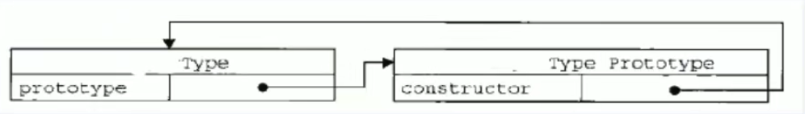

2.给原型对象添加属性(一般为方法)

- 作用：函数的所有实例对象都会拥有原型中的属性(方法)

  ```javascript
   	function Fun(){
          
      }
      const fun  = new Fun()
  	console.log(fun.__proto__===Fun.prototype);//true
  ```

  

### 2.显式原型与隐式原型

1. 每个函数function都有一个protorype，即显示原型

2. 每个构造函数的实例对象都有一个__ proto __,即隐式原型 

3. 对象的隐式原型的值为其对应构造函数的显式原型的值

4. 内存结构

   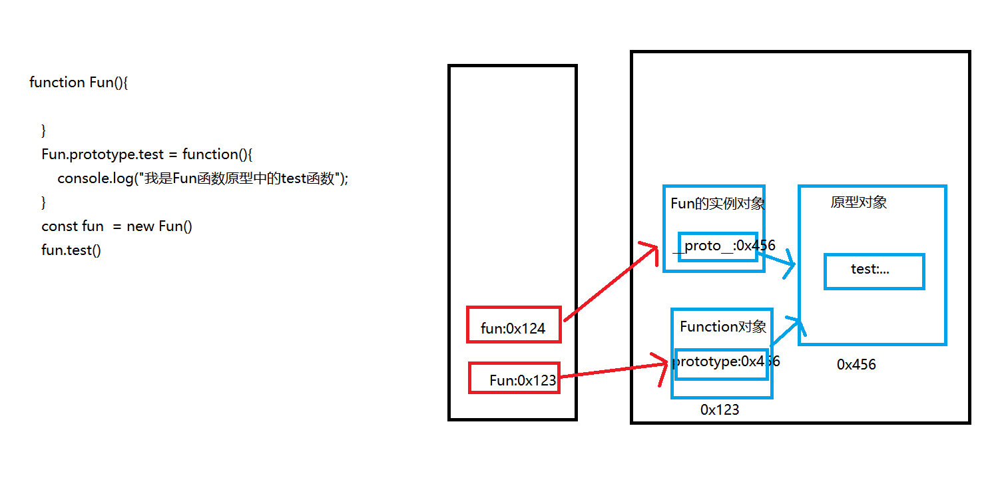

5. 总结

   1. 函数的prototype属性:在定义函数时js内部自动添加，默认值是一个空Object对象
   2. 对象的__ proto __属性:在创建对象时js内部自动添加,默认值是构造函数的prototype属性值
   3. 程序员能直接操作显示原型,但不能直接操作隐式原型(ES6之前)

### 3.原型链

#### 1.定义

​	解释:**原型链就是根据对象的__ proto __指向,一层一层连接起来的具有关联性的对象集合**

- 访问一个对象的属性时

  - 先在自身属性中查找，找到返回
  - 如果没有找到,再沿着__ proto __这条链返回
  - 如果最终没找到,返回indefined

- 别名:隐式原型链

- 作用:查找对象的属性(方法)

  

#### 	2.分析

原型链就是根据对象的__ proto __指向,一层一层连接起来的具有关联性的对象集合

当我们调用一个对象的方法时,js内部会根据原型链进行查找,如果当前层没有此方法,则往它的__ proto __指向的对象查找,直到找到这个方法

Object原型对象是原型链的尽头,它的__ proto __指向为空,如果在Object的原型对象中仍然没有找到此方法,则说明对象中不包含这个方法

```javascript
function Fun{}
const fun = new Fun()
const Object = new Object()
```

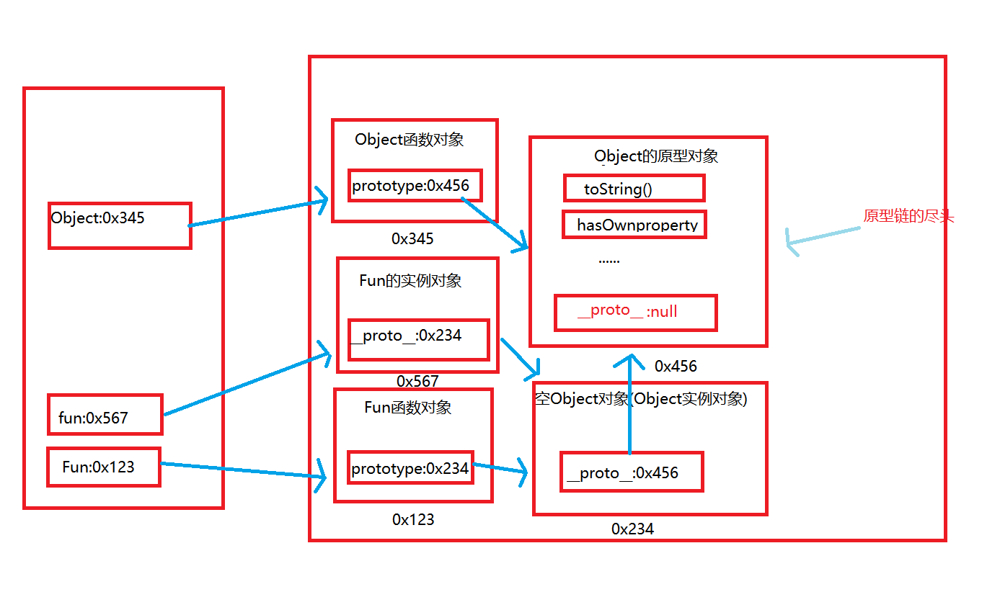

如上图所示,假设我现在想在fun函数中查找toString()方法,那么查询的顺序是这样的:

**fun--->fun. __ proto __ (没找到,往下层寻找)--->fun. __ proto __ .  __ proto __ (没找到,往下层寻找)--->**

**fun. __ proto __ .  __ proto __ . __ proto __(到达Object的原型对象,找到了toString()方法)**

如果查找一个不存在的方法,会返回**undefined**


### 4.构造函数-原型-实例对象之间的关系

#### 1.定义

1. 每个构造函数都有一个原型对象,这个原型对象又是另一个原型对象的实例
2. 每个构造函数的实例也有一个原型对象,这个原型对象也是另一个原型对象的实例
3. 构造函数的显式原型等于这个构造函数的实例的隐式原型
4. 构造函数以及他的实例最终都指向Object的原型对象

#### 2.解释

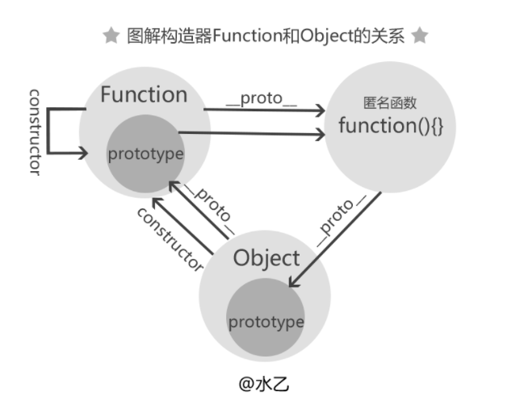


我们画图来描述

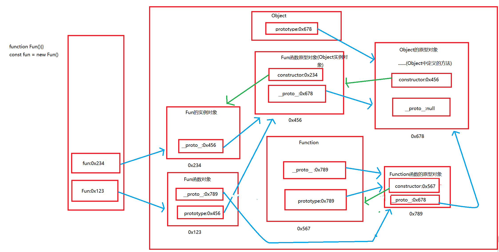

如上图

fun是Fun的实例,即 const fun = new Fun()

Fun又是Function的实例,即const Fun = new Function()

**注意**:Function是引用属性,一切函数都是Function的实例对象

我们先来分析fun函数:

​	fun是Fun实例对象,它只有隐式原型属性 __ proto __,它的隐式原型指向它的构造函数Fun的原型对象,

​		这也印证了我们之前说的一句话:**构造函数的显式原型等于这个构造函数的实例的隐式原型**,

​	然后Fun的原型对象又指向Object的原型对象

​		故而我们可以知道,Fun的原型对象实际上是Object的实例对象

​	Object的原型对象是原型链的终点,它的原型属性指向null

我们来分析Fun函数:

​	Fun本身是一个构造函数,同时他也是Function的实例对象，故而Fun既有隐式原型也有显式原型

​	它的显式原型等于fun的隐式原型,指向的是Fun的原型对象,Fun的原型对象又是Object的实例对象,他最终指向Object的原型对象

​	它的隐式原型等Function的显式原型,指向的是Function的原型对象,而Function的原型对象实际上也是Object的实例对象,它的原型指向Object的原型对象

我们可以得出结论:**一切函数的原型都指向Object的原型对象**

---

需要特别注意的一点是Function的原型关系:**Function的隐式原型等于它的显式原型**

这怎么解释呢?

实际上可以理解为 **Function的构造函数就是它本身**,即 const Function = new Function()

通俗一点就是:所有的鸡(函数)都是由鸡妈妈(Function)生的,而鸡妈妈(Function)也是鸡,所以鸡妈妈(Function)也是鸡妈妈(Function)生的

---

### 5.探索instanceof属性

#### 1.定义

instanceof:判断对象的具体类型，返回值是布尔值

instanceof是如何进行判断的?

- 表达式:A instanceof B:如果B的显式原型对象在A的原型链上,返回true,否则返回false

#### 2.解释

我们来探讨instanceof判断对象的具体过程

还是这个示例图,我们判断以下表达式

```javascript
const obj = {}
function Fun(){}
const fun = new Fun()
console.log(obj instanceof Fun)//false
```


obj instanceof Fun的过程:

对于Fun,我们要查找它的显式原型对象: 

Fun--->Fun.prototype(Object的实例对象)

对于obj,我们要沿着它的原型链查找:

obj--->obj.__ proto __(Object的原型对象)

从以上查找路径我们可知,Fun的显式原型对象在obj的原型链中并没有出现，故而返回false


注意:看下面是什么原因?

```javascript
Function instanceof Object;//true
Object instanceof Function;//true
```

实际上是这样的

```javascript
Function.__proto__.__proto__ === Object.prototype;//true
Object.__proto__ === Function.prototype;//true
```


### 6.面试题

#### 1.题目

```javascript
  //第一题 判断输出的结果
	function A(){

    }
    A.prototype.n = 1
    const b = new A()
    A.prototype = {
        n:2,
        m:3
    }
    const c = new A()
    console.log(b.n,b.m,c.n,c.m);//1 undefined 2 3

    // 第二题 判断输出的结果
    const F = function(){}
    Object.prototype.a = function(){
        console.log('a()');
    }
    Function.prototype.b = function(){
        console.log('b()');
    }
    const f = new F()
    f.a() // a()
    f.b() // undefined
    F.a() // a()
    F.b() // b()
```

#### 2.题解

先抛图


1.

​	我们定义构造函数A,并给A.prototype(A的原型对象)定义变量n为1

​	创建构造函数A的实例b,此时b的原型链为:

​	b-->b.__ proto __ (b的隐式原型对象,与A.prototype相等,故而b. __ proto __ .n = 1)-->b.__ proto __ . __ proto __(Object的原型对象)

​	在定义完b之后,我们修改了A的原型对象,此时A的原型对象中的数据已经被替换,此时n的值为2

​	创建构造函数A的实例c,此时c的原型链为:

​	c-->c.__ proto __ (c的隐式原型对象,与A.prototype相等,故而c. __ proto __ .n = 2,c. __ proto __ .m = 3)-->c.__ proto __ . __ proto __(Object的原型对象)

​	由上可得

​	**我们输出的结果为 1 indefined 2 3**

2.

​	我们给object的原型对象赋值a方法,再给Function的原型对象赋值b方法

​	此时object的原型链为:

​	object-->object.prototype(Object的原型对象,并且拥有方法a)

​	此时Function的原型链为:

​	Function-->Function.prototype(Function的原型对象,它拥有方法b)-->Function.prototype.__ proto __ (Object的原型对象,它拥有方法a)

​	我们创建构造函数F的实例f,此时F和f的原型链分别为

F: F-->F. __ proto __ (F的原型对象)-->F. __ proto __ . __ proto __ (Function的原型对象,它拥有方法b)-->F.prototype.prototype.__ proto __(Object的原型对象,它拥有方法a)

f: f-->f.__ proto __ (f的隐式原型对象)-->f. __ proto __ . __ proto __ (Object的原型对新昂,它拥有方法a)

由上可得

我们输出的结果为 a() indefined a() b()

**注意**:构造函数的实例对象的原型链不会指向Function原型对象,而构造函数的原型链指向Function原型对象

---

### 7.原型链继承

1. 流程
   1. 定义父类型构造函数
   2. 给父类型的原型添加方法
   3. 定义子类型的构造函数
   4. 创建父类型的实例赋值给子类型的原型
   5. 为子类型的原型添加方法
2. 关键
   1. **子类型的原型为父类型的实例对象**

**示例**

```javascript
    //父类型
    function Supper(){
        this.supProp = 'Supper property'
    }
    Supper.prototype.showSupperProp = function(){
        console.log(this.supProp);
    }

    //子类型
    function Sub(){
        this.subProp = 'Sub property'
    }
    
    var supper = new Supper()
    Sub.prototype = new Supper()
	Sub.prototype.constructor = Sub
    Sub.prototype.showSubProp = function(){
        console.log(this.subProp);
    }
    var sub = new Sub()
    sub.showSupperProp()// Supper property
    sub.showSubProp() //  Sub property
```

解释

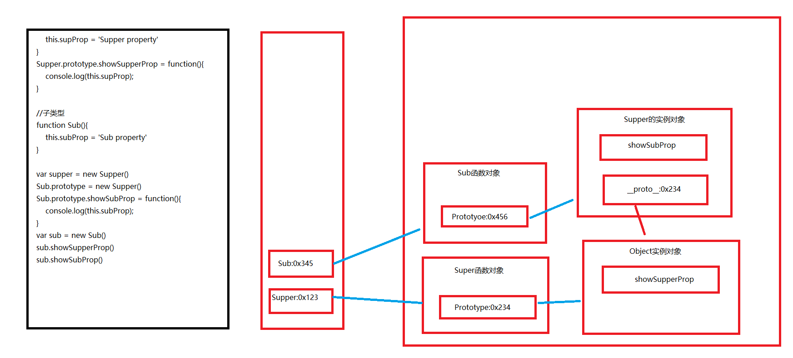

1.对原型链继承的解释

- 当我们的子类需要继承父类的变量或者方法时,我们可以用到原型链继承,**继承的关键是将子类的prototype指向父类的__ proto __ ,也就是子类的原型为父类的实例对象**
- 原型链的继承可以使得子类的原型链上拥有父类的原型属性,实际上是对子类原型链的修改

2.为什么子类的原型要指向父类的实例对象而不是指向父类的原型(构造函数)?

- 如果指向父类本身，那么我们在给子类的原型添加方法时,父类也会得到相同的方法,这样会造成引用混乱，例如

  ```javascript
  function Person(name,age){
      this.name = name;
      this.age = age;
  }
  
  Person.prototype.sayHi = function (){
      console.log("Hi,I'm "  + this.name);
  }
  
  function Student(name, age, grade){
      Person.call(this, name, age);
      this.grade = grade;
  }
  Student.prototype = Person.prototype
  Student.prototype.sayHello =function(){
      console.log("Hello, I'm "+ this.name +", I'm in grade " + this.grade + ", nice to meet you.");
      };
  
  var wang_son = new Student('老王儿子',8,'二年级');
  var wang = new Person('老王',30);
  wang_son.sayHi();//Hi,I'm 老王儿子
  wang_son.sayHello();//Hello, I'm 老王儿子, I'm in grade 二年级, nice to meet you.
  wang.sayHello()//Hello, I'm 老王, I'm in grade undefined, nice to meet you.
  
  ```

  如上所示,如果指向父类的原型,那么我们可以在父类中调用子类的方法,这明显是不应该出现的

### 8.借用构造函数实现继承

实现：

1. 定义父类构造函数
2. 定义子类构造函数
3. 在子类构造函数中调用父类构造函数

关键

1. 在子类构造函数使用call调用父类构造函数,改变父类构造函数的this指向

---

示例

```javascript
    function Person(name,age){
        this.name = name
        this.age = age
    }
    function Student(name,age,price){
        Person.call(this,name,age)
        this.price = price
    }
    var s = new Student('Tom',20,14000)
    console.log(s.name);//Tom
```


### 9.组合继承

定义：

1. 利用原型链实现对父类对象的方法的继承
2. 利用call()借用父类构造函数的属性

---


示例

```javascript
	function Person(name,age){
        this.name = name
        this.age = age
    }
    Person.prototype.setName =function(name){
        this.name = name
    }
    function Student(name,age,price){
        Person.call(this,name,age)//传入this,将person的this指向变成Student
        this.price = price
    }
    Student.prototype = new Person()
    Student.prototype.constructor = Student
    var s = new Student('tom',15,14000)
    s.setName('bob')
    console.log(s.name);//bob
```

如上所示，利用**原型继承** 继承父类的方法,利用**call()方法**继承父类的属性(call方法可以改变函数的this指向)

## 6.执行上下文与执行上下文栈

### 1.变量提升与函数提升

1. 变量声明提升
   - 通过var定义(声明)的变量,在定义语句之前就可以访问到
     - var a = 1 等价于 var a ;a=1
2. 函数声明提升
   - 通过function声明的函数,也存在变量提升
3. 变量提升与函数提升谁先执行?
   - 变量提升先执行,函数提升后执行
4. 当代码执行寻找变量时,优先从本身作用域寻找变量，如果找不到,再从大一级别的作用域寻找,直到找到window定义域

---

示例

```javascript
 /*
 	第一题
 */
 var a = 3
 function fn(){
     console.log(a)
     var a = 4
 }
 fn()//输出undefined

/*
	第二题
*/
var c = 1
function c(c){
    console.log(c)
}
c(2)//报错 c is not a function
```


题解:

1.执行fn函数时,fn函数内的代码段开始执行,首先发生变量提升,即var a,此时a已经在函数的作用域中定义,随后进行输出a的操作

​	输出时,优先从本身作用域中寻找a，可以找到a,并且它的值为undefined,故输出的值为undefined

2.代码首先发生变量提升,即**var c** ,随后发生函数提升,即 **var c = function()**,随后又执行**c=1**,此时c的值是一个基本类型,当我们调用c(2)时会报错,因为c已经不是一个函数

### 2.执行上下文

- 代码分类

  - 全局代码
  - 函数代码

- 全局执行上下文过程

  - 在执行全局代码之前将window确定为全局执行上下文
  - 对全局数据进行预处理
    - 使用**var**关键字定义的全局变量值为undefined,添加为window的属性
    - 使用function声明的全局函数(例fun)的值为函数本身(fun()),添加为window的方法
    - this的值为window
  - 开始执行全局代码

- 函数执行上下文过程

  - 在调用函数,准备执行函数体之前,创建对应的函数执行上下文对象
  - 对局部属性进行预处理
    - 形参变量-->赋值(实参)-->添加为执行上下文的属性
    - argument-->赋值(实参列表),添加为执行上下文的属性
    - var定义的局部变量赋值为undefined,添加为执行上下文的属性
    - function声明的局部函数(例fun)赋值为函数本身(fun()),添加为执行上下文的方法
    - this的值为调用函数的对象
  - 开始执行函数体代码

  ---

  示例

  ```javascript
  //全局执行上下文
  console.log(a1,window.a1)//undefined undefined
  a2() //a2()
  console.log(this)//window
  var a1 = 3
  function a2(){
      console.log('a2()')
  }
  console.log(a1)//3
  
  //函数执行上下文
  function fn(a1){
      console.log(a1)//1
      console.log(a2)//undefined
      a3()// a3()
      console.log(this)//window
      console.log(arguments)// [1,3]类数组
      var a2 = 3
      function a3(){
          console.log('a3()')
      }
  }
  fn(1,3)
  ```

  

### 3.执行上下文栈

- 在全局代码只想前,JS引擎就会创建一个栈来存储管理所有的执行上下文对象
- 在全局执行上下文(window)确定后，将其添加到栈中(压栈)
- 在函数执行上下文创建后，将其添加到栈中(压栈)
- 在当前函数执行完之后，将栈顶的对象出栈
- 当所有代码执行完之后，栈中只剩下Window


---

示例

```javascript
	var a = 10
    var bar = function(x){
        var b = 5
        foo(x+b)
    }
    var foo = function(y){
        var c = 5
        console.log(a+c+y);
    }
    bar(10)//30
```

```javascript
console.log('global begin:' +i);//undefined
    var  i = 1
    foo(1)
    function foo(i){
        if(i == 4){
            return
        }
        console.log('foo() begin:' + i);//1 2 3
        foo(i+1)
        console.log('foo() end:' + i);//
    }
    console.log('global end:' + i);//4
```

依次输出: undefined 1 2 3 3 2 1 1

### 4.面试题

```javascript
    /*
        测试题一
    */
   function a(){}
   var a;
   console.log(typeof a);//function

    /*
        测试题二
    */
   if(!(b in window)){
       var b = 1;
   }
   console.log(b);//undefined
   /*
        测试题三
   */
   var c = 1
   function c(c){
       console.log(c);
   }
   c(2)//报错 c is not a function
```

测试题一: var a --> a = function-->console.log(typeof a)

测试题二:var b --> console.log(b)

测试题三:var c -->c = function-->=1-->c(2)

## 7.闭包

### 1.定义

**本质**:在一个函数内部创建另一个函数。

**只要存在函数嵌套，并且内部函数调用了外部函数的属性，就产生了闭包!!**

闭包的特性:

- 函数嵌套函数
- 函数内部引用函数外部的参数和变量
- 参数和变量不会被垃圾回收机制回收

闭包的优点:

- 保护函数内的变量安全,实现封装，防止变量流入其他环境发生命名冲突
- 在内存中维持一个变量，延长变量的生命周期
- 匿名自执行函数可以减少内存消耗

闭包的缺点

- 被引用的私有变量不能被销毁,增大了内存的消耗，造成内存泄露，解决办法是可以在使用完变量后手动将其赋值为null
- 其次由于闭包涉及跨域访问，所以会导致性能损失，我们可以通过把跨作用域变量存储在局部变量中，然后直接访问局部变量，来减轻对执行速度的影响

闭包的作用:

- 使用函数内部的变量在函数执行完之后，仍然存活在变量中(延长了局部变量的生命周期)
- 让函数外部可以操作(读写)到函数内部的数据


### 2.实例

1.**函数作为返回值**

```javascript
function a(){
    var name ='tom'
    return function(){
        return name
    }
}
var b = a()
console.log(b())//name
```

定义一个函数a，并以另外一个函数作为a函数的返回值，内部函数又使用了a中的属性**name**,那么这个时候就产生了闭包.我们定义一个变量b接收a的返回值,此时b指向a中嵌套的函数，并且可以使用a中的属性name，故执行b时，会返回name的值为‘tom’

```javascript
function fn(){
    var num = 3
    return function(){
        var n = 0
        console.log(++n)
        console.log(++num)
    }
}
var fn1=fn()
fn1()// 1 4
fn1()// 1 5
```

fn中定义内部函数,产生了闭包,内部函数引用的外部i变量时num,于是当定义fn1接收fn的返回值时num会存在于内存中直到fn1销毁,所以每次执行fn1,num都是内存中已经存在的值,故而num可以累加,而n是内部函数中定义的临时变量,当执行完函数后立马销毁,不会存在于内存中,故而每次调用函数不会累加

---

我们来看一个体现闭包作用的示例

```javascript
for (var i = 0; i <5; i++) {
	   setTimeout(function(){
          console.log(i);
         },100) 
 }
```

当我们执行这段代码时,控制台不会依次打印**0 1 2 3 4**而是打印数 **5 5 5 5 5**，为什么？

因为我们在循环中设置了延时函数setTimeOut，原来由于**js是单线程的**，所以在执行for循环的时候定时器setTimeout被安排到任务队列中排队等待执行，而在等待过程中for循环就已经在执行，等到setTimeout可以执行的时候，for循环已经结束，i的值也已经编程5，所以打印出来五个5

怎么在不使用es6中新特性let的情况下,让其正常输出 0 1 2 3 4？答案是**闭包**

```javascript
for (var i = 0; i <5; i++) {
    (function(i){
        setTimeout(function(){
            console.log(i);
        },100)
    })(i)
}
```

在for循环中我们使用一个立即执行函数,并在其中嵌套延时函数,眼熟函数中使用了外部函数的属性,这个时候就产生了嵌套,引用的i被存在内存中没有销毁.

整个循环过程就是 ，每一次循环都立即执行函数，并将i值存储在内存中，在循环完成之后，延时函数开始执行，依次输出0 1 2 

## 8.event loop(事件循环)

既然js是单线程，那就像只有一个窗口的银行，客户需要排队一个一个办理业务，同理js任务也要一个一个顺序执行。如果一个任务耗时过长，那么后一个任务也必须等着。那么问题来了，假如我们想浏览新闻，但是新闻包含的超清图片加载很慢，难道我们的网页要一直卡着直到图片完全显示出来？因此聪明的程序员将任务分为两类：

- 同步任务
- 异步任务

当我们打开网站时，网页的渲染过程就是一大堆同步任务，比如页面骨架和页面元素的渲染。而像加载图片音乐之类占用资源大耗时久的任务，就是异步任务。关于这部分有严格的文字定义，但本文的目的是用最小的学习成本彻底弄懂执行机制，所以我们用导图来说明：


导图要表达的内容用文字来表述的话：

- 同步和异步任务分别进入不同的执行"场所"，同步的进入主线程，异步的进入Event Table并注册函数。
- 当指定的事情完成时，Event Table会将这个函数移入Event Queue。
- 主线程内的任务执行完毕为空，会去Event Queue读取对应的函数，进入主线程执行。
- 上述过程会不断重复，也就是常说的Event Loop(事件循环)。

---


我们进入正题，除了广义的同步任务和异步任务，我们对任务有更精细的定义：

- macro-task(宏任务)：包括整体代码script，setTimeout，setInterval
- micro-task(微任务)：Promise，process.nextTick

不同类型的任务会进入对应的Event Queue，比如`setTimeout`和`setInterval`会进入相同的Event Queue。

事件循环的顺序，决定js代码的执行顺序。进入整体代码(宏任务)后，开始第一次循环。接着执行所有的微任务。然后再次从宏任务开始，找到其中一个任务队列执行完毕，再执行所有的微任务。听起来有点绕，我们用文章最开始的一段代码说明：

```javascript
setTimeout(function() {
    console.log('setTimeout');
})

new Promise(function(resolve) {
    console.log('promise');
}).then(function() {
    console.log('then');
})

console.log('console');
复制代码
```

- 这段代码作为宏任务，进入主线程。
- 先遇到`setTimeout`，那么将其回调函数注册后分发到宏任务Event Queue。(注册过程与上同，下文不再描述)
- 接下来遇到了`Promise`，`new Promise`立即执行，`then`函数分发到微任务Event Queue。
- 遇到`console.log()`，立即执行。
- 好啦，整体代码script作为第一个宏任务执行结束，看看有哪些微任务？我们发现了`then`在微任务Event Queue里面，执行。
- ok，第一轮事件循环结束了，我们开始第二轮循环，当然要从宏任务Event Queue开始。我们发现了宏任务Event Queue中`setTimeout`对应的回调函数，立即执行。
- 结束。

事件循环，宏任务，微任务的关系如图所示：


总结:任务执行的顺序:**同步任务->异步宏任务->该宏任务中的微任务->下一个异步宏任务->...**

## 9.深浅拷贝

## 浅拷贝

浅拷贝的意思就是只复制引用，而未复制真正的值。

```
const originArray = [1,2,3,4,5];
const originObj = {a:'a',b:'b',c:[1,2,3],d:{dd:'dd'}};

const cloneArray = originArray;
const cloneObj = originObj;

console.log(cloneArray); // [1,2,3,4,5]
console.log(originObj); // {a:'a',b:'b',c:Array[3],d:{dd:'dd'}}

cloneArray.push(6);
cloneObj.a = {aa:'aa'};

console.log(cloneArray); // [1,2,3,4,5,6]
console.log(originArray); // [1,2,3,4,5,6]

console.log(cloneObj); // {a:{aa:'aa'},b:'b',c:Array[3],d:{dd:'dd'}}
console.log(originArray); // {a:{aa:'aa'},b:'b',c:Array[3],d:{dd:'dd'}}
```

上面的代码是最简单的利用 `=` 赋值操作符实现了一个浅拷贝，可以很清楚的看到，随着 `cloneArray` 和 `cloneObj` 改变，`originArray` 和 `originObj` 也随着发生了变化。

## 深拷贝

深拷贝就是对目标的完全拷贝，不像浅拷贝那样只是复制了一层引用，就连值也都复制了。

只要进行了深拷贝，它们老死不相往来，谁也不会影响谁。

目前实现深拷贝的方法不多，主要是两种：

1. 利用 `JSON` 对象中的 `parse` 和 `stringify`
2. 利用递归来实现每一层都重新创建对象并赋值

### JSON.stringify/parse的方法

先看看这两个方法吧：

> The JSON.stringify() method converts a JavaScript value to a JSON string.

`JSON.stringify` 是将一个 `JavaScript` 值转成一个 `JSON` 字符串。

> The JSON.parse() method parses a JSON string, constructing the JavaScript value or object described by the string.

`JSON.parse` 是将一个 `JSON` 字符串转成一个 `JavaScript` 值或对象。

很好理解吧，就是 `JavaScript` 值和 `JSON` 字符串的相互转换。

它能实现深拷贝呢？我们来试试。

```
const originArray = [1,2,3,4,5];
const cloneArray = JSON.parse(JSON.stringify(originArray));
console.log(cloneArray === originArray); // false

const originObj = {a:'a',b:'b',c:[1,2,3],d:{dd:'dd'}};
const cloneObj = JSON.parse(JSON.stringify(originObj));
console.log(cloneObj === originObj); // false

cloneObj.a = 'aa';
cloneObj.c = [1,1,1];
cloneObj.d.dd = 'doubled';

console.log(cloneObj); // {a:'aa',b:'b',c:[1,1,1],d:{dd:'doubled'}};
console.log(originObj); // {a:'a',b:'b',c:[1,2,3],d:{dd:'dd'}};
```

确实是深拷贝，也很方便。但是，这个方法只能适用于一些简单的情况。比如下面这样的一个对象就不适用：

```
const originObj = {
  name:'axuebin',
  sayHello:function(){
    console.log('Hello World');
  }
}
console.log(originObj); // {name: "axuebin", sayHello: ƒ}
const cloneObj = JSON.parse(JSON.stringify(originObj));
console.log(cloneObj); // {name: "axuebin"}
```

发现在 `cloneObj` 中，有属性丢失了。。。那是为什么呢？

在 `MDN` 上找到了原因：

> If undefined, a function, or a symbol is encountered during conversion it is either omitted (when it is found in an object) or censored to null (when it is found in an array). JSON.stringify can also just return undefined when passing in "pure" values like JSON.stringify(function(){}) or JSON.stringify(undefined).

`undefined`、`function`、`symbol` 会在转换过程中被忽略。。。

明白了吧，就是说如果对象中含有一个函数时（很常见），就不能用这个方法进行深拷贝。

### 递归的方法

递归的思想就很简单了，就是对每一层的数据都实现一次 `创建对象->对象赋值` 的操作，简单粗暴上代码：

```
function deepClone(source){
  const targetObj = source.constructor === Array ? [] : {}; // 判断复制的目标是数组还是对象
  for(let keys in source){ // 遍历目标
    if(source.hasOwnProperty(keys)){
      if(source[keys] && typeof source[keys] === 'object'){ // 如果值是对象，就递归一下
        targetObj[keys] = source[keys].constructor === Array ? [] : {};
        targetObj[keys] = deepClone(source[keys]);
      }else{ // 如果不是，就直接赋值
        targetObj[keys] = source[keys];
      }
    } 
  }
  return targetObj;
}
```

我们来试试：

```
const originObj = {a:'a',b:'b',c:[1,2,3],d:{dd:'dd'}};
const cloneObj = deepClone(originObj);
console.log(cloneObj === originObj); // false

cloneObj.a = 'aa';
cloneObj.c = [1,1,1];
cloneObj.d.dd = 'doubled';

console.log(cloneObj); // {a:'aa',b:'b',c:[1,1,1],d:{dd:'doubled'}};
console.log(originObj); // {a:'a',b:'b',c:[1,2,3],d:{dd:'dd'}};
```

可以。那再试试带有函数的：

```
const originObj = {
  name:'axuebin',
  sayHello:function(){
    console.log('Hello World');
  }
}
console.log(originObj); // {name: "axuebin", sayHello: ƒ}
const cloneObj = deepClone(originObj);
console.log(cloneObj); // {name: "axuebin", sayHello: ƒ}
```

也可以。搞定。

是不是以为这样就完了？？ 当然不是。

## JavaScript中的拷贝方法

我们知道在 `JavaScript` 中，数组有两个方法 `concat` 和 `slice` 是可以实现对原数组的拷贝的，这两个方法都不会修改原数组，而是返回一个修改后的新数组。

同时，ES6 中 引入了 `Object.assgn` 方法和 `...` 展开运算符也能实现对对象的拷贝。

那它们是浅拷贝还是深拷贝呢？

### concat

> The concat() method is used to merge two or more arrays. This method does not change the existing arrays, but instead returns a new array.

该方法可以连接两个或者更多的数组，但是它不会修改已存在的数组，而是返回一个新数组。

看着这意思，很像是深拷贝啊，我们来试试：

```
const originArray = [1,2,3,4,5];
const cloneArray = originArray.concat();

console.log(cloneArray === originArray); // false
cloneArray.push(6); // [1,2,3,4,5,6]
console.log(originArray); [1,2,3,4,5];
```

看上去是深拷贝的。

我们来考虑一个问题，如果这个对象是多层的，会怎样。

```
const originArray = [1,[1,2,3],{a:1}];
const cloneArray = originArray.concat();
console.log(cloneArray === originArray); // false
cloneArray[1].push(4);
cloneArray[2].a = 2; 
console.log(originArray); // [1,[1,2,3,4],{a:2}]
```

`originArray` 中含有数组 `[1,2,3]` 和对象 `{a:1}`，如果我们直接修改数组和对象，不会影响 `originArray`，但是我们修改数组 `[1,2,3]` 或对象 `{a:1}` 时，发现 `originArray` 也发生了变化。

**结论：`concat` 只是对数组的第一层进行深拷贝。**

### slice

> The slice() method returns a shallow copy of a portion of an array into a new array object selected from begin to end (end not included). The original array will not be modified.

解释中都直接写道是 `a shallow copy` 了 ~

但是，并不是！

```
const originArray = [1,2,3,4,5];
const cloneArray = originArray.slice();

console.log(cloneArray === originArray); // false
cloneArray.push(6); // [1,2,3,4,5,6]
console.log(originArray); [1,2,3,4,5];
```

同样地，我们试试多层的数组。

```
const originArray = [1,[1,2,3],{a:1}];
const cloneArray = originArray.slice();
console.log(cloneArray === originArray); // false
cloneArray[1].push(4);
cloneArray[2].a = 2; 
console.log(originArray); // [1,[1,2,3,4],{a:2}]
```

果然，结果和 `concat` 是一样的。

**结论：`slice` 只是对数组的第一层进行深拷贝。**

### Object.assign()

> The Object.assign() method is used to copy the values of all enumerable own properties from one or more source objects to a target object. It will return the target object.

复制复制复制。

那到底是浅拷贝还是深拷贝呢？

自己试试吧。。

**结论：`Object.assign()` 拷贝的是属性值。假如源对象的属性值是一个指向对象的引用，它也只拷贝那个引用值。**

### ... 展开运算符

```
const originArray = [1,2,3,4,5,[6,7,8]];
const originObj = {a:1,b:{bb:1}};

const cloneArray = [...originArray];
cloneArray[0] = 0;
cloneArray[5].push(9);
console.log(originArray); // [1,2,3,4,5,[6,7,8,9]]

const cloneObj = {...originObj};
cloneObj.a = 2;
cloneObj.b.bb = 2;
console.log(originObj); // {a:1,b:{bb:2}}
```

**结论：`...` 实现的是对象第一层的深拷贝。后面的只是拷贝的引用值。**

### 首层浅拷贝

我们知道了，会有一种情况，就是对目标对象的第一层进行深拷贝，然后后面的是浅拷贝，可以称作“首层浅拷贝”。

我们可以自己实现一个这样的函数：

```
function shallowClone(source) {
  const targetObj = source.constructor === Array ? [] : {}; // 判断复制的目标是数组还是对象
  for (let keys in source) { // 遍历目标
    if (source.hasOwnProperty(keys)) {
      targetObj[keys] = source[keys];
    }
  }
  return targetObj;
}
```

我们来测试一下：

```
const originObj = {a:'a',b:'b',c:[1,2,3],d:{dd:'dd'}};
const cloneObj = shallowClone(originObj);
console.log(cloneObj === originObj); // false
cloneObj.a='aa';
cloneObj.c=[1,1,1];
cloneObj.d.dd='surprise';
```

经过上面的修改，`cloneObj` 不用说，肯定是 `{a:'aa',b:'b',c:[1,1,1],d:{dd:'surprise'}}` 了，那 `originObj` 呢？刚刚我们验证了 `cloneObj === originObj` 是 `false`，说明这两个对象引用地址不同啊，那应该就是修改了 `cloneObj` 并不影响 `originObj`。

```
console.log(cloneObj); // {a:'aa',b:'b',c:[1,1,1],d:{dd:'surprise'}}
console.log(originObj); // {a:'a',b:'b',c:[1,2,3],d:{dd:'surprise'}}
```

What happend?

`originObj` 中关于 `a`、`c`都没被影响，但是 `d` 中的一个对象被修改了。。。说好的深拷贝呢？不是引用地址都不一样了吗？

原来是这样：

1. 从 `shallowClone` 的代码中我们可以看出，我们只对第一层的目标进行了 `深拷贝` ，而第二层开始的目标我们是直接利用 `=` 赋值操作符进行拷贝的。
2. so，第二层后的目标都只是复制了一个引用，也就是浅拷贝。

## 总结

1. 赋值运算符 `=` 实现的是浅拷贝，只拷贝对象的引用值；
2. JavaScript 中数组和对象自带的拷贝方法都是“首层浅拷贝”；
3. `JSON.stringify` 实现的是深拷贝，但是对目标对象有要求；
4. 若想真正意义上的深拷贝，请递归。
