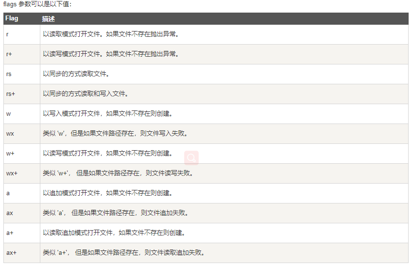
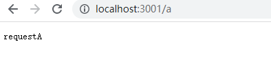
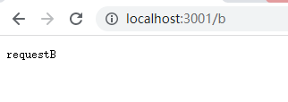
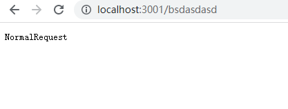

# Node.Js学习

## 1.对文件的各种操作

首先需要引入**fs**模块

```javascript
const fs = require('fs')
```

### 1.写入文件

==fs.writeFile(‘**文件路径**’,’**文本内容**’,**call()**)==

```javascript
const fs = require('fs')
fs.writeFile("写入和读取文件/data/hello.txt",'hello,nodeJs',function(err){
    if(err){
        console.log("写入文件失败!",err.message);
        return
    }
    console.log("写入文件成功!");
})
```

代码成功执行后,会在data文件夹中创建hello.txt文件


### 2.读取文件

==fs.readFile(‘**文件路径**’,**call()**)==

```javascript
const fs = require('fs')
fs.readFile('hello.txt',function(err,data){
    if(err){
        console.log("读取文件失败!",err.message);
        return
    }
    console.log(data.toString());
})
```


### 3.打开文件并将内容存入缓冲流

**打开文件**:fs.open(path, flags[, mode], callback)

参数使用说明如下：

- **path** - 文件的路径。
- **flags** - 文件打开的行为。具体值详见下文。
- **mode** - 设置文件模式(权限)，文件创建默认权限为 0666(可读，可写)。
- **callback** - 回调函数，带有两个参数如：callback(err, fd)。



---


读取文件:fs.read(fd, buffer, offset, length, position, callback)

参数使用说明如下：

- **fd** - 通过 fs.open() 方法返回的文件描述符。
- **buffer** - 数据写入的缓冲区。
- **offset** - 缓冲区写入的写入偏移量。
- **length** - 要从文件中读取的字节数。
- **position** - 文件读取的起始位置，如果 position 的值为 null，则会从当前文件指针的位置读取。
- **callback** - 回调函数，有三个参数err, bytesRead, buffer，err 为错误信息， bytesRead 表示读取的字节数，buffer 为缓冲区对象。

---


```javascript
const fs = require('fs')
var buf = new Buffer.alloc(1024);
fs.open('写入和读取文件/data/hello.txt','r+',function(err,fd){
    if(err){
        console.log("打开文件失败!",err.message);
        return
    }
    console.log("打开文件成功!");
    console.log("准备读取文件");
    fs.read(fd,buf,0,buf.length,0,function(err,bytes){
        if(err){
            console.log("读取文件失败",err.message);
        }
        console.log(bytes+"字节被读取");
        // 仅输出读取的字节，
        if(bytes > 0){
            console.log(buf.slice(0, bytes).toString());//hello,nodeJs
        }

    })

})
```

## 2.创建http服务

`首先引入http模块`

```javascript
const http = require('http')
```

==创建http服务==

```javascript
const server = http.createServer()
```

```javascript
const http = require('http')
const server = http.createServer()

server.on("request",function(){
    console.log("收到客户端请求了");
})
server.listen(3000,function(){
    console.log("服务器创建成功!");
})
```

当我们请求3000端口时,服务器就会接收到请求


---

服务器对请求进行响应

server.on中的回调函数接收两个参数 request和responce

responce中有一个**write**方法 :可以用来给客户端发送响应数据,并且可以使用多次·

还有一个**end**方法:用来结束响应,否则客户端会一直等待

**注意**:

1.向客户端发送数据时只能发送字符串或者二进制数据,如果像发送类似数组、对象的数据,则需要使用==JSON.stringify()==将其转换为json字符串

2.发送数据时解决中文乱码的问题

```javascript
 res.setHeader('Content-Type','text/plain; charset=utf-8')

```

---


当客户端请求url为/a 响应requestA 

当客户端请求url为/b 响应requestB

....

```javascript
const http = require('http')
const server = http.createServer()

server.on("request",function(req,res){
    console.log("收到客户端请求了,请求路径是",req.url);
    const reqUrl = req.url
    if(reqUrl == '/a'){
        res.write('requestA')
        res.end()
    }else if(reqUrl == '/b'){
        res.write('requestB')
        res.end()
    }else if(reqUrl == '/c'){
        res.write('requestC')
        res.end()
    }else{
        res.write('NormalRequest')
        res.end()
    }
})
server.listen(3001,function(){
    console.log("服务器开启成功");
})
```

客户端效果:

请求 /a



请求 /b



普通请求



## 3.响应内容类型

响应普通文本

```javascript
res.setHeader('Content-Type','text/plain; charset=utf-8')
```

响应html文本

```javascript
res.setHeader('Content-Type','text/html; charset=utf-8')
```

---

将客户端响应一个含有图片的页面

js文件

```javascript
const http = require('http')
const fs = require('fs')
const server = http.createServer()
server.on("request",function(req,res){
    console.log("收到客户端请求了,请求路径是",req.url);
    const reqUrl = req.url
    res.setHeader('Content-Type','text/html; charset=utf-8')//解决中文乱码
    if(reqUrl === '/'){
        fs.readFile('test.html',function(err,data){
            if(err){
                res.end('页面加载失败!')
                return
            }
            res.end(data)
        })
    }else{
         // 获取到图片的url
        fs.readFile('.' + reqUrl, function (err, data) {
            res.end(data);
            
        })
    }
})
server.listen(3002,function(){
    console.log("服务器开启成功");
})
```

html文件

```html
<!DOCTYPE html>
<html lang="en">
<head>
    <meta charset="UTF-8">
    <meta name="viewport" content="width=device-width, initial-scale=1.0">
    <title>Document</title>
</head>
<body>
    <h1>首页</h1>
    
</body>
</html>
```

图片文件:与html同级的boy.jpg

页面效果


## 4.使用模板引擎向客户端传递信息

### 1.art-template(模板引擎）

下载方式:==npm i art-template==

使用方式详见文档：

[art-template文档](https://aui.github.io/art-template/zh-cn/docs/api.html)

### 2.使用模板引擎替换html页面

art-template中有一个API:template.render(source, options)

它的功能是编译并返回渲染结果，即它可以将html文本中指定的内容替换成我们需要的内容

如果我们需要替换一个内容,需要在html文档中使用{{}}双括号来表示内容(与vue相似)

例如:

我们需要将张三的姓名渲染在页面上,

```javascript
var content = template.render(‘html文档的路径’, {
					name:'张三'
				})
```


html文档:

```html
<h1>{{name}}<h1>
```


这样就可以将name替换为张三了

## 5.URL模块

### 1.API

##### `new URL(input[, base])`

- `input` [](http://url.nodejs.cn/9Tw2bK) 要解析的绝对或相对的输入网址。 如果 `input` 是相对的，则需要 `base`。 如果 `input` 是绝对的，则忽略 `base`。
- `base` [](http://url.nodejs.cn/9Tw2bK) | [](http://nodejs.cn/api/url.html#the-whatwg-url-api) 如果 `input` 不是绝对的，则为要解析的基本网址。

通过相对于 `base` 解析 `input` 来创建新的 `URL` 对象。 如果 `base` 作为字符串传入，则其将被解析为等效于 `new URL(base)`。

```js
const myURL = new URL('/foo', 'https://example.org/');
// https://example.org/foo
```

网址构造函数可作为全局对象的属性访问。 也可以从内置的 url 模块中导入：

```js
import { URL } from 'url';
console.log(URL === globalThis.URL); // 打印 'true'.
```

如果 `input` 或 `base` 不是有效的网址，则将抛出 `TypeError`。 注意，会将给定的值强制转换为字符串。 例如：

```js
const myURL = new URL({ toString: () => 'https://example.org/' });
// https://example.org/
```

出现在 `input` 的主机名中的 Unicode 字符将使用 [Punycode](http://url.nodejs.cn/C2g98n) 算法自动转换为 ASCII。

```js
const myURL = new URL('https://測試');
// https://xn--g6w251d/
```

只有在启用 [ICU](http://nodejs.cn/api/intl.html#options-for-building-nodejs) 的情况下编译 `node` 可执行文件时，此功能才可用。 如果不是，则域名将原封不动地传入。

如果事先不知道 `input` 是否是绝对的网址并且提供了 `base`，则建议验证 `URL` 对象的 `origin` 是否符合预期。

```js
let myURL = new URL('http://Example.com/', 'https://example.org/');
// http://example.com/

myURL = new URL('https://Example.com/', 'https://example.org/');
// https://example.com/

myURL = new URL('foo://Example.com/', 'https://example.org/');
// foo://Example.com/

myURL = new URL('http:Example.com/', 'https://example.org/');
// http://example.com/

myURL = new URL('https:Example.com/', 'https://example.org/');
// https://example.org/Example.com/

myURL = new URL('foo:Example.com/', 'https://example.org/');
// foo:Example.com/
```

##### `url.hash`[#](http://nodejs.cn/api/url.html#urlhash)

获取和设置网址的片段部分。

```js
const myURL = new URL('https://example.org/foo#bar');
console.log(myURL.hash);
// 打印 #bar

myURL.hash = 'baz';
console.log(myURL.href);
// 打印 https://example.org/foo#baz
```

分配给 `hash` 属性的值中包含的无效的网址字符会进行[百分比编码](http://nodejs.cn/api/url.html#percent-encoding-in-urls)。 选择要进行百分比编码的字符可能与 [`url.parse()`](http://nodejs.cn/api/url.html#urlparseurlstring-parsequerystring-slashesdenotehost) 和 [`url.format()`](http://nodejs.cn/api/url.html#urlformaturlobject) 方法产生的结果有所不同。

##### `url.host`[#](http://nodejs.cn/api/url.html#urlhost)

获取和设置网址的主机部分。

```js
const myURL = new URL('https://example.org:81/foo');
console.log(myURL.host);
// 打印 example.org:81

myURL.host = 'example.com:82';
console.log(myURL.href);
// 打印 https://example.com:82/foo
```

分配给 `host` 属性的无效主机值将被忽略。

更多见文档

[node.js文档](http://nodejs.cn/api/url.html#class-url)

## 6.通过设置状态码让客户端网页重定向

- 状态码设置位302为临时重定向，304为永久重定向.res.statusCode = 302

- 在响应头中通过location指定重定向的url  res.setHeader(‘locaton’,’/’)

  ```javascript
  res.statusCode = 302
  res.setHeader('Location', '/')//执行此命令后,客户端会再次向服务端发起请求,请求的url为'//'
  ```

  
