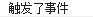
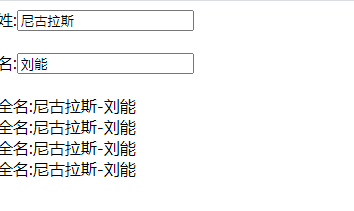
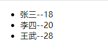
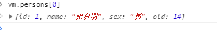

---

---

                     Vue学习笔记

## 1.创建第一个Vue实例

### 1.引入vue.js

1.下载官网vue文件

2.在script标签中引入vue.js文件

```javascript
<script src="./js/vue.js"></script> /*路径是你下载vue.js存放的路径*/
```

### 2.创建实例

```html
<div id="id">
        <h1>{{name}}</h1>//会打印出data中name的值
</div>
```

```javascript
//第一种方式
new Vue({
        el:'#id',//绑定的实例的标识符(利用类型选择器)
    	//绑定的数据
        data:{
            name:'zzm'
        }
    })
//第二种方式,通过$mount绑定实例
new Vue({
    	//绑定的数据
        data:{
            name:'zzm'
        }
}).$mount('#app')
```


## 2.v-bind和v-model的区别

### 1.v-bind(单向绑定)

> v-bind表示单向绑定,数据只能从data流向页面
>
> v-bind能解析表达式

#### 举例

> 如下gif图,通过在input中单向绑定value值为data中的name,当改变input框中的值时,data中的值不会发生变化，故页面上的{{name}}也变化,只有改变data中的name时，value才会发生变化，这就是**单向绑定**

```html
    <div id="id">
       单向绑定: <input type="text" v-bind:value="name"/>{{name}}
    </div>
```

```javascript
new Vue({
        el:'#id',
        data:{
            name:'zzm',
            url:'https:www.baidu.com'
        }
    })
```


> 如果我们想在a标签中添加url，除了最原始的方式，也可以利用vue中的v-bind

**原始方式:**

```html
<a href="https:www.baidu.com">百度</a>
```

**v-bind方式:**

```html
 <a v-bind:href="url">百度</a>
```

注意!!! **v-bind:href**可以简写成**:href**,但是一定要有‘**:**’符号,否则会将url解析成一个为‘url’的字符串

### 2.v-model(双向绑定)

> v-model表示双向绑定，数据不仅能从data流向页面，还可以从页面流向data

#### 举例

> 如下gif图,通过在input中双向绑定value值为data中的name,当改变input框中的值时,data中的值立即发生变化，页面上的{{name}}也同步变化，这就是**双向绑定**

```html
<div id="id">
       双向绑定: <input type="text" v-model:value="name"/>{{name}}
    </div>
```

```javascript
 new Vue({
        el:'#id',
        data:{
            name:'zzm',
            url:'https:www.baidu.com'
        }
    })
```


## 3.理解MVVM模型

### 1.理解


1.M:模型(Model):对应data中的数据

2.V:视图(View):模板

3.VM:视图模型(ViewModel):Vue实例对象

**可以理解为data中的数据通过VM视图模型监听绑定,最终在V视图中展示出来**

### 2.示例

```html
<div id="root">
        <h1>姓名:{{name}} </h1>
        <h1>地址:{{address}} </h1>
    </div>
```

```javascript
 var vm = new Vue({
        el:'#root',
        data:{
            name:'张振明',
            address:'湖南省'
        }
    })
```

在上述示例中,**M**就是**data**中的数据，**VM**是Vue实例对象也就是**vm**，**V**是模板也就是‘**{{}}**’

**M通过VM监听并绑定在V上，这就是vue中的MVVM模型**

## 4.Vue数据代理前篇:理解Object.defineProperty方法

### 1.理解

**Object.defineProperty方法的作用是定义一个属性,为这个属性添加值，并将属性插入一个对象中**

**Object.defineProperty(‘对象名’,’属性’,{**

**value:’属性的数据值’，**

**...**

**})**

### 2.示例

```javascript
 let person = {
        name:'张三',
        sex:'男'
    }
    Object.defineProperty(person,'age',{
        value:18,//表示在person中插入属性为age,值为18的数据
        enumerable:true,//控制属性是否可以枚举，默认值是false
        writable:true,//控制属性是否可以被修改，默认值是false
        configurable:true//控制属性是否可以被删除，默认值是false
    })
```


以上示例表示将一个属性名为**age**,值为**18**的属性插入到名为**person**的对象中,下面的enumerable等为控制属性，可以对此属性设置限制

```javascript
let number = 18
    let person = {
        name:'张三',
        sex:'男'
    }
    Object.defineProperty(person,'age',{
        // value:18,//表示在person中插入属性为age,值为18的数据
        // enumerable:true,//控制属性是否可以枚举，默认值是false
        // writable:true,//控制属性是否可以被修改，默认值是false
        // configurable:true//控制属性是否可以被删除，默认值是false
        get(){
            console.log('有人读取age属性了');
            return number
        },
        set(value){
            number = value
        }
    })
```

以上示例仍然表示将一个属性名为**age**,值为**18**的属性插入到名为**person**的对象中,但是使用了

Object.defineProperty方法中的**get**和**set**函数

#### 1.get方法

当我们运行这段代码并在控制台打印时，可以看到


其中name和sex是能直接显示的，而我们插入的**age**属性则需要手动点击才能显示，这是为什么呢？

这是因为我们在Object.defineProperty方法中写了**get**函数,只有我们点击**age**属性时，这个函数才会调用，此时函数返回**number**中的值，也就是**18**

#### 2.set方法

当我们在**person**中查看**age**的属性时，我们可以看到


此时的**value**值为**18**，当我们修改**age**的值时，


此时**person.age**的值变为**19**,此时我们再观察**number**的值


我们可以发现，此时**number**的值也变成了**19**！！！

我们并没有手动去改变**number**的值，那他是怎么变化的呢？

这就是**set**函数在起作用，当我们修改**person.age**的值时，**number**值就变成了我们修改的值，当我们再次获取**person.age**时，我们再返回**number**的值.**注意我们修改person.age的值实际上就是修改number的值**,因为**get**函数只是负责返回**number**的值!!!

这样就完成了一个**数据代理**

## 5.Vue数据更新视图原理

[不好意思！耽误你的十分钟，让MVVM原理还给你 - 掘金 (juejin.cn)](https://juejin.cn/post/6844903586103558158#heading-8)

**个人理解**:数据修改后会调用属性的set方法,在set方法中修改数据后,监听器(watcher)执行监听函数,将dom树中对应元素修改

## 5.Vue数据代理

### 1.理解


我们写一个vm实例对象,此时vue就会创建一个**vm**对象，并将**data**中的数据赋值到 **_data**中，

**vm通过Object.defineProperty中的get函数来获取 _data中的值并赋值给外部属性name和address**

**Object.defineProperty中的set函数来完成对外部属性name和address的值的修改**

通过vue数据代理，我们可以在模板{{}}上直接写data的属性名name，也就是**{{name}}**,而不需要通过 使用**{{_data.name}}**这样繁琐的写前缀 _data来实现页面的渲染,这样提高了编码效率，使得代码更加简洁

## 6.Vue中的事件修饰符

### 1.功能

#### 1.prevent:阻止默认事件

```html
 <div id="app">
        <a href="https:www.baidu.com" @click=showInfo()>点击我触发事件</a>
    </div>
```

```javascript
    const vm = new Vue({
        el:'#app',
        data:{

        },
        methods:{
            showInfo(){
                console.log("触发了事件");
            } 
        }

    }) 
```

看上述示例，当我们点击链接时


我们可以看到，点击链接之后，浏览器跳转到了新的网址,然后我们再看看使用**prevent**事件符

```html
<div id="app">
        <a href="https:www.baidu.com" @click=showInfo()>点击我触发事件</a>
    </div>
```


**此时我们点击链接之后，只会触发click绑定的函数，而不会执行默认事件**

#### 2.stop：阻止事件冒泡

```html
<div id="app">
        <!-- <a href="https:www.baidu.com" @click.prevent=showInfo()>点击我触发事件</a> -->
        <div @click="showInfo()">
            <button @click="showInfo()">点击我触发事件</button>
        </div>
    </div>
```

```javascript
const vm = new Vue({
        el:'#app',
        data:{

        },
        methods:{
            showInfo(){
                console.log("触发了事件");
            } 
        }

    }) 
```

当我们点击按钮时


控制台输出了两次，也就是调用了两次函数，这是为什么呢？

因为我们的按钮时包裹在**div**里的，我们点击按钮时，**div**也会触发函数，这样就执行了两次函数

我们可以用**stop**来解决这个问题

```html
<div @click="showInfo()">
            <button @click.stop="showInfo()">点击我触发事件</button>
 </div>
```

当我们再次点击按钮时


函数只触发了一次

**stop可以阻止事件的冒泡**

#### 3.once：事件只触发一次

```html
 <button @click.once="showInfo()">点击我触发事件1</button>
```

```javascript
 showInfo(){
                console.log("触发了事件");
            } 
```

当我们第一次点击按钮时



**但当我们继续点击按钮时，控制台将不会弹出信息**

#### 4.capture：使用事件的捕获方式

可以使得事件从外至内执行

#### 5.self:只有event.target是当前操作的元素时才触发事件

#### 6.passive:事件的默认行为立即执行，无需等待事件回调执行完毕

## 7.Vue中的键盘事件


## 8.Vue中的计算属性

### 1.理解

计算属性:

1.定义:要用的属性不存在，要通过已有属性计算得来

2.原理:底层借助了Object.defineproperty方法提供的getter和setter

3.get函数什么时候执行？

- 初次读取会执行一次

- 当以来的数据发生变化时会被再次调用

  .

4.优势:与methods相比，内部有缓存机制(复用).效率更高

5.备注:

​    1.计算属性最终会出现在vm上，直接读取即可

​    2.如果计算属性要被修改，那必须写set函数去响应修改，且set中要引起计算时以来的数据发生变化

### 2.案例

假设1我们需要实现一个“填入姓和名,自动生成姓名”的效果,如下图


我们可以用修饰符**{{}}**、**methods**、和计算属性**computed**三种方式来实现这个案例

#### 1.修饰符{{}}

**优点**:简单方便

**缺点**:对于复杂的表示式，会造成代码不简洁

​	

```html
<div id="app">
        姓:<input type="text" v-model="firstName"><br><br>
        名:<input type="text" v-model="lastName"><br><br>
        全名:{{firstName}}+{{lastName}}
    </div>
```

```javascript
 const vm = new Vue({
        el:'#app',
        data:{
            firstName:'',
            lastName:'',
            
        }
    })
```


通过v-model双向绑定，我们可以在姓名输入框输入相应的值，全名使用**通配符+表达式**，实现全名的渲染


#### 2.methods函数

**优点**:可以处理复杂的逻辑判断，代码量不会繁琐

**缺点**:与计算属性相比，函数可能会不必要的执行

```html
<div id="app">
        姓:<input type="text" v-model="firstName"><br><br>
        名:<input type="text" v-model="lastName"><br><br>
        全名:{{showFullName()}}
    </div>
```

```javascript
 const vm = new Vue({
        el:'#app',
        data:{
            firstName:'',
            lastName:'',
            
        },
        methods:{
            showFullName(){
                return this.firstName+'-'+this.lastName
            }
        }
    })
```

通过**通配符+函数**，我们可以实现复杂的逻辑判断，函数内可以进行很多的操作


#### 3.计算属性computed

**优点**:精准高效，可以准确的观测到数据的变化

```html
 <div id="app">
        姓:<input type="text" v-model="firstName"><br><br>
        名:<input type="text" v-model="lastName"><br><br>
        全名:{{fullName}}
    </div>
```

```javascript
const vm = new Vue({
        el:'#app',
        data:{
            firstName:'',
            lastName:'',
            
        },
        computed:{
            fullName:{
                get(){
                    console.log('get被调用了');
                    return this.firstName+'-'+this.lastName
                },
                set(value){
                    const arr = value.split('-')
                    this.firstName =arr[0]
                    this.lastName = arr[1]
                }
            }
        }
    })
```


以上案例也可以实现，但是我们使用计算属性的优点是什么呢，我们为什么要选择用似乎更加麻烦的计算属性呢，我们先来看它的get函数

```javascript
 get(){
                    console.log('get被调用了');
                    return this.firstName+'-'+this.lastName
                },
```

我们在之前就说到，计算属性含有缓存机制，也就是说，get函数只在**初次读取fullName**时或者所**依赖的数据发生变化**时，才进行调用

比方说

```html
 <div id="app">
        姓:<input type="text" v-model="firstName"><br><br>
        名:<input type="text" v-model="lastName"><br><br>
        全名:{{fullName}}
        全名:{{fullName}}
        全名:{{fullName}}
        全名:{{fullName}}
    </div>
```

当我们多次调用fullName，那么我们的get函数会不会多次调用呢?


我们可以发现，当我们修改姓名的值时，get函数只执行了一次，这就是计算属性特有的**缓存机制**，即只有以下情况**get**才会调用,这样可以大大的提高执行效率

1.**初次读取fullName**

2.**依赖的数据发生变化**

我们再来看看set函数

当我们需要修改fullName的值时，我们需要set函数

```javascript
set(value){
    				console.log("set被调用了");
                    const arr = value.split('-')
                    this.firstName =arr[0]
                    this.lastName = arr[1]
                }
```

我们先不使用set函数，看看我们是否可以修改fullName

当我们在控制台修改fullName的值时


页面没有任何变化,这是为什么呢？

因为fullName其实是由firstName和lastName组合而成的，我们要想修改fullName，就必须修改firstName和lastName，而修改它们我们就要用到set函数

我们现在使用set函数并修改fullName的值




我们发现页面也响应的改变了，这就是计算属性中的**set**的用法

set什么时候调用呢？

**当修改计算属性时，set函数就会被调用**

## 9.Vue中的监视属性

### 1.理解


监视属性watch:

1.当被监视的属性变化时，回调函数自动调用，进行相关操作

2.监视的属性必须存在，才能进行监视

3.监视的两种写法:

​    1.new Vue时传入watch配置

​     2.通过vm.$watch监视

格式:

```javascript

    watch:{
        xxx:{
            hander(newValue,oldValue){
                xxxxx
            }
        }
    }

```

### 2.案例

#### 1.基本属性

接下来我们通过一个修改天气的案例来观察监视属性

```html
<div id="app">
       <p>今天的天气炎热吗?{{isHot}}</p> 
       <button @click="isHot=!isHot">修改isHot</button>
    </div>
```

```javascript
 const vm = new Vue({
        el:'#app',
        data:{
            isHot:true
        },
        methods:{
           
        },
        watch:{
                isHot:{
                    handler(newValue,oldValue){
                    console.log('isHot被修改了',newValue,oldValue);
                    } 
                }
               
            }
    })
```

当我们点击“修改isHot”的按钮时,


控制台会弹出以下信息,说明**监察属性的handler函数被触发了**

**handler函数中的形参newValue表示的时当前监察属性的新值，oldValue表示的时当前监察属性的旧值**

例如我们的isHot初始值是true，那么我们第一次触发函数时，newValue就是false,oldValue是true

#### 2.监视属性监视计算属性

**通过以上案例我们可以知道，监视属性可以为data中定义的参数，但如果是计算属性呢，我们可以监视吗？**

```html
 <div id="app">
       <p>今天的天气是?{{info}}</p> 
       <button @click="isHot=!isHot">修改isHot</button>
    </div>
```

```javascript
const vm = new Vue({
        el:'#app',
        data:{
            isHot:true
        },
        methods:{
          
        },
        computed:{
            info(){
            return this.isHot?'炎热':'凉爽'
            }
        },
        watch:{
                info:{
                    handler(newValue,oldValue){
                    console.log('info被修改了',newValue,oldValue);
                    } 
                }
               
            }
    })
```

点击按钮


我们可以得出结论:**vue监视属性可以监视计算属性**

#### 3.监视属性中的深度监视

我们设想这么一个案例，有一个对象number

number：{a:1,b:1}

我们想要修改a或者修改b时，监视属性都能监测到，怎么实现呢?

```html
<div id="app">
       <h3>a的值是:{{number.a}}</h3>
       <button @click="number.a++">点我让a+1</button>
       <h3>b的值是:{{number.b}}</h3>
       <button @click="number.b++">点我让b+1</button>
    </div>
```

```javascript
const vm = new Vue({
        el:'#app',
        data:{
            number:{
                a:1,
                b:1
            }
        }, 
        watch:{
                number:{
                    handler(){
                    console.log('number被修改了');
                    } 
                }
               
            }
    })
```

我们监听number属性,如果控制台有输出，就可以说明number被成功监听到了是吧?

我们看控制台

当我们让a+1时


a的值的确改变了,但是控制台没有任何输出

这是为什么呢？

这是因为我们监听的是number属性，而a是number对象中的属性,vue只会默认监听number这个属性，如果我们要往number内部监听，我们需要在属性中添加deep配置为true

```javascript
 watch:{
                number:{
                    deep:true,//配置deep为true后，vue会进行深度监听
                    handler(){
                    console.log('number被修改了');
                    } 
                }
               
            }
```


我们配置之后再看控制台


成功监听到a

**这就是深度监视**

## 10.Vue中计算属性computed和监视属性watch的区别

**※computed计算属性函数中不能添加异步回调函数，而watch中可以**

我们在日常开发中，很多案例既可以用watch实现，也可以用computed实现,z在两者皆可的情况下，我们优先选择更加方便的computed计算属性来实现，但是如果存在computed行不通的案例怎么办？我们来看一下以下案例

我们通过输入姓和名，要求输出全名

**我们用计算属性来写这个案例：**

```html
<div id="app">
        姓:<input type="text" v-model="firstName"><br><br>
        名:<input type="text" v-model="lastName"><br><br>
        全名:{{fullName}} <br>
    </div>
```

```javascript
 const vm = new Vue({
        el:'#app',
        data:{
            firstName:'',
            lastName:'',
            
        },
        computed:{
            fullName:{
                get(){
                    console.log('get被调用了');
                    return this.firstName+'-'+this.lastName
                }  
            }
        }
    })
```

查看效果

可以实现

**我们再用监视属性watch来写这个案例**

```html
 <div id="app">
       姓:<input type="text" v-model="firstName"><br><br>
       名:<input type="text" v-model="lastName"><br><br>
       全名:{{fullName}} <br>
    </div>
```

```javascript
const vm = new Vue({
        el:'#app',
        data:{
            firstName:'',
            lastName:'',
            fullName:''
        },
        watch:{
                firstName(val){
                    this.fullName = val +'-'+this.lastName
                },
                lastName(val){
                    this.fullName = this.fullName +'-'+val
                }
               
            }
    })
```

我们分别监听firstName和lastName的值，每当它们的值发生改变，我们就给fullName重新赋值，查看效果


和之前的效果是一样的

那么我们再修改需求，假设我们再修改姓名后，需要全名延迟一秒钟再输出，那我们该怎么写呢?

**我们先用watch试试**

```javascript
 const vm = new Vue({
        el:'#app',
        data:{
            firstName:'',
            lastName:'',
            fullName:''
        },
        watch:{
                firstName(val){
                    setTimeout(()=>{
                        this.fullName = val +'-'+this.lastName
                    },1000)
                    
                },
                lastName(val){
                    setTimeout(()=>{
                        this.fullName = this.fullName +'-'+val
                    },1000)
                }
               
            }
    })
```

我们在监听函数中设置setTimeout方法(注意这是window方法，我们需要使用箭头函数来是他的作用域指向window)，我们看结果


每次全名显示时，都会有1s的延迟

**我们再用computed来写**

```javascript
const vm = new Vue({
        el:'#app',
        data:{
            firstName:'',
            lastName:'',
            
        },
        methods:{
            showFullName(){
                return this.firstName+'-'+this.lastName
            }
        },
        computed:{
            fullName:{
                get(){
                    setTimeout(()=>{
                      console.log('get被调用了');  
                      return this.firstName+'-'+this.lastName  
                    },1000)
                }
               
            }
        }
    })
```

效果


我们可以看到，页面没有任何反应

这是为什么？

我们看这段代码

```javascript
get(){
                    setTimeout(()=>{
                      console.log('get被调用了');  
                      return this.firstName+'-'+this.lastName  
                    },1000)
                }
```

**我们在get函数里写了setTimeout函数，setTimeout函数中的值会返回给get函数，而get函数并没有返回值，这样就会造成计算属性没有返回值，从而达不到我们想要的效果**

**为什么watch中可以写setTimeout函数?**

**因为我们在watch中是通过直接修改fullName来改变fullName的值，不需要像computed一样通过将几个属性进行计算再返回**

仔细对比两者的差异

```javascript
 watch:{
                firstName(val){
                    setTimeout(()=>{
                        this.fullName = val +'-'+this.lastName
                    },1000)
                    
                },
                lastName(val){
                    setTimeout(()=>{
                        this.fullName = this.firstName +'-'+val
                    },1000)
                }
               
            }
```

```javascript
computed:{
            fullName:{
                get(){
                    setTimeout(()=>{
                      console.log('get被调用了');  
                      return this.firstName+'-'+this.lastName  
                    },1000)
                }
               
            }
        }
```

一个是直接修改，一个是返回

所以我们的出结论：**computed计算属性函数中不能添加异步回调函数，而watch中可以**

## 11.动态class和style样式


## 12.key的作用与原理

### 1.原理

#### 1.虚拟DOM中key的作用

1.key是虚拟DOM对象的标识，当数据发生变化时，Vue会根据**新数据**生成**新的虚拟DOM**，随后Vue进行**新虚拟DOM**与**旧虚拟DOM**的差异比较

2.对比规则:

​    (1).**旧虚拟DOM**中找到了与**新虚拟DOM**相同的**key**:

​          ①.若**虚拟DOM**中内容**没有变化**，直接使用之前的**真实DOM**

​          ②.若**虚拟DOM**中**内容变了**，则生成**新的真实DOM**，随后替换掉页面中之前的**真实DOM**

​    (2).**旧虚拟DOM**中未找到与**新虚拟DOM**相同的**key**

​            创建新的**真实DOM**,随后渲染到页面

   3.用**index**作为**key**可能会引发的问题:

​      (1).若对数据进行**逆序添加**、**逆序删除**等**破坏顺序的操作**会产生**没有必要的真实DOM更新**，界					面效果没有问题，**但是执行效率很低**

​	  (2).如果结构中还包含**输入类的DOM**:会产生**错误DOM更新**，**界面有问题**

​	4.开发中如何选择key？

​		(1).最好使用**每条数据的唯一标识**作为**key**，比如id、手机号、身份证号、学号等唯一值

​		(2).如果不存在对数据的**逆序添加**、**逆序删除**等**破坏顺序的操作**，仅用于渲染列表用于展示，					**使用index作为key是没有问题的**

**index作为key和id作为key的区别**


## 2.举例

### 1.使用index作为key或者不定义key

我们要明白一个概念:**当我们不定义key时，Vue会默认将我们遍历的index作为key**，所以我们设置key为index和不设置key’效果是一样的

假设我们需要显示一个persons列表，我们可以使用v-for遍历列表来达到效果

```html
 <div id="app">
        <ul>
            <li v-for="(item,index) in persons" :key="index">{{item.name}}--{{item.age}}</li>
        </ul>
    </div>
```


```javascript
 new Vue({
        el:'#app',
        data:{
            persons:[
            {id:'1',name:'张三',age:18},
            {id:'2',name:'李四',age:20},
            {id:'3',name:'王武',age:28},
            ]
        },
        methods:{

        }
    })
```

最终屏幕会显示



现在我们升级条件

我们在每条信息之后添加一个输入框，并要求点击一个按钮时，将新的数据逆序插入原数组中

效果是这样的


当我们点击按钮，会看到


王八被逆序添加进了persons中

但我们进行如下操作，**在input中添加数据再点击button**


点击按钮


我们发现，**input中的数据错位了！**

这就是将index作为key的弊端之一，**Vue会只会对比虚拟dom**,当我们将**王八逆序添加**进**persons**中时，整个**persons**数组的**index**就改变了，原来的**index**是 **张三：0，李四：1，王武：2**，而现在变成了**王八：0，张三：1，李四：2，王武：3**，Vue对比**虚拟dom**时发现**key**为**0**的值中**name**改变了，于是将**王八**替换**张三**，但是**input**框并没有改变(**input组件是虚拟DOM,而input中的数据是真实DOM**)，于是**Vue复用张三的输入框**，**这就造成了数据的错位**

### 2.使用id作为key

我们仍然使用上述案例

```html
<div id="app">
        <ul>
            <li v-for="(item,index) in persons" :key="item.id">{{item.name}}--{{item.age}} <input type="text"></li>
            <button @click="addPerson">将王八添加进persons中</button>
        </ul>
    </div>
```

```javascript
 new Vue({
        el:'#app',
        data:{
            persons:[
            {id:'1',name:'张三',age:18},
            {id:'2',name:'李四',age:20},
            {id:'3',name:'王武',age:28},
            ]
        },
        methods:{
            addPerson(){
                const p = {id:'4',name:'王八',age:30}
                this.persons.unshift(p)
            }
        }
    })
```


初始页面是这样的


当我们点击按钮


会发现数据没有任何问题，不存在像使用index作为key时数据错位的情况

这是因为我们以**id**作为**key**添加数据时，Vue会对比每个值的**id**，**王八**的**id**为**4**，Vue没有发现原数组中存在**id**为**4**的数据，于是vue会**创建新的真实DOM**，并渲染到页面上

## 13.列表的过滤与排序

### 1.理解

我们要实现一个列表的过滤或者排序，可以使用许多方法，我们这里使用Vue中的计算属性和监听		属性来实现这个需求

计算属性求解:使用计算属性中的get方法，并在方法内使用filter来对keywords进行过滤

监听属性求解:每次监听keyword的变化，并在handler方法中将过滤后的数据放到新数组中，并		进行渲染

### 2.举例

#### 1.列表过滤

##### 1.监听属性解决

我们提出这样一个需求：需要对一个persons数组进行过滤，在输入框中输入关键词，如果数组中	含有这个关键词，就将其输出

我们先用监听属性求解:

```html
 <div id="app">
        <input type="text" v-model="keyWord">
        <ul>
            <li  v-for="(item,index) in filterPersons" :key="item.id">{{item.name}}--{{item.sex}}--{{item.old}}</li>   
        </ul>
    </div>
```

```javascript
new Vue({
        el:'#app',
        data:{
            keyWord:'',
            persons:[
                {id:001,name:'马冬梅',sex:'女',old:14},
                {id:002,name:'周冬雨',sex:'女',old:45},
                {id:003,name:'周杰伦',sex:'男',old:30},
                {id:004,name:'张立伦',sex:'男',old:50}
            ],
            filterPersons:[]
        },
        watch:{
            keyWord:{
                immediate:true,//让监听handler函数一开始就调用一次，解决初始input框				为空时，列表不渲染的问题
                handler(val){
                   this.filterPersons =  this.persons.filter((item)=>{
                    return item.name.indexOf(val)!== -1
                   }) 
                }
                
            }
        }
    })
```

我们监听input中的keyword，如果发现keyword发生改变，调用handler函数，利用filter方法根据persons数组中name的索引值来判断是否需要过滤(如果item.name不存在val,则val的索引值为-1)，将数组过滤后，存放到新的数组filterPersons中，并在页面完成渲染

搜索前:


搜索后:


**如果不存放到新数组filterPersons中，会发生什么情况?**

如果将过滤后的数据重新赋值给原数组persons,这样会使得persons每次都变成过滤后的数据，persons

数组中的数据会变得越来越少，下一次搜索时会发现有些数据已经不存在了

比方说我们persons的原数据为：

```javascript
persons:[
                {id:001,name:'马冬梅',sex:'女',old:14},
                {id:002,name:'周冬雨',sex:'女',old:45},
                {id:003,name:'周杰伦',sex:'男',old:30},
                {id:004,name:'张立伦',sex:'男',old:50}
            ],
```

当我们搜索关键词为“冬”时


搜索数据没有问题，但此时persons已经变成了

```javascript
persons:[
                {id:001,name:'马冬梅',sex:'女',old:14},
                {id:002,name:'周冬雨',sex:'女',old:45},
               
            ],
```

周杰伦和张立伦已经不见了

我们再次搜索关键词为“伦”时


就出问题了

所以，**当我们使用监听属性来过滤列表时，需要创建一个过滤数组，并保持原数组不变**

##### 2.计算属性解决

我们使用计算属性解决此需求时，只需要返回persons的过滤值就行了，不需要重新定义新数组

```html
<div id="app">
        <input type="text" v-model="keyWord"/>
        <button @click="sortType=1">升序</button>
        <button @click="sortType=2">降序</button>
        <button @click="sortType=0">默认排序</button>
        <ul>
            <li  v-for="(item,index) in filPersons" :key="item.id">{{item.name}}--{{item.sex}}--{{item.old}}</li>   
        </ul>
    </div>
```

```javascript
const vm = new Vue({
        el:'#app',
        data:{
            keyWord:'',
            sortType:0,//0为默认排序，1为升序，2为降序
            persons:[
                {id:001,name:'马冬梅',sex:'女',old:14},
                {id:002,name:'周冬雨',sex:'女',old:45},
                {id:003,name:'周杰伦',sex:'男',old:30},
                {id:004,name:'张立伦',sex:'男',old:50}
            ],
            filterPersons:[]
        },
        computed:{
            filPersons(){
                    return this.persons.filter((p)=>{
                        return p.name.indexOf(this.keyWord) !== -1
                    }) 
            }
        },
    })
```

我们定义一个计算属性，当我们需要获取计算属性的值时，我们通过判断p.name中是否含有关键词keyword，如果存在就将其返回


输入关键词后


当我们使用计算属性来过滤列表时，不需要创建新数组

我么增加需求:**我们需要过滤列表的同时，能对列表进行排序**

我们使用计算属性来实现这个需求

```html
<div id="app">
        <input type="text" v-model="keyWord"/>
        <button @click="sortType=1">升序</button>
        <button @click="sortType=2">降序</button>
        <button @click="sortType=0">默认排序</button>
        <ul>
            <li  v-for="(item,index) in filPersons" :key="item.id">{{item.name}}--{{item.sex}}--{{item.old}}</li>   
        </ul>
    </div>
```

```javascript
const vm = new Vue({
        el:'#app',
        data:{
            keyWord:'',
            sortType:0,//0为默认排序，1为升序，2为降序
            persons:[
                {id:001,name:'马冬梅',sex:'女',old:14},
                {id:002,name:'周冬雨',sex:'女',old:45},
                {id:003,name:'周杰伦',sex:'男',old:30},
                {id:004,name:'张立伦',sex:'男',old:50}
            ],
            filterPersons:[]
        },
        computed:{
            filPersons(){
                    const arr =  this.persons.filter((p)=>{
                        return p.name.indexOf(this.keyWord) !== -1
                    })
                    
                    if(this.sortType){
                        arr.sort((p1,p2)=>{
                            return this.sortType ===1 ? p2.old-p1.old:p1.old-p2.old
                        })
                    }
                    return arr
                
            }
        },
    })
```

效果:

点击”升序“按钮


点击”降序“按钮


点击默认排序按钮


实现方法：我们通过点击按钮修改sortType的值，并使用计算属性filPersons来控制列表的排序与过滤

首先对persons进行过滤，过滤出筛选出来的人员信息，将人员信息存入新的数组，并对数组使用sort方法进行排序

```javascript
 const arr =  this.persons.filter((p)=>{
                        return p.name.indexOf(this.keyWord) !== -1
                    })
                    
                    if(this.sortType){
                        arr.sort((p1,p2)=>{
                            return this.sortType ===1 ? p2.old-p1.old:p1.old-p2.old
                        })
                    }
                    return arr
```

这样就能实现**既要过滤又要排序的需求**

------

那么问题来了,使用监听属性能不能同时实现这两个需求呢？

答案是**不能**

如果我们分别监听keyWord和sortType

```javascript
 watch:{
            sortType:{
                immediate:true,
                handler(val){
                  this.filterPersons = this.filterPersons.sort((p1,p2)=>{
                      return val ===1 ? p2.old-p1.old:p1.old-p2.old
                  })
                   
                }
                
            },
            keyWord:{
                immediate:true,
                handler(val){
                   this.filterPersons =  this.persons.filter((item)=>{
                    return item.name.indexOf(val)!== -1
                   }) 
                   
                }
                
            }
            
        },
```


我们会发现，如果我们**先进行排序，然后进行过滤**，展示出来的数据又变成默认的排序方式了，因为我们过滤时，**filterPersons**又从**persons**中获取数据，而**persons**是不改变的(所保持默认排序)，所以**filterPersons**的顺序也变成了**默认排序**

------

## 14.Vue监测数据的原理

### 1.原理

1.vue会监视data中所有层次的数据

2.如何监测对象中的数据？

​	通过setter事件监视，且要在newVue时就传入要监测的数据

​		(1).在对象后追加的属性，Vue默认不做响应式处理

​		 (2).如需给后添加的属性做响应式，需要使用以下API:

​				Vue.set(target,propertyName/index,value)

​			    vm.$set(target,propertyName/index,value)

 3.如何监测数组中的数据?

​     通过包裹数组更新元素的方法实现，本质就是做了两件事:

​			(1).调用原生对应的方法对数组进行更新

​			(2).重新解析模板，进而更新页面

4.在Vue修改数组中的某个元素需要用到以下方法:

​		1.使用这些API:push(),pop(),shift(),unshift(),splice(),sort(),erverse()

​        2.Vue.set()或vm.$set

### 2.举例

我们现在提出这么一个需求:修改persons数组中的第一条数据

```html
 <div id="app">
        <button @click="updateData">更新数据</button>
        <ul>
            <li v-for='(item,index) in persons'>
                {{item.name}}--{{item.sex}}--{{item.old}}
            </li>
        </ul>
    </div>
    
```

```javascript
  const vm =  new Vue({
        el:'#app',
        data:{
            persons:[
                {id:001,name:'马冬梅',sex:'女',old:14},
                {id:002,name:'周冬雨',sex:'女',old:45},
                {id:003,name:'周杰伦',sex:'男',old:30},
                {id:004,name:'张立伦',sex:'男',old:50}
            ],
        },
        methods:{
            updateData(){
                this.persons[0] = {id:001,name:'张振明',sex:'男',old:14}
            }
        }
    })
```

我们直接对persons[0]进行修改

点击按钮 发现列表的数据并没有改变


我们在控制台输出persons[0]



会发现我们persons中的数据实际上已经改变了

那为什么没有渲染到页面呢？

我们查看vm中persons


会发现我们修改的数据并没有被Vue监测

但是我们定位到数组中对象的属性进行操作

```javascript
this.persons[0].name = '张振明'
```


页面能成功渲染

我们查看vm中的persons


会发现每一个对象的属性都有对应的getter和setter，说明数据被Vue监测到了

Vue通过什么监测数据?

通过Object.defineProperty方法，运用get和set函数来对数据进行修改和解析

封装obeserver方法遍历data中的每一个属性，并对属性添加getter和setter,从而实现对数据的监控

通过以上例子我们可以知道，**直接修改数组中的元素，Vue是不会监测的，因为Vue并没有对其进行数据监控，Vue只会监测数组中对象元素的属性**

persons[0].name是对象中的属性，在创建实例对象中，Vue就对其添加了数据监测，所以当我们修改persons[0].name时，Vue会监听其修改的内容并将页面重新渲染

### 3.Vue.set方法

从上面的问题我们知道，直接修改没有被Vue监控的内容是不会引起页面重新渲染的，那我们如何解决这个问题呢？Vue提供给了我们set方法

#### 1.set监视对象

通过Vue.set或者vm.$set我们可以给对象加入监视属性，从而达到修改数据重新渲染页面的效果

```html
 <div id="app">
        <h1>学校信息</h1>
        <h2>学校名称:{{name}}</h2>
        <h2>学校地址{{address}}</h2>
        <hr/>
        <h1>学生信息</h1>
        <h2>姓名{{student.name}}</h2>
        <button @click="addSex">添加一个性别</button>
        <h2>性别:{{student.sex}}</h2>
        <h2>年龄:真实{{student.age.rAge}}，对外{{student.age.sAge}}</h2>
        <h2>朋友们</h2>
        <ul>
            <li v-for="(item,index) in student.friends">{{item.name}}--{{item.age}}</li>
        </ul>
    </div>
```

```javascript
 const vm = new Vue({
        el:'#app',
        data:{
            name:'北京大学',
            address:'北京',
            student:{
                name:'tom',
                age:{
                    rAge:40,
                    sAge:18
                },
                friends:[
                    {name:'jerry',age:35},
                    {name:'tony',age:18}
                ]
            }
        },
        methods: {
            addSex(){
                Vue.set(this.student,'sex','男')
            }
        },
        
    })
```

页面效果是这样的


我们点击按钮，会发现列表成功渲染


原理是:**点击按钮触发函数，在函数中使用vue.set对student添加‘sex‘属性，此时Vue会为其添加监视属性，并通过setter重新渲染页面**


#### 2.set监视数组

要对数组进行操作，Vue对原生的操纵数组的方法进行了重新封装,我们使用这些	API:push(),pop(),shift(),unshift(),splice(),sort(),erverse()，Vue会为数组配置监听属性，从而达到页面的重新渲染，我们也可以使用Vue.set方法来实现对数组的操作

```html
<div id="app">
        <h1>学校信息</h1>
        <h2>学校名称:{{name}}</h2>
        <h2>学校地址{{address}}</h2>
        <hr/>
        <h1>学生信息</h1>
        <h2>姓名{{student.name}}</h2>
        <button @click="addSex">添加一个性别</button>
        <h2>性别:{{student.sex}}</h2>
        <h2>年龄:真实{{student.age.rAge}}，对外{{student.age.sAge}}</h2>
        <button @click="addFriend()">修改第一个朋友的姓名</button>
        <h2>朋友们</h2>
        <ul>
            <li v-for="(item,index) in student.friends">{{item.name}}--{{item.age}}</li>
        </ul>
    </div>
```

```javascript
const vm = new Vue({
        el:'#app',
        data:{
            name:'北京大学',
            address:'北京',
            student:{
                name:'tom',
                age:{
                    rAge:40,
                    sAge:18
                },
                friends:[
                    {name:'jerry',age:35},
                    {name:'tony',age:18}
                ]
            }
        },
        methods: {
            addSex(){
                Vue.set(this.student,'sex','男')
            },
            addFriend(){
                Vue.set(this.student.friends,0,{name:'zzm',age:35})
                //this.student.friends.splice(0,1,{name:'zzm',age:35})
            }
        },
        
    })
```

当我们点击添加修改朋友姓名的按钮


页面成功渲染

原理是：**我们点击按钮执行函数，函数中使用vue.set或者splice对数组进行修改,从而达到我们想要的效果**

## 15.Vue收集表单数据


## 16.Vue过滤器

### 1.介绍

Vue过滤器filters可以对数据进行过滤，实际上就是一个函数

在修饰符{{}}中使用|可以对数据进行过滤

格式为{{item | filters}}

### 

### 2.举例

假设我们有这样一个需求:要按照一定格式并且实时输出时间

在编写之前我们介绍一款很好用的插件

Dayjs，可以将输入的时间戳格式化，而且有非常多的格式化方式，非常方便

[Dayjs]([Format · Day.js (gitee.io)](https://dayjs.gitee.io/docs/zh-CN/display/format))


我们利用Vue中的filter实现这个需求

**注意使用dayjs插件需要先下载然后引入**

```html
<div id="app">
        {{newDate | formatTime}}
    </div>
```

```javascript
const vm = new Vue({
        el:'#app',
        data:{
            newDate:new Date()
        },
        mounted() {
            setInterval(() => {
                vm.newDate = new Date(); // 修改日期数据
            }, 1000);
        },
        filters:{
            formatTime(val){
                return dayjs(val).format('YYYY:MM:DD ss')
            }
        }
    })
```

我们定义一个newDate属性，并给它设置一个初始值，防止刚进入页面时显示异常

我们通过mounted挂载时间

mounted在模板**渲染成html后调用**，通常是初始化页面完成后，再对html的dom节点进行一些需要的操作。

在里面设置定时函数，每经过一秒钟，将newData重新赋值为当前时间戳

然后我们通过在修饰符中对数据进行过滤

formatTime函数中的val就是newData的值(当前为时间戳),通过dayjs格式化将新的数据传递给newDate并且输出

这就实现了一个动态输出时间的需求

## 17.内置指令

### 介绍

回顾以下以前学过的指令


#### 1.v-text

##### 属性

1.向其所在的节点中渲染文本内容

2.与插值语法的区别:v-text会替换掉节点中的内容，{{}}不会

```html
  <div id="app">
        <p>{{str}}</p>
        <p v-text="str"></p>
    </div>
```

```javascript
  new Vue({
        el:'#app',
        data:{
            str:'hello world'
        }
    })
```


#### 2.v-html

##### 属性

将文本内容解析成html内容

```html
 <div id="app">
        <p>{{str}}</p>
        <p v-text="str"></p>
        <div v-html="str2"></div>
    </div>
```

```javascript
 new Vue({
        el:'#app',
        data:{
            str:'hello world',
            str2:'<h1>helloworld</h1>'
        },
    })
```


#### 3.v-cloak

##### 属性

1.本质是一个特殊指令，Vue实例创建完毕并接管容器后，会删掉v-cloak属性

2.使用css配合v-cloak可以解决网速慢时页面展示出{{xxx}}的问题

##### 解释

如果vue加载较慢，则页面可能会将插值语法{{}}渲染再页面，这对于用户来说肯定时不友好的，

使用v-cloak搭配css中的属性选择器可以使得组件没有渲染完成时隐藏组件

```html
  <div id="app">
        <p v-cloak>{{str}}</p>
        <p v-text="str"></p>
        <div v-html="str2"></div>
    </div>
```

```css
 [v-cloak]{
        display: none;
    }
```

在组件尚未渲染完成时,v-cloak属性是存在的，于是隐藏组件，当组件渲染完成时，v-cloak属性销毁，于是组件展示在页面上

#### 4.v-once

##### 属性

1.v-once所在节点在初次动态渲染后，就被视为静态内容了

2.以后数据的改变不会引起v-once所在结构的更新，可以用于优化性能

```html
<div id="app">
       <p v-once>{{num}}</p>
       <p>{{num}}</p>
       <button @click="num++">点我使num+1</button>
        
    </div>
```

```javascript
new Vue({
        el:'#app',
        data:{,
            num:0
        },
        methods: {
  
        },
    })
```


使用v-once之后，节点只渲染一次

#### 5.v-pre

##### 属性

1.跳过其所在节点的编译过程

2.可利用它跳过没有使用指令语法、没用使用插值语法的节点，会加快编译


```html
<div id="app">
       <p v-pre>{{num}}</p>
       <p>{{num}}</p>   
    </div>
```

```javascript
new Vue({
        el:'#app',
        data:{
            num:0
        },

    })
```


加了v-pre之后，vue不对标签中的内容进行解析

## 18.自定义指令

### 1.格式

```javascript
 directives:{
            big(element,binding){
                element.innerText =binding.value*10
                console.log(element,binding)
            },
            fbind:{
                //指令与元素成功绑定时
                bind(element,binding){
                    element.value =binding.value*10
                    console.log("bind");
                },
                //指令所在元素被插入页面时
                inserted(element,binding){
                    element.focus()
                    console.log("inserted");
                },
                //指令所在模板被重新解析时
                update(element,binding){
                    console.log("update");
                    element.value =binding.value*10
                    // element.focus()
                }
            }
        },
```

在与data同级层定义directives，并在其中定义指令

一个完整的指令包含**bind**、**inserted**、**update**三个钩子函数

**bind**:指令与元素成功绑定时执行

**inserted**:指令所在元素被插入页面时

**update**:指令所在模板被重新解析时

```html
           fbind:{
                //指令与元素成功绑定时
                bind(element,binding){
                    console.log("bind");
                },
                //指令所在元素被插入页面时
                inserted(element,binding){

                    console.log("inserted");
                },
                //指令所在模板被重新解析时
                update(element,binding){
                    console.log("update");
                }
            }
```


### 2.举例

### 1.案例一

定义一个v-big指令，和v-text功能类似，但要求吧绑定的数值放大十倍

```html
 <div id="app">
        <h2 >当前的n的值是: <span v-text="n"></span> </h2>
        <h2>放大十倍后的的n的值是: <span v-big="n"></span></h2>
        <button @click = "n++">点击使n++</button>
    </div>
```

```javascript
const vm =new Vue({
        el:'#app',
        data:{
            n:1
        },
        directives:{
            big(element,binding){
                element.innerText =binding.value*10
                console.log(element,binding)
            },
        }
    })
```

当不需要对数据进行精细处理时，我们自定义组件可以使用简写，以上为

```javascript
 big(element,binding){
                element.innerText =binding.value*10
                console.log(element,binding)
            }
```

简写会跳过**inserted**钩子函数，只执行**bind**和**update**函数

### 2.案例二

定义一个v-fbind指令,和v-bind功能类似，但可以让其所绑定的input元素默认获取焦点

```html
<div id="app">
        <h2 >当前的n的值是: <span v-text="n"></span> </h2>
        <h2>放大十倍后的的n的值是: <span v-big="n"></span></h2>
        <button @click = "n++">点击使n++</button>
        <input type="text" v-fbind:value="n">
    </div>
```

```javascript
 const vm =new Vue({
        el:'#app',
        data:{
            n:1
        },
        directives:{
            big(element,binding){
                element.innerText =binding.value*10
                console.log(element,binding)
            },
            fbind:{
                //指令与元素成功绑定时
                bind(element,binding){
                    element.value =binding.value*10
                    console.log("bind");
                },
                //指令所在元素被插入页面时
                inserted(element,binding){
                    element.focus()
                    console.log("inserted");
                },
                //指令所在模板被重新解析时
                update(element,binding){
                    console.log("update");
                    element.value =binding.value*10
                    // element.focus()
                }
            }
        }
    })
```

当我们需要获取输入框的焦点时，我们需要在指令所在元素被插入页面时进行操作，需要inserted钩子函数，所以我们不能简写

## 19.生命周期函数

### 1.原理


**beforeCreate**:此时生命周期以及事件已经被初始化但是数据代理还未开始，无法通过vm访问到data中的数据、methods中的方法

**created**：此时数据监测和数据代理已经初始化，可以通过访问vm访问到data中的数据

**beforeMount**：此阶段Vue开始解析模板，生成虚拟DOM(内存中)，但是页面还不能显示解析好的内容，

此时页面呈现的时未经Vue编译的DOM结构，所有对DOM的操作，最终都不奏效

**mouted**:此阶段内存中的虚拟DOM已经转成真实DOM插入页面。页面中呈现的时经过Vue编译的DOM，此时对DOM的操作均有效。至此初始化过程结束，一般再次进行:开启定时器、发送网络请求、订阅消息、绑定自定义事件等初始化操作、

**beforeUpdate**:此时数据是新的，但是页面是旧的，页面尚未和数据保持同步

**updated**:此时页面已经完成了从Model到View的更新，页面数据是新的，页面也是新的，即页面和数据保持同步

**beforeDestory**：此时vm中所以的data、methods、指令等等都处于可用状态，但是马上要执行销毁过程，一般在此阶段:关闭定时器，取消订阅消息、解绑自定义事件等收尾操作

**destoryed**:销毁vm实例

### 2.实例

设置一个定时器，实现元素的渐变效果

```html
 <div id="app">
        <h2 :style="{opacity}">我爱Vue</h2>
        <button @click="stop">使渐变停止</button>
    </div>
```

```javascript
const vm = new Vue({
        el:'#app',
        data:{
            opacity:0.5
        },
        methods: {
            stop(){
                console.log("bye");
                this.$destroy()
            }
        },
        beforeCreate() {
            console.log("beforeCreate");
        },
        created() {
            console.log("created");
        },
        beforeMount() {
            console.log("beforeMount");
        },
    //在mounted钩子函数中设置定时器
        mounted() {
            console.log("mounted");
            setInterval(() => {
                this.opacity-=0.01
                if(this.opacity<=0){
                    this.opacity=1
                }
            }, 16);
        },
        beforeDestroy() {
            console.log("beforeDestroy");
        },
        destroyed() {
            console.log("destroyed");
        },
    })
```


点击按钮时触发stop函数，对vm实例进行销毁，销毁后，原来的dom仍有残留，但实际上已经全部销毁

## 20.非单文件组件

### 1.定义

组件的定义:实现应用中**局部**功能**代码**和**资源**的**集合**

非单文件组件:一个文件中包含n个组件

单文件组件:一个文件中只包含1个组件

### 2.使用

#### 1.创建组件的基本格式

创建组件的基本格式:**使用Vue.extend创建组件实例，并在父级实例中注册该组件**

组件的基本格式:与**vm实例**类似，但是**不能有el**，并且**data只能是一个函数**

```javascript
const component = Vue.extend({
    template:`xxx`//模板内为html代码，使用时会将模板渲染到页面
    data(){
    	//data必须是一个函数，这样才能保证每次使用该组件时获取的数据都是data中的原数据，否则当我们在一个页面中修改了data中的数据时，其他使用了该组件的页面中的数据也会相应改变，会造成数据混乱  
        return{
		
        }
	}，
    //vm实例中的功能与组件基本都相同
    methods：{
        
    }
	....
})
```

------

##### 1.**为什么data必须是一个函数?**

**data必须是一个函数，这样才能保证每次使用该组件时获取的数据都是data中的原数据，否则当我们在一个页面中修改了data中的数据时，其他使用了该组件的页面中的数据也会相应改变，会造成数据混乱**  

假设我们定义x为一个对象，并且定义x1=x，x2=x，当我们修改x1中的a的值为100时，会发现x中的a也变成100了，x2中的a也变成100了，这显然会造成数据的混乱

```javascript
	let x = {a:1,b:2}
    let x1 = x
    let x2= x
```


当我们将data定义为函数，我们修改x1和x2的值都不会对x造成影响

**x、x1、x2的关系**就是 

**x**:定义的一个组件  **身份证原件**

**x1**:页面一使用该组件,需要使x1=new x()  **身份证复印件1**

**x2**:页面二使用该组件,需要使x2=new x()  **身份证复印件2**

无论身份证复印件怎么修改都不会对身份证原件造成影响，并且我下次再次打印身份证复印件3时，数据仍与原件保持一致

```javascript
 function x(){
        return{
            a:1,
            b:2
        }
    }
    let x1 = new x()
    let x2= new x()
```


##### 2.注册和使用属性

例如我们创建一个名为school的组件，他有有模板，数据等等属性，

并且我们需要在它的父级实例中注册，也就是下方代码中的**vm中的components**

格式为

```javascript
components:{
            属性名:属性创建时的名字
        }
```

注意**我们注册时定义的属性名是我们最终在模板中引用的名字**，如以下代码，我们在模板中引用的属性名是**xuexiao**而不是**school**，**school**只是作为一个**中间变量**

```html
<div id="app">
<xuexiao></xuexiao>
</div>
```

```javascript
const school = Vue.extend({
        template:'<h1>{{name}}</h1>',
        data(){
            return{
                name:'北京大学'
            }
        }
    })
const vm =new Vue({
        el:'#app',
        data:{

        },
        components:{
            xuexiao:school
        }
    })
```

最终呈现在页面是这样的


##### 3.创建属性需要注意的几个地方


#### 2.组件的嵌套

**组件的嵌套就是在一个组件中添加新的组件，并且可以一直套娃(doge)**

如下所示，我们在vm中创建了组件school，又在组件school中创建了组件student,

我们**需要在school组件中注册student并且在它的模板中引用student组件**，而**不能跳过school组件直接在vm中引用该组件**

```javascript
const student =Vue.extend({
        template:`
        <h1>{{name}}</h1>`,
        data(){
            return{
                name:'张三'
            }
        }
    })

    const school = Vue.extend({
        template:`
        <div>
        <h1>{{name}}</h1>    
        <student></student>
        </div>
        `,
        data(){
            return{
                name:'北京大学'
            }
        },
        components:{
            student:student
        }
    })
    const vm =new Vue({
        el:'#app',
        data:{

        },
        components:{
            school:school
            
        }
    })
```

#### 3.VueComponent构造函数

以之前写的school组件为例

1.school组件本质是一个名为VueComponent的构造函数，且它是Vue.extend生成的

2.我们只需要写<scholl/>或者<school></school>,Vue解析时会帮我构建school组建的实例对象，即Vue帮我们执行的：**new VueComponent(options)**

3.每次调用Vue.extend,返回的都是一个全新的VueComponent

4.关于this指向:

​	(1).组件配置中:data函数、methods中的函数watch中的函数，computed中的函数 他们的this均是				【**VueCompinent实例对象**】

​	(2).new Vue()配置中：

​	data函数、methods中的函数watch中的函数，computed中的函数 它们的this均是【Vue实例对象】

5.VueComponent实例对象简称组件实例对象，Vue的实例对象，简称vm

#### 4.Vue与VueComponent的关系


## 21.单文件组件


## 22.ref属性

### 1.理解

ref属性:

​		1.被用来给元素或子组件注册引用信息(id的替代者)

​		2.应用在html标签上获取的是真实DOM元素，应用在组件标签上是组件实例对象(VueComponent)

​		3.使用方式：

​			打标识: <School ref="school"></School>或者<button ref="btn"></button>

### 2.示例

接下来我们演示ref的结构

首先我们定义一个组件 school

```html
<div>
      <p>姓名：{{name}}</p>
      <p>年龄：{{age}}</p>
  </div>
```

```javascript
export default {
    name:'School',
    data(){
        return{
            name:'张振明',
            age:18
        }
    }
}
```

并在app.vue中注册该组件

```html
 <div id="app">
    <School ref="school"></School>
    <button ref="btn" @click="getRef">点我查看ref</button>
  </div>
```

```javascript
import School from './components/school.vue'

export default ({
  name:'App',
  components:{School},
  data(){
    return{
      
    }
  },
  methods:{
    getRef(){
      console.log(this.$refs.school);
       console.log(this.$refs.btn);
    }
  }

})
```

我们定义一个getRef函数分别打印 html标签和组件标签的ref

得到的结果是


这就印证了我们之间的说法:**应用在html标签上获取的是真实DOM元素，应用在组件标签上是组件实例对象(VueComponent)**

得到ref中的内容后，我们可以进行非常多的操作

## 23.prop属性

### 1.定义

让组件接受外部传过来的数据

​	(1).传递数据:

​		<demo name="xxx"/>

​	(2).接收数据:

​		方式一(只接收，不进行其他的配置)

​			props:['name']

​		方式二(限制类型)

​		

```javascript
	props:{
​				name:String
​			}
```

​		方式三(限制类型、限制必要性、指定默认值)

```javascript
props:{
    ​	name:{
        ​		type:String,//类型
            ​	requried:true,//必要性
               	defaut: xxx//默认值
              }
    ​	}
```

备注:props是只读的，Vue底层会监测你对props的修改，如果进行了修改，就会发出警告.如确实需要修改，可以在data中重新定义一个变量，将props的值赋给它

​			

### 2.示例

我们定义一个组件，在data中定义name和age，在props中定义school属性

```html
  <div>
      <p>学校:{{school}}</p>
      <p>姓名：{{name}}</p>
      <p>年龄：{{age}}</p>
  </div>
```

```javascript
export default {
    name:'School',
    data(){
        return{
            name:'张振明',
            age:18
        }
    },
    props:['school']
}
```

在app.vue中注册school组件并使用该组件

```html
<div id="app">
    <School school="北京大学"></School>
  </div>
```

```javascript
import School from './components/school.vue'
export default ({
  name:'App',
  components:{School},
})
```

我们在使用该组件时，需要给school属性添加值，添加值后我们就可以在页面中输出该值啦

注意上述案例中 name和age是组件data中定义的属性,而school是在prop中定义的属性，如果我们在上级组件中给school赋值，school就为默认值(如果没有默认值，则值为空)


另外，如果我们需要在prop接收到数据之后又修改prop中的值，则需要在data中定义一个属性来接收prop中传来的值

在school组件中

```html
<div>
      <p>学校:{{mySchool}}</p>
      <p>姓名：{{name}}</p>
      <p>年龄：{{age}}</p>
  </div>
```

```javascript
 name:'School',
    data(){
        return{
            name:'张振明',
            age:18,
            mySchool:this.school+"666"
        }
    },
    props:['school']
```

这样就能将props中的school属性进行修改了

## 24.mixin混入

### 1.mixins

#### 1.定义

​	**功能**:可以把多个组件公用的配置提取成一个混入对象,接受一个对象数组，意味着可以接受多个mixin对象

​	类似于node.js中的工具类

​	mixin中可以写VC(VueComponent)中的任 何属性,例如 methods data 生命周期函数等等

​	**使用方式**:

​		第一步:定义mixin

​					创建一个新的js文件，并在对象中书写功能

```javascript
export const mixin ={
    methods:{
        showName(){
            alert(this.name)
        }
    },
    data(){
        return{
            a:1,
            b:2
        }
    }
}
```

​		第二步:使用混入:

​				(1).全局混入:Vue.mixin(xxx)

​				(2).局部混入:mixins:['xxx']

​	**注意**:若在组件和混入中拥有相同的属性，则组件中的优先级高于混入,但生命周期函数例外，若两者皆有同样的生命周期函数，则两者皆执行()(执行顺序为**先引入的mixin->后引入的mixin->组件**)

当我们在实际开发中如果每个页面都需要调用某个接口或者使用方法，就可以全局引用混入，可以减少代码量

如果引入的多个混入同时具有同名的方法,并且当前组件没有这个方法,那么哪个mixin后引入,这个组件就拥有哪个方法

比如app.vue是自组件,它本身没有sayHello方法,而它引入的两个混入mixin1和mixin2同时具有sayHello方法,那么如果mixin2后引用,组件就含有mixin2的方法(**后引入的覆盖前面引入的**)

如图

mixin1后引入那么


组件中的sayHello为mixin1的方法

#### 2.示例

**局部混入**:

实现一个点击姓名出现弹出框的功能

 创建一个混合

```javascript
export const mixin ={
    methods:{
        showName(){
            alert(m.name)
        }
    },
    data(){
        return{
            a:1,
            b:2
        }
    }
}
```

**在组件中引用混入**

```html
<template>
  <div>
      <p @click="showName">姓名：{{name}}</p>
      <p>年龄：{{age}}</p>
  </div>
</template>
```

```javascript
import {mixin} from '../mixin'//导入混入
export default {
    name:'School',
    data(){
        return{
            name:'张振明',
            age:18
        }
    },
    mixins:[mixin]//在vc中引用混入
}
```


**全局引用混入**:

在main.js中

```javascript
import Vue from 'vue'
import App from './App.vue'
import router from './router'
import {mixin} from './mixin'//引入混入
Vue.config.productionTip = false
Vue.mixin(mixin)//全局使用混入
new Vue({
  router,
  render: h => h(App)
}).$mount('#app')

```

### extends

定义:与mixin类似,只不过接收的参数是简单的选项对象或构造函数,所以extends只能单次扩展一个组件

当一个组件同时含有extends，minxins时,生命周期的执行顺序是:**extends->先引入的mixin->后引入的mixin->组件**，对于同名的属性和方法,mixins会覆盖掉extends(因为extends总是先在实例中注册)


## 25.插件

### 1.定义

功能:用于增强Vue

本质:包含install方法的一个对象，install的第一个参数是Vue，第二个以后的参数是插件使用者传递的数据


定义插件的方法:

```javascript
对象.insatll =function(Vue,options){
    //1.添加全局过滤器
    Vue.filter(...)
    //2.添加全局指令
    Vue.directive(...)
    //3.配置全局混入
    Vue.mixin(...)
   	//4.添加实例方法
    Vue.prototype.demo =()=>{
            alert('hello')
        }
}
```

使用插件

Vue.use()

### 2.示例

创建一个plugins的js文件

```javascript
import Vue from "vue"
export default {
    install(){
        Vue.prototype.demo =()=>{
            alert('hello')
        }
    }
    
}
```

并在main.js中引入plugins.js

```javascript
import Vue from 'vue'
import App from './App.vue'
import router from './router'
import plugins from './plugins'
Vue.config.productionTip = false
Vue.use(plugins)
new Vue({
  router,
  render: h => h(App)
}).$mount('#app')

```

这样就可以全局使用插件了

在实际开发中我们会用到很多的插件，原理使用和引入的原理都是一样的

## 26.scoped样式

### 1.定义

作用：让样式在局部生效，防止样式冲突

原理：给每个组件的最外侧div添加一个id，这样就能有效的阻止样式冲突

写法:

```css
<style scoped>
</style>
```

### 2.示例

假设我们需要写两个组件的css样式,假设我们样式的类名一样

在student.vue中

```html
<div class="name"></div>
```

```css
.name{
    width: 200px;
    height: 200px;
    background-color: yellow;
}
```

在School.vue中

```html
<div class="name">     </div>
```

```css
.name{
    width: 200px;
    height: 200px;
    background-color: red;
}
```

将两个组件注册到App.vue中

```html
  <div id="app">
    <School ></School>
    <hr>
    <student></student>
  </div>
```

```javascript
<script>
import School from './components/school.vue'
import Student from './components/student.vue'
export default ({
  name:'App',
  components:{School,Student},
  data(){
    return{
      
    }
  }

})
</script>
```

我们查看页面效果


会发现两个div都是黄色，这是因为我们定义组件样式的类名冲突了，我们在引入组件时，student的样式会覆盖掉school的样式，于是就造成了此现象，我们可以给style添加scoped解决此问题

给两个组建的style分别添加scoped

页面效果


冲突解决，原因是添加scoped后Vue给每个组件的最外侧div添加了一个id，渲染时会根据id来进行样式选择，这样就防止了样式冲突的现象

## 27.webStorage

### 1.定义

1.浏览器通过window.sessionStorage和window.localStorage属性来实现本地存储机制

2.**相关API**

```javascript
xxxxStorage.setItem('key','value')//把键值对添加到存储中，如果键名存在，则更新其对应的值
```

```javascript
xxxxStorage.getItem('key')//获取对应键名的值
```

```javascript
xxxxStorage.removeItem('key')//移除对应键值对
```

```javascript
xxxxStorage.clear()//清空存储中的所有数据
```

3.**sessionStorage与localStorage的区别**

​	**sessionStorage**的存储内容会随着浏览器窗口的关闭而消失

​	**localStorage**的存储内容需要手动清除才会消失

### 2.示例

#### 1.localStorage

```html
<!DOCTYPE html>
<html lang="en">
<head>
    <meta charset="UTF-8">
    <meta http-equiv="X-UA-Compatible" content="IE=edge">
    <meta name="viewport" content="width=device-width, initial-scale=1.0">
    <title >localStorage</title>
</head>
<body>
    <button onclick="add()">点我添加localStorage</button>
    <button onclick="get()">点我获取localStorage</button>
    <button onclick="remove()">点我删除localStorage</button>
</body>
</html>
<script>
    //添加localStorage
    function add(){
        localStorage.setItem('name','张振明')
    }
    //获取localStorage
    function get(){
        console.log(localStorage.getItem('name')); 
    }
    //删除localStorage
    function remove(){
        localStorage.removeItem('name')
    }
</script>
```

#### 2.sessionStorage

```html
<!DOCTYPE html>
<html lang="en">
<head>
    <meta charset="UTF-8">
    <meta http-equiv="X-UA-Compatible" content="IE=edge">
    <meta name="viewport" content="width=device-width, initial-scale=1.0">
    <title >sessionStorage</title>
</head>
<body>
    <button onclick="add()">点我添加sessionStorage</button>
    <button onclick="get()">点我获取sessionStorage</button>
    <button onclick="remove()">点我删除sessionStorage</button>
</body>
</html>
<script>
    //添加sessionStorage
    function add(){
        sessionStorage.setItem('name','张振明')
    }
    //获取sessionStorage
    function get(){
        console.log(sessionStorage.getItem('name')); 
    }
    //删除sessionStorage
    function remove(){
        sessionStorage.removeItem('name')
    }
</script>
```

## 28.组件自定义事件

### 1.定义

​	1.一种组件间通信的方式，适用于： **子组件===>父组件**

​	2.使用场景:A是父组件，B是子组件，B想给A传递数据，那么就给在A中给B绑定自定义事件(**事件的回调在A中**)

​	3.绑定自定义事件:

​			**1.方式一**

​				在父组件中：

```html
<School @getSchoolName="getSchoolName" />
```

或者

```html
<School v-on:getSchoolName="getSchoolName" />
```

​			**2.方式二**	在父组件中定义ref

```html
<School  ref="schoolName"/>  
```

```javascript
  mounted(){
 	this.$refs.XXXX.$on('getSchoolName',this.getSchoolName)   	
  },
  methods:{
    getSchoolName(name){ 
      this.schoolName = name
    }
  }
```


​			**3**.若想让自定义事件只能触发一次，可以使用once修饰符或者$once方法

​	4.触发自定义事件:在子组件中定义函数  

```javascript
this.$emit('getSchoolName',this.schoolName)
```

​	5.解绑自定义事件 

```javascript
this.$off('getSchoolName')
```

​	6.组件上绑定原生DOM事件，需要使用native修饰符

​	7.通过**ref**绑定自定义事件，回调要么配置在**methods**中，要么使用**箭头函数**，否则**this的指向**会出问题

​	8.使用ref绑定自定义事件相比于@和v-on的好处：ref可以更加灵活，比如添加**setInterval**函数，可以给**事件绑定设置延迟**


### 2.示例

需求:点击按钮，将子组件scholl和student的schoolName和studentName传给父组件App

在school组件中：

```html
<div class="school">
    <span>{{schoolName}}</span>
    <button @click="sendShoolName">将学校名传给父组件</button>
  </div>
```

```javascript
export default {
  data(){
    return{
      schoolName:'北京大学'
    }
  },
  methods:{
     sendShoolName(){
            this.$emit('getSchoolName',this.schoolName)
        }
  }
}
```

在student组件中:

```html
  <div class="student">
      <span>{{studentName}}</span>
      <button @click="sendStudentName">将学生名传给父组件</button>
    </div>
```

```javascript
export default {
    data(){
        return{
            studentName:'张三'
        }
    },
    methods:{
        sendStudentName(){
            this.$emit('getStudentName',this.studentName)
        }
    }
}
```

在父组件App中

```html
 <div id="app">
    <!-- 使用@或者v-on自定义事件 -->
    <!-- <School @getSchoolName="getSchoolName" />   -->
    <!-- 使用ref自定义事件 -->
    <School  ref="schoolName"/>  
    <!-- 在组件中使用原生的click事件需要加上native修饰符 -->
    <Student @getStudentName="getStudentName" @click.native="show"/>  
    <span>{{studentName}}</span>
    <span>{{schoolName}}</span>
  </div>
```

```javascript
import School from './components/school.vue'
import Student from './components/student.vue'
export default ({
  name:'App',
  components:{School,Student},
  data(){
    return{
      studentName:'',
      schoolName:''
    }
  },
  mounted(){
    setInterval(()=>{
      this.$refs.schoolName.$on('getSchoolName',this.getSchoolName)
    },3000)
    
  },
  methods:{
    show(){
      alert('哈哈哈')
    },
    getSchoolName(name){ 
      console.log('###',name);
      this.schoolName = name
    },
     getStudentName(name){
      console.log('###',name);
      this.studentName = name
    }
  }
})
```


## 29.事件总线

### 1.定义

​	1.一种组件间通信的方式，适用于**任何组件间通信**

​	2.事件总线实际上就是**定义一个全局变量将其挂载在Vue实例上**，**在Vue实例中需要在其生命中期中的beforeCreate中将事件总线挂载在Vue实例上**，如果在创建实例之间挂载，则此时实例不存在，无法挂载，如果在创建实例之后挂载，此时页面已经渲染完成，挂载已经不生效

​	3.安装全局事件总线

```javascript
new Vue({
 ...
  beforeCreate(){
    //将事件总线挂载在Vue实例上
    Vue.prototype.$bus = this
  }
}).$mount('#app')
```

​	4.使用事件总线:

​		1.接收数据:A组件想接收数据，则应该在A组件中给$bus绑定自定义事件,s事件的回调留在A组件本身

```javascript
 mounted(){
    this.$bus.$on('getSchoolName',this.getSchoolName)
    this.$bus.$on('getStudentName',this.getStudentName)
  },
  methods:{
    getSchoolName(name){ 
      ...
    },
     getStudentName(name){
      ...
    }
  }
```

​		2.提供数据

```javascript
this.$bus.$emit('getSchoolName',this.schoolName)
```

​	5.最好在beforeDestroy钩子中，用$off解绑当前组件用到的事件.因为事件过多可能会出现事件名被占用的情况。

​	6.事件总线实际上就是自定义事件的一种使用方式

### 2.示例

需求:点击按钮，将子组件scholl和student的schoolName和studentName传给父组件App

在school中

```html
 <div class="school">
    <span>{{schoolName}}</span>
    <button @click="sendShoolName">将学校名传给父组件</button>
  </div>
```

```javascript
export default {
  data(){
    return{
      schoolName:'北京大学'
    }
  },
  methods:{
     sendShoolName(){
         //将数据传递给事件总线
            this.$bus.$emit('getSchoolName',this.schoolName)
        },
       beforeDestroy(){
    	this.$bus.$off('getSchoolName')
  		}
  }
}
```

在student中

```html
<div class="student">
      <span>{{studentName}}</span>
      <button @click="sendStudentName">将学生名传给父组件</button>
    </div>
```

```javascript
export default {
    data(){
        return{
            studentName:'张三'
        }
    },
    methods:{
        sendStudentName(){
            //将数据传递给事件总线
            this.$bus.$emit('getStudentName',this.studentName)
        }
    },
       
}
```

在父组件App中

```html
<div id="app">
    <School/>  
    <!-- 在组件中使用原生的click事件需要加上native修饰符 -->
    <Student/>  
    <span>{{studentName}}</span>
    <span>{{schoolName}}</span>
  </div>
```

```javascript
import School from './components/school.vue'
import Student from './components/student.vue'
export default ({
  name:'App',
  components:{School,Student},
  data(){
    return{
      studentName:'',
      schoolName:''
    }
  },
  mounted(){
      //将自定义事件绑定在事件总线上
    this.$bus.$on('getSchoolName',this.getSchoolName)
    this.$bus.$on('getStudentName',this.getStudentName)
  },
  methods:{
    getSchoolName(name){ 
      console.log('###',name);
      this.schoolName = name
    },
     getStudentName(name){
      console.log('###',name);
      this.studentName = name
    }
  }
})
```

事件总线能完成任何组件之间数据的传递,在以下情况推荐使用:

**一个组件传递数据给它的爷爷组件**(可以跳过他的父组件，直接传递数据)

但是如果是普通的父子组件间传递数据，仍推荐使用 **prop**和**emit**

## 30.消息订阅与发布(pubsub)

### 1.定义

1.一种组件间通信方式，适用于任意组件间通信

2.使用步骤：

​	1.安装pubsub: npm i pubsub-js

​	2.引入: import pubsub from 'pubsub-js'

​	3.接收数据：A组件想接收数据，则在A组件中订阅消息,订阅的回调留在A组件本身

```javascript
 methods:{
        hello(){
            console.log("school组件发布的消息成功传输到student组件中了");
        }

    },
    mounted(){
        pubsub.subscribe('hello',this.hello)
    },
```

​	4.提供数据: pubsub.publish('xxx',数据)

​	5.最好在**beforeDestroy**钩子中用**pubsub.unsubscribe(pid)**去取消订阅

### 2.示例

案例：兄弟组件间传递数据

订阅消息:

```javascript
import pubsub from 'pubsub-js'
export default {
    data(){
        return{
     
        }
    },
    methods:{
        hello(){
            console.log("school组件发布的消息成功传输到student组件中了");
        }

    },
    mounted(){
        this.pubid = pubsub.subscribe('hello',this.hello)
    },
    beforeDestroy(){
        pubsub.unsubscribe('pubid')
  }

}
```

发布消息:

```html
<div class="school">
    <span>{{schoolName}}</span>
    <button @click="sendShoolName">将学校名传给兄弟组件</button>
  </div>
```

```javascript
import pubsub from 'pubsub-js'
export default {
  data(){
    return{
      schoolName:'北京大学'
    }
  },
  methods:{
     sendShoolName(){ 
            pubsub.publish('hello',this.schoolName)
        },

  },

}
```

## 31.nextTick

### 1.定义

​	1.语法: this.$nextTick(回调函数)

​	2.作用:在下一次DOM更新结束后执行其指定的回调

​	3.什么时候用:当改变数据之后，要基于更新后的新DOM进行某些操作时，要在nextTick所指定的回调函数中执行

### 2.示例

​	案例:需要在点击一个编辑按钮时弹出输入框，并且输入框自动获得焦点

```html
<input type="text"  v-show="todo.isEdit" ref="focusRef" :value="todo.todo" @blur="editBlur(todo,$event)">
```

```javascript
 handleEdit(todo){
            if(todo.hasOwnProperty('isEdit')){
                 todo.isEdit = true
            }else{
                this.$set(todo,'isEdit',true)  
            }
            this.$nextTick(function(){
              this.$refs.focusRef.focus()  
            })
        },
```

## 32.Vue封装的过渡与动画

### 1.定义

​	1.在插入、更新或移除Dom元素时，在合适的时候给元素添加样式类名

​	2.封装了动画和过度效果，标签是 **transition**和**transition-group**


​	3.写法

​		1.准备好样式

​				元素进入的样式：

​						1.v-enter:进入的起点

​						2.v-enter-active:进入过程中

​						3.v-enter-to:进入的终点

​				元素离开的样式:

​						1.v-leave:离开的终点

​						2.v-leave-active:离开过程中

​						3.v-leave-to:离开的终点

​		2.使用**<transition>**包裹要过渡的元素，并配置name

属性

```html
<transition>
  <div v-if="ok">toggled content</div>
</transition>
```

​		3.当有多个元素需要过渡时，使用<transition-group>,需要指定name，每个元素都要配置key

```html
<transition-group tag="ul" name="slide">
  <li v-for="item in items" :key="item.id">
    {{ item.text }}
  </li>
</transition-group>
```

​	**注意:如果不指定name，那么css中控制过渡transtion标签的类名默认为v-xxx，若配置了name，类名为name-xxx**

### 2.示例

#### 1.导入外部库

​	animate.css是一个动画库

​	下载:

```javascript
npm install animate.css --save
```

​	导入

```javascript
import "animate.css"
```

使用

```html
<template>
    <div class="todo-list">
      <transition-group 
          name="animate__animated animate__bounce"
          enter-active-class="animated fadeInLeftBig"
          leave-active-class="animated fadeInLeftBig" 
          appear>
          <TodoItem 
                v-for="item in todoList" 
                :key="item.id" 
                :todo="item"  />
      </transition-group>
    </div>
</template>
```

注意:**版本使用3.5.0，最新版本可能使用不了**

## 33.Vue脚手架配置代理

**原理**:在服务端之前是不存在跨域的行为的，通过设置proxy，然后node.js作为服务器去请求后端的服务器

### 1.方法一

​	在vue.config.js添加如下配置:

```javascript
devServer: {
    proxy: 'http://localhost:4000'//请求的后端服务器地址
  }
```

​	说明:

​		1.优点:配置简单，请求资源时直接发给前端即可

​		2.缺点:不能配置多个代理，不能灵活的控制请求是否走代理.

​		3.工作方式:若按照上述配置代理，当请求了前端不存在的资源时，请求才会转发给后端服务器，如果请求了前端存在的资源，则直接从前端获取资源，不会向后端发起请求

### 2.方法二

在vue.config.js中

```javascript
module.exports = {
  devServer: {
    proxy: {
      '/api': {//匹配所有以'/api'开头的请求路径
        target: '<url>',//代理目标的基础路径
        ws: true,
        changeOrigin: true,//将代理服务器端口伪装成请求的后端服务器端口
        pathRewrite:{'^/api',''}//将请求路径中的'/api'替换为空，防止后端识别错误
      },
      '/foo': {
        target: '<other_url>'
      }
    }
  }
}
```

## 34.slot插槽

### 1.默认插槽

#### 1.定义

​	1.作用:让父组件可以向子组件指定位置插入html结构，也是一种组件间通信的方式，适用于**父组件==>子组件**

​	2.使用场景:只需要最基本的往组件中插入html时，可以使用默认插槽

#### 2.示例

理解:父组件在子组件的标签内编写代码，在子组件中使用slot标签即可接收

子组件

```html
<div class="list">
    <h1>{{title}}</h1>
    <slot></slot>
  </div>
```

```javascript
export default {
    data(){
      return{
         
      }
    },
    props:['title']
}
```

父组件

```html
    <div class="container">
      <list title="游戏">
        <ul >
          <li v-for="(item,index) in dataList.games" :key="index">{{item}}</li>
        </ul>
      </list>

      <list title="汽车">
        <ul >
          <li v-for="(item,index) in dataList.cars" :key="index">{{item}}</li>
        </ul>
      </list>

      <list title="电影">
        <ul >
          <li v-for="(item,index) in dataList.films" :key="index">{{item}}</li>
        </ul>
      </list>
    </div>
```

```javascript
import list from './components/list.vue'
export default ({
  name:'App',
  components:{list},
  data(){
    return{
      dataList:{
        games:['王者荣耀','穿越火线','洛克王国'],
        cars:['奔驰','奥迪','法拉利'],
        films:['海上钢琴师','肖申克的救赎','心灵捕手']
      }
    }
  },
  
})
```


### 2.具名插槽

#### 1.定义

1.作用

2.使用场景:当组件中需要使用多个插槽时，可以使用具名插槽

#### 2.示例

理解:我们需要在组件中加入多个插槽，可以在父组件中定义slot，并在子组件中通过name对应slot

子组件

```html
 <div class="list">
    <h1>{{title}}</h1>
    <slot name="center"></slot>
    <slot name="footer"></slot>
  </div>
```

```javascript
export default {
    data(){
      return{
      }
    },
    props:['title']
}
```

父组件

```html
    <div class="container">
      <list title="游戏">
        <ul slot="center">
          <li v-for="(item,index) in dataList.games" :key="index">{{item}}</li>
        </ul>
        <a href="" slot="footer">更多游戏</a>
      </list>

      <list title="汽车">
        <ul slot="center">
          <li v-for="(item,index) in dataList.cars" :key="index">{{item}}</li>
        </ul>
        <a href="" slot="footer">更多汽车</a>
      </list>

      <list title="电影">
        <ul slot="center">
          <li v-for="(item,index) in dataList.films" :key="index">{{item}}</li>
        </ul>
        <a href="" slot="footer">更多电影</a>
      </list>
    </div>
```

```javascript
import list from './components/list.vue'
export default ({
  name:'App',
  components:{list},
  data(){
    return{
      dataList:{
        games:['王者荣耀','穿越火线','洛克王国'],
        cars:['奔驰','奥迪','法拉利'],
        films:['海上钢琴师','肖申克的救赎','心灵捕手']
      }
    }
  },
  
})
```


### 3.作用域插槽

#### 1.定义

​	1.作用:可以从子组件拿到数据并且向子组件插入指定数据的html结构

​	2.使用场景:数据存放在子组件，但是根据数据生成的结构需要由组件使用者决定，可以使用作用域插槽

#### 2.示例

**理解**:

数据存放在子组件,但是我们需要根据不同的数据生成不同的结构。我们在子组件中slot中绑定list,父组件通过slot-scope或者scope接收list，接收时的参数名可以随意，此时接收的list是一个对象

比如下方示例中父组件接到的是


实际数据**list**的外层又被一层对象包裹,对象名为子组件中定义的属性名**lists**

父组件接到数据后，可以根据数据类型进行渲染，**并通过slot指定插槽名，子组件通过name与父组件的插槽名对应**

子组件:

```html
<template>
  <div class="list">
    <slot :lists="list" name="games"></slot>
    <slot :lists="list" name="cars"></slot>
  </div>
</template>
```

```javascript
export default {
    data(){
      return{
        list:{
          games:['王者荣耀','穿越火线','洛克王国'],
          cars:['奔驰','奥迪','法拉利'],
        }
         
      }
    },
    props:['title']
}
```

父组件：

```html
<template>
    <div class="container">
      <list>
        <template slot-scope="games" slot="games">
          <ul>
            <li v-for="(item,index) in games.lists.games" :key="index">{{item}}</li>
          </ul>
        </template>
        <template slot-scope="cars" slot="cars">
           <ul>
            <li v-for="(item,index) in cars.lists.cars" :key="index">{{item}}</li>
          </ul>
        </template>
      </list>
    </div>
</template>
```


## 35.Vuex

### 1.定义

**1.vuex是什么**:

专门在Vue中实现集中式状态(数据)管理的一个Vue插件，对vue应用中多个组件的共享状态进行集中式的管理(读/写),也是一种组件间通信的方式，且适用于任意组件间通信

**2.什么时候使用Vuex**

​	1.多个组件依赖同一状态

​	2.来自不同组件的行为需要变更同一状态

**3.Vuex工作原理图**


### 2.vuex核心概念和API

#### 1.state

1.vuex管理的状态对象(存放数据的对象)

2.它应该时唯一的

3.示例代码:

```javascript
const state = {
   // key:value
}
```

#### 2.actions

1.值为一个对象，包含多个响应用户动作的回调函数

2.通过commit()来触发mutation中函数的调用，间接更新state

3.示例代码:

```javascript
const actions = {
	//函数
}
```


#### 3.mutations

1.值是一个对象，包含多个直接更新state的方法

2.谁能调用mutations中的方法？如何让调用？

​	在action中使用:**commit(‘对应的mutations方法名’)**触发

3.mutations中方法的特点：不能写异步代码、只能单纯的操作state

4.示例代码:

```javascript
const mutations = {
   //函数
}
```

### 3.vuex使用流程

1.下载vuex

```javascript
npm i vuex
```

2.创建store.js用于导入并定义Vuex

​	新建store文件夹，添加index.js文件，并定义相关方法

```javascript
//该文件用于创建Vuex中最核心的store
import Vue from 'vue'
//引入Vuex
import Vuex from 'vuex'
Vue.use(Vuex)
//准备actions--用于响应组件中的动作
const actions = {
  
}
//准备mutations--用于操作数据(state)
const mutations = {
 
}
//准备state--用于存储数据
const state = {
    
}

//创建并暴露store
export default new Vuex.Store({
    actions,
    mutations,
    state
})
```


​	3.在vue的入口文件main.js中注册vuex

```javascript
import Vue from 'vue'
import App from './App.vue'
import store from './store'
Vue.config.productionTip = false
new Vue({
  router,
  render: h => h(App),
  store,//注册vuex
  beforeCreate(){
    //将事件总线挂载在Vue实例上
    Vue.prototype.$bus = this
  }
}).$mount('#app')

```


4.对于不需要向后端请求数据的情况，可以跳过**dispatch**方法，直接调用**commit**方法(跳过**actions**过程，直接来到**mutations**)，流程:

​	 **this.$store.commit('Add',this.n) ==> state.count += value**

对于需要向后端请求数据的情况，需要在actions中向后端发起请求获得数据，流程:

​	 **this.$store.commit('Add') ==> context.commit('AddOdd',value) ==> state.count += value**


5.渲染数据

​	在组件中使用通配符{{$store.state.xxx}}获取数据

### 4.基本使用

案例:点击按钮对数字进行各种操作


我们将求和之后的数字定义为count，存入vuex的临时组件中，每次进行操作从原组件中调用vuex的api，最终完成求和的计算

Count.vue组件:

```html
  <div >
      <h1>当前求和为:{{$store.state.count}}</h1>
      <select v-model.number="n">
        <option value="1">1</option>
        <option value="2">2</option>
        <option value="3">3</option>
      </select>
      <button @click="add">+</button>
      <button @click="reduce">-</button>
      <button @click="addOdd">当前求和为奇数再加</button>
      <button @click="addWait">等一等再加</button>
  </div>
```

```javascript
export default {
    data(){
      return{
       n:1,//选择框中选择的数字
      }
    },
    methods:{
      add(){
        this.$store.commit('Add',this.n)
      },
      reduce(){
        this.$store.commit('Reduce',this.n)
      },
      addOdd(){
        this.$store.dispatch('addOdd',this.n)
      },
      addWait(){
           this.$store.dispatch('addWait',this.n)
      }
    }
}
```

store中index.js

```javascript
//该文件用于创建Vuex中最核心的store
import Vue from 'vue'
//引入Vuex
import Vuex from 'vuex'
Vue.use(Vuex)
//准备actions--用于响应组件中的动作
const actions = {
    addOdd(context,value){
        if(context.state.count % 2){
           context.commit('AddOdd',value) 
        }
    },
    addWait(context,value){
        setTimeout(()=>{
            context.commit('AddWait',value) 
        },1000)
    },
}
//准备mutations--用于操作数据(state)
const mutations = {
    Add(state,value){
        state.count += value
    },
    Reduce(state,value){
        state.count -= value
    },
    AddOdd(state,value){
        state.count += value
    },
    AddWait(state,value){
        state.count += value
    }
}
//准备state--用于存储数据
const state = {
    count:1  
}

//创建并暴露store
export default new Vuex.Store({
    actions,
    mutations,
    state
})
```

效果


### 5.getters的使用

1.概念:当state中的数据需要经过加工后再使用时，可以使用getters加工,类似于组件中的计算属性

2.在store.js中追加getters配置

```javascript
...

const getters = {
    bigCount(state){
        return state.count*10
    }
    
}
//创建并暴露store
export default new Vuex.Store({
  	...
    getters
})
```


3.组件中读取数据: **$store.getters.XXX**

4.流程:对state中的数据修改后返回，组件通过**{{$store.getters.XXX}}**来接收数据并渲染

### 6.四个map方法的使用

定义:使用vuex提供的map方法可以对组件中的计算属性和方法进行映射，可以大大的减少代码量，提高代码的复用率

#### 1.mapState

理解:用于帮助我们映射state中的数据为计算属性

```javascript
 computed:{
     //借助mapState生成计算属性:count,student,school(对象写法)
     //对象中的key是我们在自己的组件中渲染时需要调用的值，value是我们在store中state内定义的值
      ...mapState({count:'count',student:'student',school:'school'}),
     
     //借助mapState生成计算属性:count,student,school(数组写法)
      ...mapState(['count','student','school']),
    },
```


#### 2.mapGetters

理解:用于帮助我们映射getters中的数据为计算属性

```javascript
 computed:{
     //借助mapGetters生成计算属性:bigCount(对象写法)
     //对象中的key是我们在自己的组件中渲染时需要调用的值，value是我们在store中getters内定义的值
      ...mapState({count:'count',student:'student',school:'school'}),
     
     //借助mapGetters生成计算属性:bigCount(数组写法)
      ...mapGetters(['bigCount'])
    },
```


#### 3.mapActions

理解:用于帮助我们生成与action对话的方法，即：包含$store.dispatch(xxx)的函数

```javascript
   methods:{
     //借助mapActions生成方法:addOdd，addWait(对象写法)
     //对象中的key是我们在自己的组件中需要调用的方法，value是我们在store中actions内定义的方法名
     ...mapActions({addOdd:'addOdd',addWait:'addWait'}),
     
     //借助mapActions生成方法:addOdd，addWait(数组写法)
      ...mapActions(['addOdd','addWait'])
    }
```


#### 4.mapMutations

理解：用于帮助我们生成与mutations对话的方法，即：包含$store.commit(xxx)的函数

```javascript
  methods:{
     //借助mapActions生成方法:Add，Reduce(对象写法)
     //对象中的key是我们在自己的组件中需要调用的方法，value是我们在store中mutations内定义的方法名
     ...mapMutations({add:'Add',reduce:'Reduce'}),
     
     //借助mapActions生成方法:Add，Reduce(数组写法)
      ...mapActions(['Add','Reduce'])
    }
```

注意:当我们使用**mapActions**和**mapMutations**方法时，我们需要将dispatch和commit中需要传递的值通过组件中方法传参，例如:

```html
 <button @click="add(n)">+</button>
```

### 7.vuex模块化+命名空间

1.目的:使得代码更好维护，让多种数据分类更加明确

2.修改store.js

```javascript

//count组件相关模块
const numberAbout = {
    namespaced:true,
    actions:{...},
    mutations:{...},
    state:{...},
    getters:{...}
}
//person组件相关模块
const personAbout = {
   	namespaced:true,
    actions:{...},
    mutations:{...},
    state:{...},
    getters:{...}
}


//创建并暴露store
export default new Vuex.Store({
    //vuex模块化
    modules:{
        //在js语法中 numberAbout:'numberAbout' === numberAbout
        numberAbout,
        personAbout
    }
})
```

3.开启命名空间后，组件中读取state数据

```javascript
//方式一，直接读取
this.$store.state.personAbout.personList
//方式二，借助mapState读取
...mapState('numberAbout',['count','school','student'])
```

4.开启命名空间后，组件中读取getters数据

```javascript
//方式一，直接读取
this.$store.getters['personAbout/firstPersonName']
//方式二，借助mapGetters读取
...mapGetters('numberAbout',['count','school','student'])
```


5.开启命名空间后，组件中读取dispatch

```javascript
//方式一，直接读取
this.$store.dispatch['personAbout/addPerson'，person]
//方式二，借助mapActions读取
...mapActions('numberAbout',['count','school','student'])
```


6.开启命名空间后，组件中读取commit

```javascript
//方式一，直接commit
this.$store.commit['personAbout/addPerson'，person]
//方式二，借助mapMutations读取
...mapMutations('numberAbout',['count','school','student'])
```

## 36.router路由

### 1.定义

理解:一个路由(route)就是一组映射关系(key-value),多个路由依靠路由器(router)进行管理

前端路由:key是路径，value是组件

### 2.基本使用

1.安装vue-router

```javascript
npm i vue-router
```

2.应用插件

```javascript
Vue.use(Router)
```

3.编写router配置项

在router.js中(如果没有这个文件就自己创建)

```javascript
import Vue from 'vue'
import Router from 'vue-router'
Vue.use(Router)
export default new Router({
    routes:[
        {path:'/xxx',component:xxx},//page是页面的路径，component是页面
        {path:'/yyy',component:yyy}  
    	]
})
```

​	4.路由的切换

```html
<router-link to="/home/new">New</router-link>
```

​	5.指定展示位置

```html
<router-view></router-view>
```

### 3.嵌套路由的使用

1.配置路由规则,需要使用children配置项

```javascript
routes:[
        {path:'/about',component:About,},
        {path:'/home',component:Home,
            redirect:'/home/message',
         //在children配置项中添加需要嵌套的路由
            children:[
                {path:'new',component:New},
                {path:'message',component:Message}
            ]}
    ]
```

2.路由跳转(要写完整路径)

```html
<router-link to="/home/message">message</router-link>
```

示例：


### 4.路由的query参数

#### 1.传递参数

1.方式一

to的字符串写法,将需要传递的参数作为字符串传递

2.方式二

to的对象写法，将在对象中配置query项，并将参数存入


```html
//方式一:to的字符串写法
<router-link  :to="`/home/message/detail?id=001&title=666`" >{{item.id}}</router-link>
//方式二:to的对象写法
<router-link :to="{
                  path:'/home/message/detail',
                  query:{
                  id:001
                  title:666
                  }}">
</router-link>
```


#### 2.接收参数

```html
$route.query.id
$route.query.title
```

### 5.路由的命名

1.作用：可以简化路由跳转的信息

2.如何使用

​	1.给路由命名

```javascript
 routes:[
        {path:'/about',component:About,},
        {path:'/home',component:Home,
         	name:'home',//通过name配置项对路由命名
            redirect:'/home/message',//可以在进入home组件时，直接在home的内容框中渲染message组件的信息
            children:[
                {path:'new',component:New},
                {path:'message',component:Message,
                    children:[
                        {name:'detail',
                        path:'detail/:id/:title',
                        component:Detail,}
                    ]}
            ]}
    ]
```

​		2.作用(简化路径信息)

```html
//简化前，需要写完整的路径
<router-link to="/home/message/detail">message</router-link>
//简化后，直接通过name跳转，但需要写在对象中
<router-link :to="{name:'detail'}">
</router-link>
```

### 6.路由的params参数

1.配置路由，声明接收params参数

```javascript
 routes:[
        {path:'/about',component:About,},
        {path:'/home',component:Home,
            redirect:'/home/message',
            children:[
                {path:'new',component:New},
                {path:'message',component:Message,
                    children:[
                        {name:'detail',
                        path:'detail/:id/:title',//使用占位符声明接收params参数
                        component:Detail,}
                    ]}
            ]}
    ]
```


​	2.传递参数

```html
//方式一 to的字符串写法
<router-link  :to="`/home/message/detail/001/666`" >{{item.id}}</router-link>
//方式二 to的对象写法
<router-link :to="{
                name:'detail',
                params:{
                    id:001,
                    title:666
                }}">
跳转</router-link>
```

**特别注意:路由携带params参数时，若使用to的对象写法，则不能使用path配置项，必须使用name配置**

3.接收参数

```html
$route.query.id
$route.query.title
```

### 7.路由的props配置

**作用**:让路由组件接收参数更加简便

**写法一**:props为对象，将该对象传递给子组件

**写法二**:props值为布尔值，若为true，则把路由收到的所有params参数通过props传给子路由组件

**写法三**:props值为函数，该函数返回的对象中的每一组key-value都会通过props传给子路由组件

------

假设我们需要从数据从一个路由传递给他的子路由

父级路由：将id和title作为参数传递给子路由

```html
<div>
        <ul>
           <li v-for="item in messageList" :key="item.id">
               //to的字符串方式
            <router-link  :to="`/home/message/detail/${item.id}/${item.title}`" >{{item.id}}</router-link>
               //to的对象方式
            <!-- <router-link :to="{
                name:'detail',
                params:{
                    id:item.id,
                    title:item.title
                }}">
            </router-link> -->
           </li> 
        </ul>
        <div>
            <router-view></router-view>
        </div>
    </div>
```

```javascript
export default {
    data() {
        return {
            messageList:[
                {id:'001',title:'111'},
                {id:'002',title:'222'},
                {id:'003',title:'333'},
            ]
        }
    },
}
```

router.js

```javascript
export default new Router({
    routes:[
        {path:'/about',component:About,},
        {path:'/home',component:Home,
            redirect:'/home/message',
            children:[
                {path:'new',component:New},
                {path:'message',component:Message,
                    children:[
                        {name:'detail',
                        path:'detail/:id/:title',
                         //第一种写法:props为对象，将该对象传递给子组件
                         props:{id:xxx,title:xxx}
                        //第二种写法:props值为布尔值，若为true，则把路由收到的所有params参数通过props传给子路由组件
                        props:true,//将props配置项设为true
                         //第三种写法：props值为函数，该函数返回的对象中的每一组key-value都会通过props传给子路由组件
                        props(route){
                        	return{
                        		//如果父级路由传来的参数形式是params，则接收也用params，如果为query，就用route.query.xxx
								id:route.params.id,
                        		title:route.query.title
                        	}
                        }
                        component:Detail,}
                    ]}
            ]}
    ]
})
```


子路由:

```html
 <div>
      <h1> title:{{id}} </h1>   
      <h1> name:{{title}}</h1>
  </div>
```

### 8.< router-link >的replace属性

1.作用:控制路由跳转时操作浏览器历史记录的模式

2.浏览器的历史记录有两种写入方式,分别为**push**和**replace**，**push**是追加历史记录，**replace**是替换当前记录，跳转路由时默认为**push**,因为浏览器操作是栈模式，每一次操纵都会压栈，**push是将新的记录压入栈中**，**而replace是先将栈顶元素删除并压栈**

3.如何开启replace模式

```html
<router-link replace>xxx</router-linkrouter-link>
```

### 9.编程式路由导航

1.作用：不借助< router-link >实现路由跳转，让路由跳转更加灵活

2.实现

有**push**和**replace**两种路由模式以及**forward**、**back**、**go**三种方法

```html
    <div>
        <ul>
           <li v-for="item in messageList" :key="item.id">
            //replace模式
           <button @click="$router.replace({
                name:'detail',
                params:{
                    id:item.id,
                    title:item.title
                }
            })">跳转至detail页面</button>
               //push模式
              <button @click="$router.push({
                name:'detail',
                params:{
                    id:item.id,
                    title:item.title
                }
            })">跳转至detail页面</button>
               <button @click="$router.forward()">前进</button>
               <button @click="$router.back()">后退</button>
               <button @click="$router.go(3)">可前可后，里面的数字代表前进/后退的步数</button>
           </li> 
        </ul>
        <div>
            <router-view></router-view>
        </div>
    </div>
```

### 10.缓存路由组件

1.作用:让不展示的路由组件保持挂载，不被销毁

2.具体编码

使用< keep-alive>标签将路由展示区包裹,include的作用是指定保持挂载的组件，不需要保持挂载的组件不需要添加进include中，

**注意**：include内的参数是**组件名**

```html
//缓存多个路由组件
<keep-alive :include="['News',‘old’]"></keep-alive>

//缓存一个路由组件
<keep-alive include="New">
    <router-view></router-view>
</keep-alive>
```

**效果**


### 11.两个新的生命周期钩子

1.作用：路由组件所独有的两个钩子，用于捕获路由组件的激活状态

2.具体名字:

	1. **activated**:路由组件被激活时触发
	2. **deactivated**:路由组件失活时触发

### 12.路由守卫

1.作用:对理由进行权限控制

2.分类:**全局守卫**、**独享守卫**、**组件内守卫**

3.全局守卫

```javascript
export default new Router({
    routes:[
        {path:'/about',component:About,},
        {path:'/home',component:Home,
            redirect:'/home/message',
            children:[
                {path:'new',component:New,meta:{isAuth:true}},
                {path:'message',component:Message}
            ]}
    ]
})
```


```javascript
//全局前置守卫:初始化时执行、每次路由切换前执行
router.beforeEach((to,from,next)=>{
  if(to.meta.isAuth){//判断当前路由是否需要进行权限控制,meta是在路由中的一个属性，里面的内容自定义
    const tokenStr = window.sessionStorage.getItem('token')
    if(!tokenStr){
      return next('/home')
    }
  }
  next()//放行
})
//全局后置守卫，初始化时执行、每次路由切换后执行，后置首位没有next的概念,因为放行操作已经在前置守卫中执行了
router.afterEach((to,from)=>{
  if(to.meta.title){
    document.title = to.meta.title
  }
})
```

4.独享路由守卫:

独享路由守卫需要写在具体的路由中

```javascript
routes:[
        {path:'/about',component:About,},
        {path:'/home',component:Home,
            redirect:'/home/message',
            children:[
                {
                    path:'new',
                    component:New,
                    meta:{isAuth:true},
                    //独享路由守卫，用法与前置守卫一样
                    beforeEnter:(to,from,next)=>{
                        if(to.meta.isAuth){
                            const tokenStr = window.sessionStorage.getItem('token')
                            if(!tokenStr){
                              return next('/home')
                            }
                          }
                          next()//放行
                    }   
                },
            ]}
    ]
```

5.组件内守卫:

进入守卫:当从另一个组件进入该组件时，执行**beforeRouteEnter**方法

离开守卫:当从该组件时进入另一个组件时，执行**beforeRouteLeave**方法

必须定义在具体的组件中，在VC中调用

```javascript
export default{
    ...
	//通过路由规则进入该组件时被调用，用法与上述路由守卫类似
    beforeRouteEnter(to,from,next){

    }
    //通过路由规则离开该组件时被调用
    beforeRouteLeave(to,from,next){

    }
}

```

### 13.路由器的两种工作模式

1.对于一个url来说 hash值的定义:#及其后面的内容就是hash值


2.hash值不会包含在http请求中，即hash值不会带给服务器

3.**hash**模式:

​	1.地址中永远携带#号

​	2.地址容易被app标记为不合法

​	3.兼容性较好

4.**history**模式:

​	1.兼容性较hash模式较差

​	2.刷新页面服务器端容易出现404的问题


#### Hash路由的原理

> 在Hash模式下，url中#后面的部分表示的是一个客户端状态，当这部分发生变化的时候，浏览器本身就不会刷新，这样就满足了第一个条件，即在不刷新浏览器的情况下修改浏览器链接，同时通过监听hashChange事件来监听URL中hash值的变化，触发相关函数，改变相关组件。

#### History路由的原理

> History模式利用了HTML5中history的API,history.pushState和history.replaceState这两个方法可以在不刷新页面的情况下，操作浏览器的历史记录，这样也就满足了第一个条件，然后通过监听popState事件来剪影URL的变化，从而触发相关函数，改变相关组件。


5.解决history刷新出现404的问题:

在node项目中

下载第三方库

```javascript
npm install --save connect-history-api-fallback
```

引入

```javascript
var history = require('connect-history-api-fallback');
```

使用:

```javascript
var app = express();
app.use(history());
```


## 37.Vue项目结构设计


