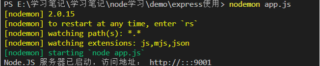

## 1.使用nodemon解决node修改代码后需要手动重启的问题

`nodemon`是一个第三方库，**他能监视我们node项目代码的变化,每当代码被修改后,它能自动重启node项目,**我们可以不需要频繁的手动重启服务器

**下载**:`npm install --global nodemon`

注意使用global将它下载到全局

安装完毕后,

**使用方法**:`nodemon xxx`  xxx为我们执行的js文件

示例:

```javascript
nodemon app.js
```



## 2.nanoid:自动生成一个唯一的id

**nanoid** :自动生成一个唯一的id

`npm i nanoid`

使用时引入

`import {nanoid} from 'nanoid'`

调用

`nanoid()`

## 3.forever:守护nodejs进程

当我们在终端执行node项目时,如果我们将终端关闭,那么node项目也会停止,使用forever工具可以使得我们的node项目一直执行

安装:`npm install forever --global`

使用:

```shell
# 启动
forever start ./bin/www  ＃最简单的启动方式
forever start -l forever.log ./bin/www  #指定forever日志输出文件，默认路径~/.forever
forever start -l forever.log -a ./bin/www  #需要注意，如果第一次启动带日志输出文件，以后启动都需要加上 -a 参数，forever默认不覆盖原文件
forever start -o out.log -e err.log ./bin/www  ＃指定node.js应用的控制台输出文件和错误信息输出文件
forever start -w ./bin/www  #监听当前目录下文件改动，如有改动，立刻重启应用，不推荐的做法！如有日志文件，日志文件是频繁更改的

# 重启
forever restart ./bin/www  ＃重启单个应用
forever restart [pid]  #根据pid重启单个应用
forever restartall  #重启所有应用

# 停止（和重启很类似）
forever stop ./bin/www  ＃停止单个应用
forever stop [pid]  #根据pid停止单个应用
forever stopall  ＃停止所有应用

# 查看forever守护的应用列表
forever list
```

